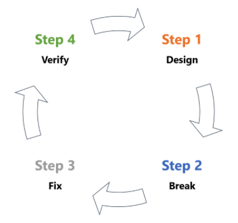
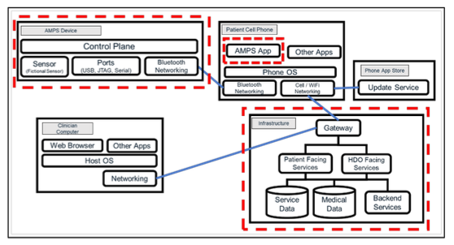
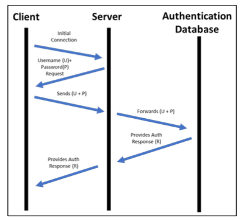
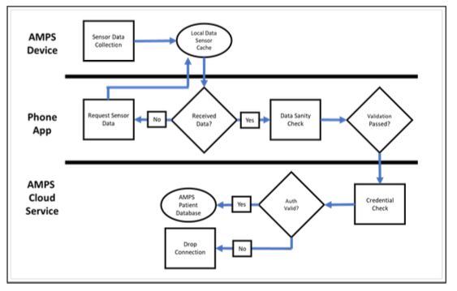
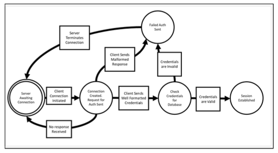

# Threat Modeling
<!-- _class: first-slide -->

Juan Vera del Campo

<juan.vera@campusviu.es>

# Hoy hablamos de...
<!-- _class: cool-list -->

1. [Modelado de amenazas](#3)
1. [¿Qué queremos modelar?](#7)
1. [¿Qué puede salir mal?](#18)
1. [¿Qué podemos hacer para arreglarlo?](#33)
1. [¿Hemos hecho un buen trabajo?](#40)
1. [Ejemplo: drones](#45)
1. [Referencias y ejercicio](#48)

# Modelado de Amenazas
<!-- _class: lead -->

## Modelado de Amenazas - Threat Modeling

- Representación estructurada de toda la información que afecta a la seguridad de una aplicación.
- Proceso de capturar, organizar y analizar toda esta información.

- Permite la toma de decisiones fundamentadas sobre los riesgos de seguridad de la aplicación.

- Además de la creación del modelo, típicamente también se produce una lista ordenada por prioridad de mejoras, requisitos, diseño e implementación de la seguridad de la misma.

**Perspectiva general de la aplicación y su entorno desde el punto de vista de la seguridad**

## Modelado de amenazas a través del ciclo de vida del desarrollo
<!-- _class: smaller-font -->

- Se tiene que aplicar de forma continua a través del ciclo de vida del desarrollo de software.
- Idealmente, el modelado inicial debería hacerse durante la fase de planificación y diseño para tener una vista general de lo que estamos construyendo. A medida que se avanza en el ciclo de vida, el modelado se va redefiniendo para capturar más detalles de nuestra apliacación.
- A medidas que se avanza el proceso de modelado debería examinar, diagnosticar y tratar las amenazas encontradas.

## Fases genéricas

- ¿En qué estamos trabajando?
- ¿Qué puede salir mal?
- ¿Qué haremos al respecto?
- ¿Hemos hecho un buen trabajo? ¿Qué podemos mejorar?

# ¿Qué queremos modelar?
<!-- _class: lead -->

# Paso 1: describe el sistema

AMPS es un dispositivo médico que se lleva por la noche por los pacientes en riesgo de padecer un infarto cuando están en su vivienda. Registra medidas que los médicos pueden después analizar, pero no emite alertas

---

Tecnología:

- Dispositivo Bluetooth BLE en el tobillo
- Aplicación en el teléfono móvil que envía datos al servidor
- AMPSCS: servidor que recibe los datos
    - API paa el móvil
    - Backend
    - Frontend para doctores

## Metodología

- Brainstorming estructurado
- Diagramas del sistema
    - Actores
    - Casos de uso
    - Flujo de datos

## Diagramas del sistema (DFD3)

> https://github.com/adamshostack/DFD3/

## Brainstorming

> En blanco para poder dibujar

## Brainstorming (ejemplo)

## Flujos de datos

---

> https://en.wikipedia.org/wiki/Threat_model

## Diagrama funcional

## Diagrama de estados

## Resumen

- Dibuja los eventos que maneja el sistema
- Dibuja los procesos involucrados
- Peticiones y respuestas generadas
- Identifica las fuentes de datos de peticiones respuestas
- Foco en el/los componentes que se está/n modelando
- Divide el diagrama si crece de forma compleja
- Considera hacer el diagrama parte de la aplicación (repositorio de código). 

¡Ojo a los datos sensibles!

# ¿Qué puede salir mal?
<!-- _class: lead -->

## Metodología

- STRIDE
- Juegos de cargas
- Matriz de Mitre
- Experiencia
- P.A.S.T.A.
- Trike
- VAST
- Kill chains
- CAPEC
- Magerit
- ...

## STRIDE
<!-- _class: smallest-font -->

Amenaza|Servicio de seguridad|Ejemplo
--|--|--
Spoofing|Autenticación|Credencialias robadas al doctor
Tampering|Integridad|Datos falseados
Repudiation|No repudio, logs, registros|El doctor alega que no recetó un medicamento
Information Disclosure|Confidencialidad|Las datos se envían por un canal no cifrado
Denial of Service|Availability|La aplicación deja de funcionar si hay conectados otros dispositivos Bluetooth
Elevation of Priviledge|Authorization|Un paciente puede ver datos de otros pacientes

## STRIDE - Spoofing

- El atacante pretende ser algo o alguien que no es
- ¿Están ambos extremos de las comunicaciones autenticados?
    - Envío de emails desde cuentas que parecen ser reales
    - Cambio de role
    - Creación de ficheros
    - ARP, IP, DNS

## STRIDE - Tampering

- El atacante cambia datos sin autorización
- ¿Cómo puedo saber si un usuario no puede cambiar los datos en tránsito o en reposo (at-rest)
    - Modificación de la memoria
    - Modificación de registros de una base de datos que pertenecen a otro usuario
    - Actuar cómo proxy y modificar el tráfico (Man in the middle)

## STRIDE - Repudiation

- El atacante asegura no haber hecho algo
- ¿Están las acciones asociadas a su autor?
    - Decir no haber borrado registros de una base de datos
    - Decir no haber recibido una notificación
    - Decir no haber usado la cuenta de otro

## STRIDE – Information Disclosure

- El atacante ve datos que no debería
- ¿Cómo puedo aseurar que los usuarios sólo puedan ver los datos a los que están autorizados? • Ejemplos:
    - Acceso a registros de otro usuario
    - Acceso al tráfico de red
    - Acceso a ciertos logs

##  STRIDE – Denial of Service

- El atacante tira el sistema abajo o lo pone en una situación de malfuncionamiento
- ¿Hay áreas en el sistema limitada por recursos o sus dependencias?
    - Inundando el tráfico de red
    - Lanzando alguna petición que consuma la CPU o la memoria
    - Llenando el sistema de ficheros con datos (logs, subiendo ficheros grandes, etc)

## STRIDE – Elevation of Privilege

- El atacante gana más acceso al sistema del que debería
- ¿Cómo puedo asegurar que un usuario no puede hacer o ver cosas que no debería?
    - Extracción de datos explotando una vulnerabilidad (memoria, base de datos, etc)
    - Ganando privilegios de administrador

## Magerit

<https://administracionelectronica.gob.es/pae_Home/pae_Documentacion/pae_Metodolog/pae_Magerit.html>

## Elevation of Privilege
<!-- _class: center -->

 

> Elevation of Privilege: https://www.microsoft.com/en-gb/download/confirmation.aspx?id=20303

---

- Desarrollado por Microsoft
- Nada como aprender jugando
- Diseñado para ser fácilmente adoptado por desarrolladores y arquitectos
- Ayuda a examinar posibles amenazas
- https://www.microsoft.com/en-us/download/details.aspx?id=20303

---

-  Crea el diagrama
-  3-6 jugadores
- Reparte todas las cartas
- 3 de Tampering empieza
- Juega la mano
- Los jugadores deben usar el mismo palo si es posible
- La carta más alta gana la mano, a menos alguien juega una carta
EoP
- Los jugadores ganan un punto si pueden identificar una amenaza
en el diagrama, y otro punto si ganan la mano
- As es para amenazas que no están en otras cartas

## Cornucopia

- OWASP Cornucopia: https://owasp.org/www-project-cornucopia/

# ¿Qué podemos hacer para arreglarlo?
<!-- _class: lead -->

## Alternativas

- Ignorar el riesgo – No recomendable
- Evitar el riesgo – Rediseño en arquitectura
- Aceptar el riesgo – Documentación sin acción
- Transferir el riesgo – Transferencia a otro equipo
- Afrontar el riesgo – Implementación del arreglo

##  Evaluación de riesgos

- Un riesgo es alto si es fácil de atacar y produce un impacto alto
- Un riesgo es bajo cuando es complicado de atacar y el impacto es bajo

riesgo = impacto * facilidad de ataque

> Magerit: https://administracionelectronica.gob.es/pae_Home/pae_Documentacion/pae_Metodolog/pae_Magerit.html

## Metodología

- Kill Chain
- Matriz de Mitre
- Experiencia

## Inspiración: MITRE y la Kill Chain

## La Kill Chain unificada

## Matriz de MITRE

https://attack.mitre.org/

# ¿Hemos hecho un buen trabajo?
<!-- _class: lead -->

## Metodología

- Revisiones constantes
- Uso de checklists
- Auditorías internas / externas
- Pentesting
- Trátalo como código: lleva control de versiones
- No te centres en problemas improbables
- No te centres en problemas que se van a resolver sin duda

## Informe

- Título
- Componente/s afectados
- Descripción de la amenaza
- Evaluación de riesgo
- Validación y mitigación
- Referencias externas (si es aplicable)

## Propósito del informe
• Transparencia sobre amenazas existentes
• Habilita la inversión en seguridad vs funcionalidad
• Captura el contexto del resultado de la sesión de Threat Modeling
• Documenta el trabajo hecho
• El informe debería tratarse como algo confidencial

## Threat Modelling como código

https://github.com/izar/pytm

# Ejemplo: drones
<!-- _class: lead -->

## Superficie de ataque

## STRIDE

# Referencias y ejercicios
<!-- _class: lead -->

## Referencias

- Manual: https://www.mitre.org/sites/default/files/publications/Playbook-for-Threat-Modeling-Medical-Devices.pdf
- Elevation of Privilege: https://www.microsoft.com/en-gb/download/confirmation.aspx?id=20303
- OWASP Cornucopia: https://owasp.org/www-project-cornucopia/
- Magerit: https://administracionelectronica.gob.es/pae_Home/pae_Documentacion/pae_Metodolog/pae_Magerit.html

## Ejercicio

- Escoge una sistema cualquiera de tu interés: una aplicación web con interfaz móvil, redes de drones...
- Dibuja un diagrama de la aplicación, identificando las zonas de confianza y los flujos de datos (1 página)
- Haz un análisis STRIDE (1 página)
- Plantea mitigaciones para cada amenaza STRIDE que identifiques (1 página)

