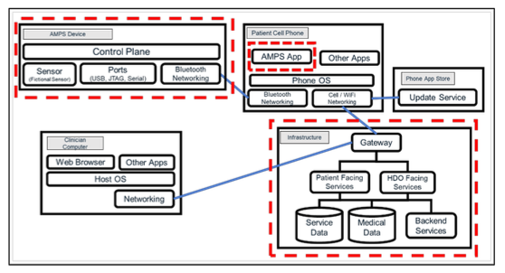

<style>
    /* You can add custom style here. VSCode supports this.
    Other editor might need these custom code in
    the YAML header: section: | */
</style>

# Threat Modeling - Modelo de amenazas
<!-- _class: first-slide -->

Juan Vera del Campo - <juan.vera@professor.universidadviu.com>

# Hoy hablamos de...
<!-- _class: cool-list toc -->

1. [Threat Modeling - Modelo de amenazas](#3)
1. [¿En qué estamos trabajando?](#13)
1. [¿Qué puede salir mal?](#28)
1. [¿Qué podemos hacer para arreglarlo?](#45)
1. [¿Hemos hecho un buen trabajo?](#57)
1. [Ejemplos de antiguos alumnos](#63)
1. [Referencias y ejercicios](#71)

# Threat Modeling - Modelo de amenazas
<!-- _class: lead -->

## Modelado de Amenazas - Threat Modeling
<!-- _class: with-info -->

- Representación estructurada de toda la información que afecta a la seguridad de una aplicación
- Proceso de capturar, organizar y analizar toda esta información
- Lista ordenada por prioridad de mejoras, requisitos, diseño e implementación de la seguridad de la misma
- Buscar puntos ciegos y plantearse las asunciones que hemos hecho del sistema

*El modelado de amenazas es el brainstorming de un atacante*

¿Qué puede salir mal y qué hacemos para evitarlo?

## Modelado de amenazas en una empresa

- Threat modeling: Servicio. Ingenieros y managers. 3 meses vista.
- Risk management: Estrategia. Directores y VP. 1 año vista.
- [Wardley Mapping](https://cynefin.io/wiki/Wardley_Mapping): Sistema. VP y niveles "C". 3 años vista.


## Ciclo de vida del desarrollo

- Se modela de forma continua durante todo ciclo de vida del desarrollo de software.
- Modelado inicial: fase de planificación y diseño para tener una vista general de lo que estamos construyendo.
- Evolución: El modelo se va detallando para capturar más detalles de la aplicación
- Aplicación: examinar, diagnosticar y tratar las amenazas encontradas.


## Diseño seguro

- Identificación temprana de las amenazas
- Prevención de vulnerabilidades
- Análisis de código
- Pruebas de seguridad


## Workflow, the agile way

- Escoge una "historia" de tu aplicación
- Dibuja un diagrama de datos/proceso
- Aplica una metología de identificación de amenazas
- Maneja las amenazas identificadas
- Chequeo continuo

> https://cheatsheetseries.owasp.org/cheatsheets/Threat_Modeling_Cheat_Sheet.html

## Terminología

- *Threat* / **Amenaza**: cualquier circunstancia con el potencial de impactar una organización
- *Vulnerability* / **Vulnerabilidad**: debilidad que un agente puede usar durante un ataque
    - A tener en cuenta: facilidad de descubrimiento, explotación, publicidad, ¿es detectable?
- *Asset* / **Recurso**: qué es lo que queremos proteger. Datos, prestigio...
- *Agent* / **Actor**: individuo o grupo capaz de llevar a cabo una amenaza.
    - A tener en cuenta: conocimientos, motivos, oportunidad y recursos


> https://www.g2.com/articles/threat-modeling


<!--
Las amenazas existen por sí solas, pero tiene que haber un agente capaz de explotar una vulnerabilidad

¿Existe una vulnerabilidad pero no es accesible desde el exterior? Entonces quizá no tiene prioridad

¿Exista una vulnerabilidad menor y conocida accesible desde el exterior? máxima prioridad
-->

---

- **Impacto** / *Impact*: daño potencial que puede producir una amenaza
    - A tener en cuenta: confidencialidad, integridad, *availability*, *accountability*, existencia de logs...
    - Tipos: económico, de imagen, *non-compliance*, privacidad
- **Probabilidad de ocurrencia** / *Likelihood*: probabilidad de que una amenaza se realice
- **Controles**: seguridad instalada para impedir, detectar y minimizar amenazas
    - **Prevenciones**: controles que impiden totalmente un ataque
    - **Mitigaciones**: controles que reducen la probabilidad de que un ataque tenga impacto
    - **Trazabilidad**: controles que permiten descubrir qué ha pasado: logs

> https://cheatsheetseries.owasp.org/cheatsheets/Threat_Modeling_Cheat_Sheet.html

## Tipos de errores

Término|Definición|Detección
--|--|--
Defecto/Bugs|Imperfección en el desarrollo del software. Un *bug* es como informalmente nos referimos a los defectos|Durante el desarrollo y el testeo
Errores|Defectos introducidos por los humanos al escribir el código|Durante el desarrollo, "fácil"
Fallos|El sistema no se comporta como se espera debido a algún defecto|Durante el testeo, "difícil"

> https://www.baeldung.com/cs/software-testing-defect-bug-error-and-failure

## Fases genéricas del análisis de amenazas

- ¿En qué estamos trabajando?
- ¿Qué puede salir mal?
- ¿Qué haremos al respecto?
- ¿Hemos hecho un buen trabajo? Es decir: ¿qué podemos mejorar?

[](https://www.threatmodelingmanifesto.org/)

> https://www.threatmodelingmanifesto.org/

# ¿En qué estamos trabajando?
<!-- _class: lead -->

# Paso 1: describe el sistema

* **Ejemplo 1**: AMPS es un dispositivo médico que se lleva por la noche por los pacientes en riesgo de padecer un infarto cuando están en su vivienda. Registra medidas que los médicos pueden después analizar, pero no emite alertas

* **Ejemplo 2**: CodiMD es un editor colaborativo de informes para un grupo pequeño de trabajadores. Los informes incluyen datos confidenciales que no deben salir de las instalaciones de la compañía.

## Ejemplo 1: AMPS

Tecnología:

- Dispositivo Bluetooth BLE en el tobillo
- Aplicación en el teléfono móvil que envía datos al servidor
- AMPSCS: servidor que recibe los datos
    - API para el móvil
    - *Backend*
    - *Frontend* para doctores

> https://www.mitre.org/sites/default/files/publications/Playbook-for-Threat-Modeling-Medical-Devices.pdf

## Ejemplo 2: CodiMD

Tecnología:

- Trabajadores "en remoto" (*home office*)
- Servidor central de informes en dependencias de la compañía
- Sistema documental con informes finales que incluya búsquedasd

## Metodología

- *Brainstorming* estructurado
- Diagramas del sistema
    - Actores
    - Casos de uso
    - Flujo de datos
    - Identificación de los "trust boundaries", puntos en los que los datos cambian de entorno


> https://en.wikipedia.org/wiki/4%2B1_architectural_view_model

## Diagramas del sistema (DFD3)


> https://github.com/adamshostack/DFD3/

## Brainstorming

> En blanco para poder dibujar

<!--

Ideas:

- "comuicaciones seguras". Ya, pero ¿cómo lo implementaremos?

AMPS:

- Actores:
    - Pacientes
    - Personal médico: decisiones
    - Personal enfermería: acceso a medicamentos
    - Personal de investigación: datos anonimizados
    - Personal administrador del sistema
- Trust boundaries
    - PAN entre teléfono móvil y sensores
    - Almacenamiento de información en el móvil
    - Servidor de autenticación
    - Equipo del hospital
    - Equipos externos
- Problemas
    - Gestión de usuarios y autorizaciones para cada uno de ellos
    - ¿Cómo y quién da de alta a un paciente? ¿Y la baja?
    - Gestión de historiales médicos intra y extra hospitales
    - Gestión de medidas ¿alarma cuando el usaurio no envía medidas?
    - Trazabilidad en el acceso a los documentos

CodiMD:

- Actores:
    - Trabajadores
    - Administradores de sistemas
    - Clientes
- Gestión de certificados
- Gestión de aplicaciones, vulnerabilidades y desarrollos internos
- Gestión de errores de software: ¿cuántos usuarios concurrentes permite el sistema? ¿recuperación del sistema?
- Control de versiones de documentos
- Plan de copias de seguridad. ¿Quién las gestiona, quién tiene las claves?
- Gestión de usuarios:
    - Contraseñas, cómo se guardan en la base de datos, actualización, pérdida...
    - Doble factor de autenticación
    - Pérdida de equipos
    - Baja de usuarios
    - Acciones de los suuarios
- Gestión de trust boundaries
    - Gestión del endpoint de los trabajadores: ¿EDR?
    - VPN
    - Conexión entre apliación y base de datos
    - Conexión entre base de datos y sistema documental

-->

## Brainstorming (ejemplo)



## Flujos de datos


---


> https://en.wikipedia.org/wiki/Threat_model


## Diagrama funcional


## Diagrama de estados


## Casos de uso


## Creación de historias

"Como  **tipo-de-usario**, quiero **característica** para recibir **beneficio** pero también **indeseado**"

Ejemplos de aplicación: https://github.com/OpenSecuritySummit/project-ASVS-User-Stories

## Resumen

- Dibuja los eventos que maneja el sistema
- Dibuja los procesos involucrados
- Peticiones y respuestas generadas
- Identifica las fuentes de datos de peticiones respuestas
- Foco en el/los componentes que se está/n modelando
- Divide el diagrama si crece de forma compleja
- Considera hacer el diagrama parte de la aplicación (repositorio de código). 

¡Ojo a los datos sensibles!

# ¿Qué puede salir mal?
<!-- _class: lead -->

## ¿Qué le preocupa al usuario?
<!-- _class: with-success -->

- **BIEN**: Para añadir seguridad, implementaremos una pantalla de login
* **MEJOR**: El usuario no quiere que otra persona acceda a sus fotos personales

En vez de añadir características a tu producto, identifica qué quiere realmente el usuario, sus preocupaciones, y dale soluciones

## Identificación

- [OWASP Top 10](https://owasp.org/www-project-top-ten/)
- [STRIDE](https://www.microsoft.com/en-us/security/blog/2007/09/11/stride-chart/)
- Juegos de cartas: Cornucopia, Elevation of privilege
- [Matriz de Mitre](https://attack.mitre.org/matrices/enterprise/)
- [P.A.S.T.A.](https://threat-modeling.com/pasta-threat-modeling/)
- [Mitre CAPEC](https://capec.mitre.org/)
- [Magerit](https://administracionelectronica.gob.es/pae_Home/pae_Documentacion/pae_Metodolog/pae_Magerit.html)
- [STRIPED](https://dl.acm.org/doi/10.1145/3538969.3538970)
- [VAST Visual Agile Simple Threat Modeleling](https://threatmodeler.com/)
- [Hybrid Threat Modeling Method HTMM](https://insights.sei.cmu.edu/documents/2308/2018_004_001_516627.pdf)

## Debilidad

Un tipo de error (no solo un *bug*) que puede contrubuir a la introducción de vulnerabilidades en el sofware

Ejemplos de debilidades en la base de datos [CWE, *Common Weakness Enumeration*](https://cwe.mitre.org)


> Top weakness 2023: https://cwe.mitre.org/data/definitions/1425.html

## Vulnerabilidad

Una ocurrencia de una debilidad en el sofware que puede utilizar un atacante para acceder o modificar datos, interrumpir el servicio o realizar acciones incorrectas.

Ejemplos en la base de adtos [CVE, *Common Vulnerabilities and Exposures*](https://cve.mitre.org/)


## STRIDE
<!-- _class: smaller-font -->

Desarrollada en Microsoft en 2009

Amenaza|Servicio de seguridad|Ejemplo
--|--|--
Spoofing|Autenticación|Credencilaes robadas al doctor
Tampering|Integridad|Datos falseados
Repudiation|No repudio, logs, registros|El doctor alega que no recetó un medicamento
Information Disclosure|Confidencialidad|Las datos se envían por un canal no cifrado
Denial of Service|Availability|La aplicación deja de funcionar si hay conectados otros dispositivos Bluetooth
Elevation of Priviledge|Authorization|Un paciente puede ver datos de otros pacientes

## STRIDE - Spoofing

- El atacante pretende ser algo o alguien que no es
- ¿Están ambos extremos de las comunicaciones autenticados?
    - Envío de emails desde cuentas que parecen ser reales
    - Cambio de roles
    - Creación de ficheros
    - ARP, IP, DNS...

## STRIDE - Tampering

- El atacante cambia datos sin autorización
- ¿Cómo puedo detectar si un usuariocambia los datos en tránsito o en reposo (at-rest)?
    - Modificación de la memoria
    - Modificación de registros de una base de datos que pertenecen a otro usuario
    - Actuar cómo proxy y modificar el tráfico (Man in the middle)

## STRIDE - Repudiation

- El atacante asegura no haber hecho algo
- ¿Están las acciones registradas y asociadas a su autor?
    - Decir no haber borrado registros de una base de datos
    - Decir no haber recibido una notificación
    - Decir no haber usado la cuenta de otro

## STRIDE – Information Disclosure

- El atacante ve datos que no debería
- ¿Cómo puedo aseurar que los usuarios sólo puedan ver los datos a los que están autorizados?
    - Acceso a registros de otro usuario
    - Acceso al tráfico de red
    - Acceso a ciertos logs

##  STRIDE – Denial of Service

- El atacante tira el sistema abajo o lo pone en una situación de malfuncionamiento
- ¿Hay áreas en el sistema limitada por recursos o sus dependencias?
    - Inundando el tráfico de red
    - Lanzando alguna petición que consuma la CPU o la memoria
    - Llenando el sistema de ficheros con datos (logs, subiendo ficheros grandes, etc)

## STRIDE – Elevation of Privilege

- El atacante gana más acceso al sistema del que debería
- ¿Cómo puedo asegurar que un usuario no puede hacer o ver cosas que no debería?
    - Extracción de datos explotando una vulnerabilidad (memoria, base de datos, etc)
    - Ganando privilegios de administrador

## Magerit

<https://administracionelectronica.gob.es/pae_Home/pae_Documentacion/pae_Metodolog/pae_Magerit.html>


## Elevation of Privilege

 

Elevation of Privilege: https://www.microsoft.com/en-gb/download/confirmation.aspx?id=20303

## Cornucopia


OWASP Cornucopia: https://owasp.org/www-project-cornucopia/

## OWASP ASVS

[OWASP Application Security Verification Standard (ASVS)](https://owasp.org/www-project-application-security-verification-standard/) es:

- Base para des controles técnicos de seguridad de las aplicaciones web
- Lista de requisitos para un desarrollo seguro de aplicaciones web

Usos:

- Como métrica: grado de confianza que se puede depositar en sus aplicaciones web
- Como guía: qué incorporar a los controles de seguridad para satisfacer los requisitos
- Como estándar: requisitos de verificación de seguridad de las aplicaciones en los contratos


## Brainstorming
<!-- _class: two-columns -->


1. Spoofing
2. Tampering
3. Repudiation
4. Information Disclosure
5. Denial of service
6. Elevation of privilege

> https://bandaancha.eu/articulos/asi-han-robando-cuentas-whatsapp-10754


# ¿Qué podemos hacer para arreglarlo?
<!-- _class: lead -->

## Análisis de riesgos
<!-- _class: with-success -->

Se puede hacer un análisis desde el punto de vista de...

- Amenazas. Inicio: identificamos amenazas
- Impacto. Inicio: identificamos nuestros recursos más valiosos
- Vulnerabilidades. Inicio: identificamos vulnerabilidades

> https://csrc.nist.gov/publications/detail/sp/800-30/rev-1/final

Objetivo: priorizar los defectos encontrados durante las fases anteriores

<!--
Aunque hay otras metodologías, en esta clase nos vamos a centrar en el análisis de riesgos desde el punto de vista de amenanzas
-->

## Risk Rating Methodologies

- [Guide for Conducting Risk Assessments. NIST SP 800-30 Rev. 1](https://csrc.nist.gov/pubs/sp/800/30/r1/final)
- [OWASP Risk Rating Methodology](https://owasp.org/www-community/OWASP_Risk_Rating_Methodology)
- [DREAD](https://learn.microsoft.com/en-us/archive/blogs/david_leblanc/dreadful) Microsoft
- [Rapid Risk Assessment](https://infosec.mozilla.org/guidelines/risk/rapid_risk_assessment.html) Mozilla
- [Bug Bar](https://www.microsoft.com/en-us/securityengineering/sdl/practices) (Practice 3) Microsoft
- [Common Vulnerability Scoring System SIG
 CVSS](https://www.first.org/cvss/)

## OWASP: Risk Rating Methodology

- Paso 1: Identificación del riesgo
- Paso 2: Factores para estimar la Probabilidad: agentes y vulnerabilidades
- Paso 3: Factores para estimar la Probabilidad: técnicos y negocio
- Paso 4: Determinar la severidad del riesgo
- Paso 5: ¿Qué hacemos?
- Paso 6: Mejora el modelo de riesgos

> https://owasp.org/www-community/OWASP_Risk_Rating_Methodology

<!--
Fíjate: la probabilidad incluye que exista una agente y una vulnerabilidad explotable

- ¿No hay agente? No hay riesgo
- ¿La vulnerabilidad no es explotable desde el experior? El riesgo es menor
- ¿No tiene impacto? No hay riesgo

El objetivo final de un análisis de riesgos es decidir qué priorizar, qué tenemos que arreglar primero: lo que más riesgo tenga. ¡Eso no significa necesariamente que sea lo que tenga más impacto!

Por ejemplo: el impacto de que se haya un terremoto en la sede de la compañía es muy alto, pero... ¿cuál es el riesgo? Alto en Perú, muy pequeño en España.
-->


## Paso 1: Identificación del riesgo

- Los que han aparecido durante las fases anteriores
- Kill Chain
- Matriz de Mitre
- Experiencia

---

Inspiración: MITRE y la Kill Chain


---

La Kill Chain unificada


---

Matriz de MITRE

https://attack.mitre.org/

https://mitre-attack.github.io/attack-navigator/

https://top-attack-techniques.mitre-engenuity.org/

https://top-attack-techniques.mitre-engenuity.org/calculator

https://mitre-attack.github.io/attack-navigator/#layerURL=https://center-for-threat-informed-defense.github.io/insider-threat-ttp-kb/green_seen_v1_v2.json


## Paso 4: Determinar la severidad del riesgo
<!-- _class: with-success two-columns-->


- **Probabilidad** de que un ataque se lleve a cabo. Tiene en cuenta habilidad necesaria, motivo, oportunidad, facilidad de explotación...
- **Impacto**. Cómo de malo sería que un ataque tuviese éxito. Confidencialidad, impacto en negocio...
- El riesgo se calcula para cada amenaza individual, no por categoría
- [Metodología de OWASP](https://owasp.org/www-community/OWASP_Risk_Rating_Methodology) y [Calculadora](https://www.owasp-risk-rating.com/)

Riesgo = Probabilidad * Impacto


---


> https://csrc.nist.gov/publications/detail/sp/800-30/rev-1/final

---
<!-- _class: with-success -->

- Un riesgo es alto si es fácil de atacar y produce un impacto alto
- Un riesgo es bajo cuando es complicado de atacar y el impacto es bajo

Riesgo = Probabilidad * Impacto


> Magerit: https://administracionelectronica.gob.es/pae_Home/pae_Documentacion/pae_Metodolog/pae_Magerit.html

## Paso 5: ¿Qué hacemos con el riesgo?
<!-- _class: with-info two-columns smaller-font -->

- **Evitar el riesgo**: dejar de hacer algo. Ejemplos:
    - No permitas que se suban fotografías a un perfil
    - Utiliza redes cableadas
    - No utilizar librerías externas
- **Mitigar el riesgo**. Ejemplos:
    - Usar TLS para cifrar las comunicaciones
    - Reducir cross-site-scripting implementando políticas
    - Cifrar dispositivos con Bitlocker
    - Uso de cortafuegos
    - Usar solo librerías auditadas

<!-- -->

- **Aceptar el riesgo**: probabilidad de impacto bajo. Siempre existe un riesgo resedual incluso después de evitar/mitigar riesgos. Ejemplos:
    - Secretos gestionados por al menos tres personas
    - Poner un tamaño máximo de XML para parsear
    - trusted admins that go rogue?
- **Transferir el riesgo**: que sean otros
    - Uso de MFA: el riesgo se transfiere al usuario
    - Uso de librerías comerciales
    - Externalizar la seguridad
- **Ignorar el riesgo**: ¡nunca lo hagas!

Los riesgos no pueden eliminarse totalmente, pero pueden llevarse hasta niveles aceptables

<!--
Aviso importante: los ejemplos de esta slide no son recomendaciones, son ejemplos de decisiones que puedes tomar o no para tu aplicación. Fíjate que algunos son contradictorios entre sí
-->


# ¿Hemos hecho un buen trabajo?
<!-- _class: lead -->

## Metodología

- Revisiones constantes
- Uso de checklists
- Auditorías internas / externas
- Pentesting
- Trátalo como código: lleva control de versiones
- No te centres en problemas improbables
- No te centres en problemas que se van a resolver sin duda

## Informe

- Título
- Componente/s afectados
- Descripción de la amenaza
- Evaluación de riesgo
- Validación y mitigación
- Referencias externas (si es aplicable)


## Propósito del informe

- Reportar amenazas existentes
- Ejecutivo: decidir sobre priorización de tareas
- Documentar el trabajo hecho
- Rápido de leer y entender:
    - Usa tablas
    - Usa nomenclatura estándar
- Entender dónde estamos y hacia dónde vamos

El informe debería tratarse como documento confidencial

## Herramientas

- [Diagrams.net](https://app.diagrams.net/) More Diagrams -> Data Flow
- [OWASP Threat Dragon](https://owasp.org/www-project-threat-dragon/)
- [pyTM](https://github.com/izar/pytm): Threat Modeling as code. It can generate DFDs, sequence diagrams and reveal threats to your system

---

Threagile: <https://github.com/Threagile/threagile>

```bash
docker run --rm -it --user $(id -u):$(id -g) \\
   -v "$(pwd)":/app/work threagile/threagile -create-example-model -output /app/work
docker run --rm -it --user $(id -u):$(id -g) \\
   -v $(pwd):/app/work threagile/threagile -verbose \\
   -model /app/work/threagile-example-model.yaml -output /app/work
```


# Ejemplos de antiguos alumnos
<!-- _class: lead -->

## Sistema de Incident Response en cloud


<!-- Alumno: Jorge Barreto Olivos -->

---


## Creación de Pólizas Individuales de Salud


<!-- Alumno: Aldo Armesto Marcús -->

## Sistema de facturación para empresa


<!-- Alumno: ALEJANDRO REDIN -->

---


## Aplicación para control financiero


<!-- Alumno: JOHANN LEONARDO SOLANO TORRADO -->

---


# Referencias y ejercicios
<!-- _class: lead -->

## Referencias

- Manual: https://www.mitre.org/sites/default/files/publications/Playbook-for-Threat-Modeling-Medical-Devices.pdf
- OWASP Threat Modelling: https://cheatsheetseries.owasp.org/cheatsheets/Threat_Modeling_Cheat_Sheet.html
- NIST: https://csrc.nist.gov/publications/detail/sp/800-30/rev-1/final
- Elevation of Privilege: https://www.microsoft.com/en-gb/download/confirmation.aspx?id=20303
- OWASP Cornucopia: https://owasp.org/www-project-cornucopia/
- Magerit: https://administracionelectronica.gob.es/pae_Home/pae_Documentacion/pae_Metodolog/pae_Magerit.html

## Ejercicio

- Escoge una sistema cualquiera de tu interés: una aplicación web con interfaz móvil, redes de drones, sistema médico como el que hemos visto en la sesión...
- Dibuja un modelo de la aplicación, identificando las zonas de confianza y los flujos de datos
- Haz un análisis STRIDE de las amenazas que identifiques
- Plantea mitigaciones para cada amenaza STRIDE que identifiques
- Prioriza los riesgos encontrados

El objetivo no es encontrar todos los problemas de seguridad de una aplicación, sinó aplicar los pasos modelado, análisis, mitigaciones, priorización.

La extensión esperada del documento es unas 5 páginas

Entrega en PDF

# ¡Gracias!
<!-- _class: last-slide --> 
