

# Threat Modeling - Modelo de amenazas
<!-- _class: first-slide -->

Juan Vera del Campo

<juan.vera@campusviu.es>

# Hoy hablamos de...
<!-- _class: cool-list toc -->

1. [Modelado de Amenazas](#3)
1. [¿En qué estamos trabajando?](#7)
1. [¿Qué puede salir mal?](#19)
1. [¿Qué podemos hacer para arreglarlo?](#34)
1. [¿Hemos hecho un buen trabajo?](#41)
1. [Ejemplo: drones](#46)
1. [Referencias y ejercicios](#49)

# Análisis de riesgos y modelado de Amenazas
<!-- _class: lead -->

## Modelado de Amenazas - Threat Modeling

- Representación estructurada de toda la información que afecta a la seguridad de una aplicación.
- Proceso de capturar, organizar y analizar toda esta información.

- Permite la toma de decisiones fundamentadas sobre los riesgos de seguridad de la aplicación.

- Además de la creación del modelo, típicamente también se produce una lista ordenada por prioridad de mejoras, requisitos, diseño e implementación de la seguridad de la misma.

**Perspectiva general de la aplicación y su entorno desde el punto de vista de la seguridad**

## Modelado de amenazas durante ciclo de vida del desarrollo
<!-- _class: smaller-font -->

- Aplica de forma continua durante todo ciclo de vida del desarrollo de software.
- Modelado inicial: fase de planificación y diseño para tener una vista general de lo que estamos construyendo.
- A medida que se avanza en el ciclo de vida, el modelado se va detallando para capturar más detalles de nuestra apliacación.
- A medidas que se avanza el proceso de modelado debería examinar, diagnosticar y tratar las amenazas encontradas.

## Terminología

- *Thread* / Amenaza: cualquier circunstancia con el potencial de impactar una organización
- *Vulnerability* / Vulnerabilidad: debilidad que un agente puede usar durante un ataque
    - A tener en cuenta: facilidad de descubrimiento, explotación, publicidad, ¿es detectable?
- *Agent* / Actor: individuo o grupo capaz de llevar a cabo una amenaza.
    - A tener en cuenta: conocimientos, motivos, oportunidad y recursos

<!--
Las amenazas existen por sí solas, pero tiene que haber un agente capaz de explotar una vulnerabilidad

¿Existe una vulnerabilidad pero no es accesible desde el exterior? Entonces quizá no tiene prioridad

¿Exista una vulnerabilidad menor y conocida accesible desde el exterior? máxima prioridad
-->

---

- *Impact*: daño potencial que puede producir una amenaza
    - A tener en cuenta: confidencialidad, integridad, *availability*, *accountability*, existencia de logs...
    - Tipos: económico, de imagen, *non-compliance*, privacidad
- *Likelihood*: probabilidad de que una amenaza se realice
- *Controls*: seguridad instalada para impedir, detectar y minimizar amenazas
    - *Preventions*: controles que impiden totalmente un ataque
    - *Mitigations*: controles que reducen la probabilidad de que un ataque tenga impacto
    - *Traceability*: controles que permiten descubrir qué ha pasado: logs

> https://cheatsheetseries.owasp.org/cheatsheets/Threat_Modeling_Cheat_Sheet.html

---

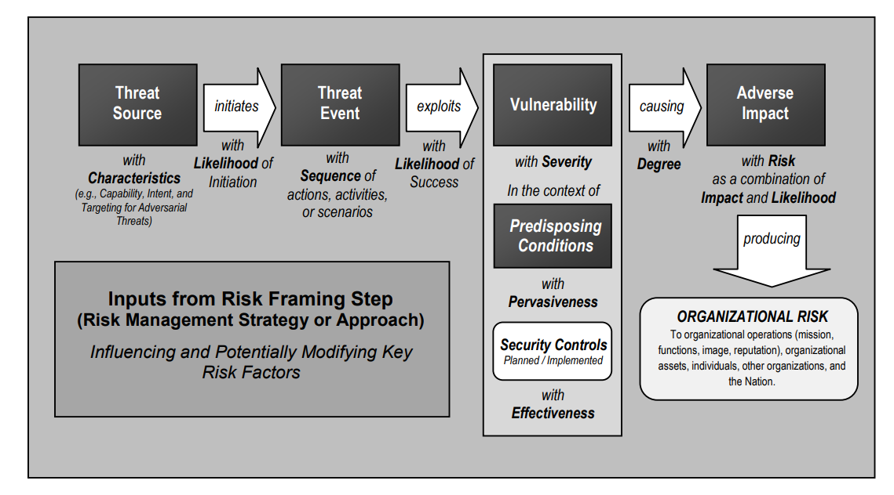

> https://csrc.nist.gov/publications/detail/sp/800-30/rev-1/final

## Fases genéricas del análisis de amenazas

- ¿En qué estamos trabajando?
- ¿Qué puede salir mal?
- ¿Qué haremos al respecto?
- ¿Hemos hecho un buen trabajo? Es decir: ¿qué podemos mejorar?

> https://www.threatmodelingmanifesto.org/

# ¿En qué estamos trabajando?
<!-- _class: lead -->

# Paso 1: describe el sistema

* **Ejemplo 1**: AMPS es un dispositivo médico que se lleva por la noche por los pacientes en riesgo de padecer un infarto cuando están en su vivienda. Registra medidas que los médicos pueden después analizar, pero no emite alertas

* **Ejemplo 2**: CodiMD es un editor colaborativo de informes para un grupo pequeño de trabajadores. Los informes incluyen datos confidenciales que no deben salir de las instalaciones de la compañía.

## Ejemplo 1: AMPS

Tecnología:

- Dispositivo Bluetooth BLE en el tobillo
- Aplicación en el teléfono móvil que envía datos al servidor
- AMPSCS: servidor que recibe los datos
    - API para el móvil
    - Backend
    - Frontend para doctores

## Ejemplo 2: CodiMD

Tecnología:

- Trabajadores "en remoto" (*home office*)
- Servidor central de informes en dependencias de la compañía
- Sistema documental con informes finales que incluya búsquedasd

## Metodología

- Brainstorming estructurado
- Diagramas del sistema
    - Actores
    - Casos de uso
    - Flujo de datos
    - Identificación de los "trust boundaries", puntos en los que los datos cambian de entorno

> https://en.wikipedia.org/wiki/4%2B1_architectural_view_model

## Diagramas del sistema (DFD3)

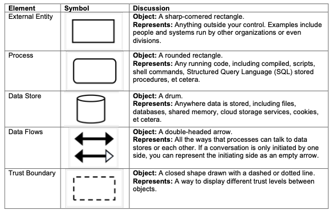

> https://github.com/adamshostack/DFD3/

## Brainstorming

> En blanco para poder dibujar

<!--

Ideas:

- "comuicaciones seguras". Ya, pero ¿cómo lo implementaremos?

AMPS:

- Actores:
    - Pacientes
    - Personal médico: decisiones
    - Personal enfermería: acceso a medicamentos
    - Personal de investigación: datos anonimizados
    - Personal administrador del sistema
- Trust boundaries
    - PAN entre teléfono móvil y sensores
    - Almacenamiento de información en el móvil
    - Servidor de autenticación
    - Equipo del hospital
    - Equipos externos
- Problemas
    - Gestión de usuarios y autorizaciones para cada uno de ellos
    - ¿Cómo y quién da de alta a un paciente? ¿Y la baja?
    - Gestión de historiales médicos intra y extra hospitales
    - Gestión de medidas ¿alarma cuando el usaurio no envía medidas?
    - Trazabilidad en el acceso a los documentos

CodiMD:

- Actores:
    - Trabajadores
    - Administradores de sistemas
    - Clientes
- Gestión de certificados
- Gestión de aplicaciones, vulnerabilidades y desarrollos internos
- Gestión de errores de software: ¿cuántos usuarios concurrentes permite el sistema? ¿recuperación del sistema?
- Control de versiones de documentos
- Plan de copias de seguridad. ¿Quién las gestiona, quién tiene las claves?
- Gestión de usuarios:
    - Contraseñas, cómo se guardan en la base de datos, actualización, pérdida...
    - Doble factor de autenticación
    - Pérdida de equipos
    - Baja de usuarios
    - Acciones de los suuarios
- Gestión de trust boundaries
    - Gestión del endpoint de los trabajadores: ¿EDR?
    - VPN
    - Conexión entre apliación y base de datos
    - Conexión entre base de datos y sistema documental

-->

## Brainstorming (ejemplo)

## Flujos de datos

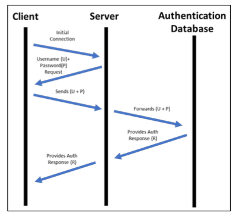

---

> https://en.wikipedia.org/wiki/Threat_model

## Diagrama funcional

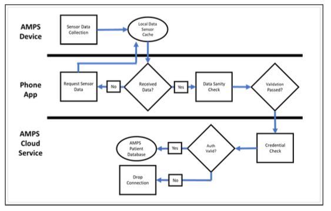

## Diagrama de estados

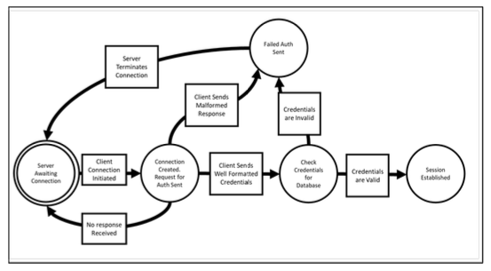

## Casos de uso

## Resumen

- Dibuja los eventos que maneja el sistema
- Dibuja los procesos involucrados
- Peticiones y respuestas generadas
- Identifica las fuentes de datos de peticiones respuestas
- Foco en el/los componentes que se está/n modelando
- Divide el diagrama si crece de forma compleja
- Considera hacer el diagrama parte de la aplicación (repositorio de código). 

¡Ojo a los datos sensibles!

# ¿Qué puede salir mal?
<!-- _class: lead -->

## ¿Qué le preocupa al usuario?
<!-- _class: with-success -->

- **BIEN**: Para añadir seguridad, implementaremos una pantalla de login
* **MEJOR**: El usuario no quiere que otra persona acceda a sus fotos personales

En vez de añadir características a tu producto, identifica qué quiere realmente el usuario, sus preocupaciones, y dale soluciones.

## Metodología

- STRIDE
- Juegos de cargas
- Matriz de Mitre
- Experiencia
- P.A.S.T.A.
- Trike
- VAST
- Kill chains
- CAPEC
- Magerit
- ...

## STRIDE
<!-- _class: smallest-font -->

Amenaza|Servicio de seguridad|Ejemplo
--|--|--
Spoofing|Autenticación|Credencialias robadas al doctor
Tampering|Integridad|Datos falseados
Repudiation|No repudio, logs, registros|El doctor alega que no recetó un medicamento
Information Disclosure|Confidencialidad|Las datos se envían por un canal no cifrado
Denial of Service|Availability|La aplicación deja de funcionar si hay conectados otros dispositivos Bluetooth
Elevation of Priviledge|Authorization|Un paciente puede ver datos de otros pacientes

## STRIDE - Spoofing

- El atacante pretende ser algo o alguien que no es
- ¿Están ambos extremos de las comunicaciones autenticados?
    - Envío de emails desde cuentas que parecen ser reales
    - Cambio de role
    - Creación de ficheros
    - ARP, IP, DNS

## STRIDE - Tampering

- El atacante cambia datos sin autorización
- ¿Cómo puedo saber si un usuario no puede cambiar los datos en tránsito o en reposo (at-rest)
    - Modificación de la memoria
    - Modificación de registros de una base de datos que pertenecen a otro usuario
    - Actuar cómo proxy y modificar el tráfico (Man in the middle)

## STRIDE - Repudiation

- El atacante asegura no haber hecho algo
- ¿Están las acciones asociadas a su autor?
    - Decir no haber borrado registros de una base de datos
    - Decir no haber recibido una notificación
    - Decir no haber usado la cuenta de otro

## STRIDE – Information Disclosure

- El atacante ve datos que no debería
- ¿Cómo puedo aseurar que los usuarios sólo puedan ver los datos a los que están autorizados? • Ejemplos:
    - Acceso a registros de otro usuario
    - Acceso al tráfico de red
    - Acceso a ciertos logs

##  STRIDE – Denial of Service

- El atacante tira el sistema abajo o lo pone en una situación de malfuncionamiento
- ¿Hay áreas en el sistema limitada por recursos o sus dependencias?
    - Inundando el tráfico de red
    - Lanzando alguna petición que consuma la CPU o la memoria
    - Llenando el sistema de ficheros con datos (logs, subiendo ficheros grandes, etc)

## STRIDE – Elevation of Privilege

- El atacante gana más acceso al sistema del que debería
- ¿Cómo puedo asegurar que un usuario no puede hacer o ver cosas que no debería?
    - Extracción de datos explotando una vulnerabilidad (memoria, base de datos, etc)
    - Ganando privilegios de administrador

## Magerit

<https://administracionelectronica.gob.es/pae_Home/pae_Documentacion/pae_Metodolog/pae_Magerit.html>

## Elevation of Privilege
<!-- _class: center -->

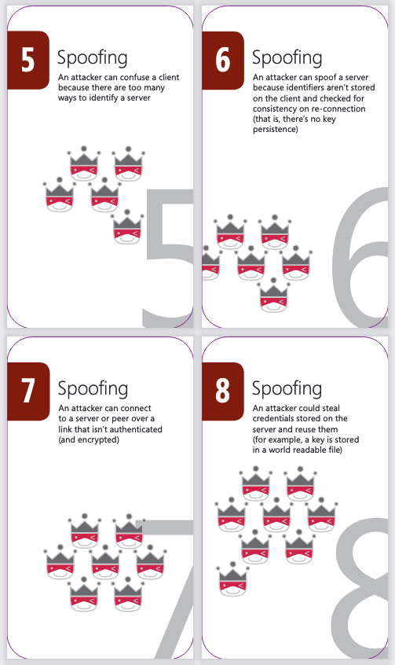 

> Elevation of Privilege: https://www.microsoft.com/en-gb/download/confirmation.aspx?id=20303

---

- Desarrollado por Microsoft
- Nada como aprender jugando
- Diseñado para ser fácilmente adoptado por desarrolladores y arquitectos
- Ayuda a examinar posibles amenazas
- https://www.microsoft.com/en-us/download/details.aspx?id=20303

---

-  Crea el diagrama
-  3-6 jugadores
- Reparte todas las cartas
- 3 de Tampering empieza
- Juega la mano
- Los jugadores deben usar el mismo palo si es posible
- La carta más alta gana la mano, a menos alguien juega una carta
EoP
- Los jugadores ganan un punto si pueden identificar una amenaza
en el diagrama, y otro punto si ganan la mano
- As es para amenazas que no están en otras cartas

## Cornucopia

- OWASP Cornucopia: https://owasp.org/www-project-cornucopia/

# ¿Qué podemos hacer para arreglarlo?
<!-- _class: lead -->

## Análisis de riesgos

Se puede hacer un análisis desde el punto de vista de...

- Amenazas. Inicio: identificamos amenazas
- Impacto. Inicio: identificamos nuestros recursos más valiosos
- Vulnerabilidades. Inicio: identificamos vulnerabilidades

> https://csrc.nist.gov/publications/detail/sp/800-30/rev-1/final

<!--
Aunque hay otras metodologías, en esta clase nos vamos a centrar en el análisis de riesgos desde el punto de vista de amenanzas
-->

## OWASP: Risk Rating Methodology

- Step 1: Identifying a Risk
- Step 2: Factors for Estimating Likelihood: agents and vulnerabilities
- Step 3: Factors for Estimating Impact: technical and business
- Step 4: Determining Severity of the Risk
- Step 5: Deciding What to Fix: priorities
- Step 6: Customizing Your Risk Rating Model

> https://owasp.org/www-community/OWASP_Risk_Rating_Methodology

<!--
Fíjate: la probabilidad incluye que exista una agente y una vulnerabilidad explotable

- ¿No hay agente? No hay riesgo
- ¿La vulnerabilidad no es explotable desde el experior? El riesgo es menor
- ¿No tiene impacto? No hay riesgo

El objetivo final de un análisis de riesgos es decidir qué priorizar, qué tenemos que arreglar primero: lo que más riesgo tenga. ¡Eso no significa necesariamente que sea lo que tenga más impacto!

Por ejemplo: el impacto de que se haya un terremoto en la sede de la compañía es muy alto, pero... ¿cuál es el riesgo? Alto en Perú, muy pequeño en España.
-->

---

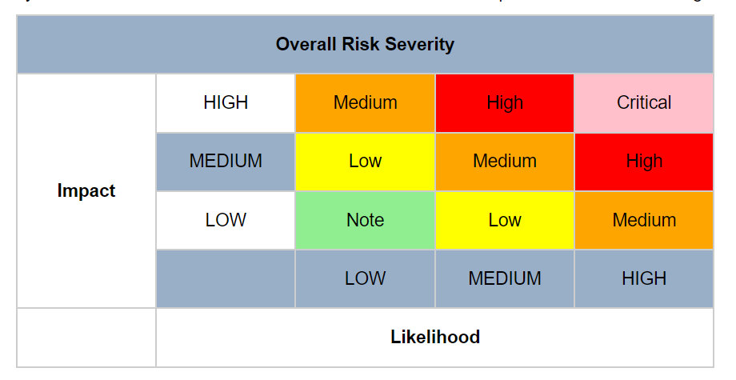

<!-- Ejemplo de prioridades -->

##  Evaluación de riesgos
<!-- _class: with-success -->

- Un riesgo es alto si es fácil de atacar y produce un impacto alto
- Un riesgo es bajo cuando es complicado de atacar y el impacto es bajo

riesgo = impacto * probabilidad

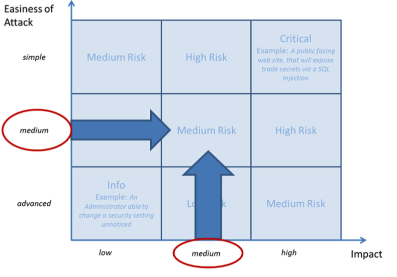

> Magerit: https://administracionelectronica.gob.es/pae_Home/pae_Documentacion/pae_Metodolog/pae_Magerit.html

## Metodología

- Kill Chain
- Matriz de Mitre
- Experiencia
- OWASP: https://owasp.org/www-community/OWASP_Risk_Rating_Methodology
- NIST: https://nvlpubs.nist.gov/nistpubs/Legacy/SP/nistspecialpublication800-30r1.pdf

## Inspiración: MITRE y la Kill Chain

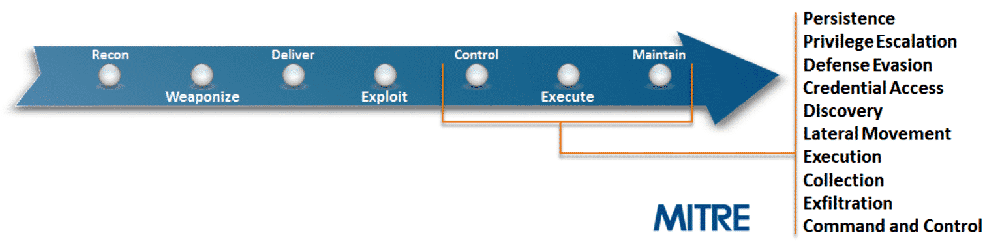

## La Kill Chain unificada

## Matriz de MITRE

https://attack.mitre.org/

https://mitre-attack.github.com/attack-navigator

# ¿Hemos hecho un buen trabajo?
<!-- _class: lead -->

## Metodología

- Revisiones constantes
- Uso de checklists
- Auditorías internas / externas
- Pentesting
- Trátalo como código: lleva control de versiones
- No te centres en problemas improbables
- No te centres en problemas que se van a resolver sin duda

## Informe

- Título
- Componente/s afectados
- Descripción de la amenaza
- Evaluación de riesgo
- Validación y mitigación
- Referencias externas (si es aplicable)

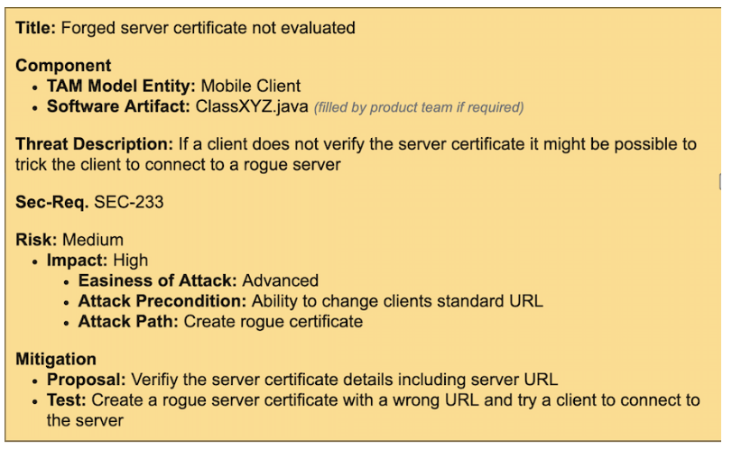

## Propósito del informe
• Transparencia sobre amenazas existentes
• Habilita la inversión en seguridad vs funcionalidad
• Captura el contexto del resultado de la sesión de Threat Modeling
• Documenta el trabajo hecho
• El informe debería tratarse como algo confidencial

## Threat Modelling como código

https://github.com/izar/pytm

# Ejemplo: drones
<!-- _class: lead -->

## Superficie de ataque

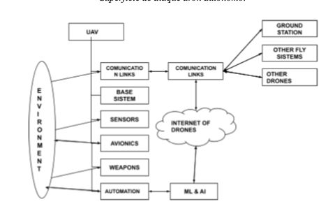

## STRIDE

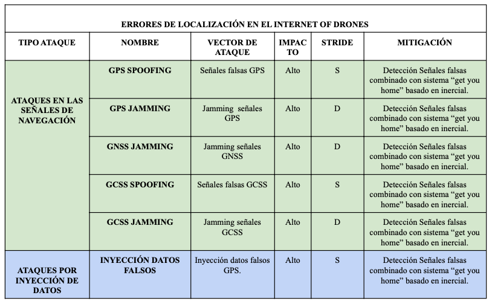

# Referencias y ejercicios
<!-- _class: lead -->

## Referencias

- Manual: https://www.mitre.org/sites/default/files/publications/Playbook-for-Threat-Modeling-Medical-Devices.pdf
- OWASP Thread Modelling: https://cheatsheetseries.owasp.org/cheatsheets/Threat_Modeling_Cheat_Sheet.html
- NIST: https://csrc.nist.gov/publications/detail/sp/800-30/rev-1/final
- Elevation of Privilege: https://www.microsoft.com/en-gb/download/confirmation.aspx?id=20303
- OWASP Cornucopia: https://owasp.org/www-project-cornucopia/
- Magerit: https://administracionelectronica.gob.es/pae_Home/pae_Documentacion/pae_Metodolog/pae_Magerit.html

## Ejercicio

- Escoge una sistema cualquiera de tu interés: una aplicación web con interfaz móvil, redes de drones...
- Dibuja un diagrama de la aplicación, identificando las zonas de confianza y los flujos de datos (1 página)
- Haz un análisis STRIDE (1 página)
- Plantea mitigaciones para cada amenaza STRIDE que identifiques (1 página)---

---

<!-- _class: center -->

Continúa en: [Buenas prácticas en la escritura de código](02-coding.html)

# ¡Gracias!
<!-- _class: last-slide --> 
