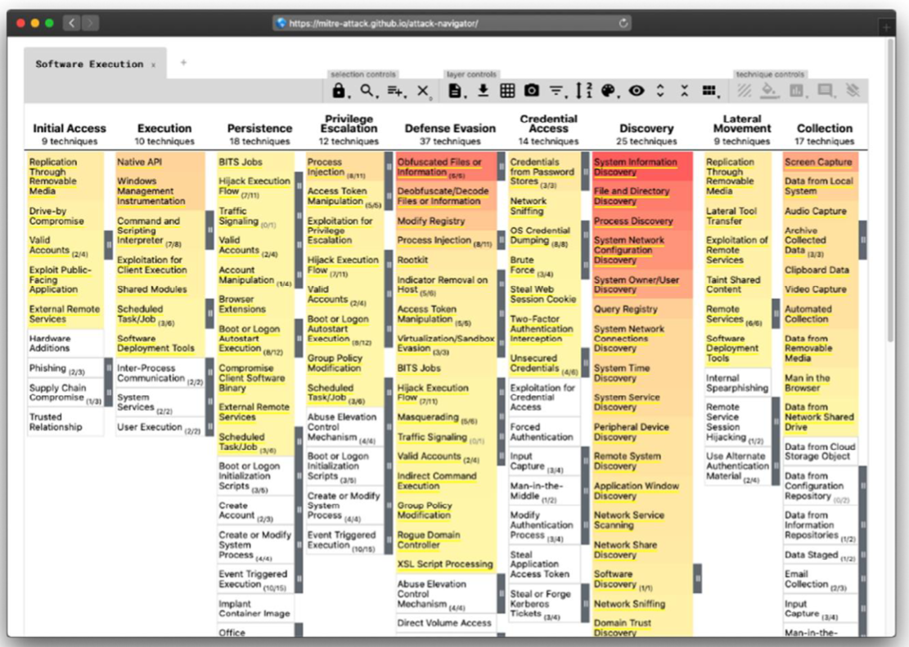

<style>
    /* You can add custom style here. VSCode supports this.
    Other editor might need these custom code in
    the YAML header: section: | */
</style>

# Threat Modeling - Modelo de amenazas
<!-- _class: first-slide -->

Juan Vera del Campo - <juan.vera@professor.universidadviu.com>

# Hoy hablamos de...
<!-- _class: cool-list toc -->

1. [Threat Modeling - Modelo de amenazas](#3)
1. [¿En qué estamos trabajando?](#14)
1. [¿Qué puede salir mal?](#32)
1. [¿Qué podemos hacer para arreglarlo?](#49)
1. [¿Hemos hecho un buen trabajo?](#63)
1. [Ejemplos de antiguos alumnos](#70)
1. [Referencias y ejercicios](#78)

# Threat Modeling - Modelo de amenazas
<!-- _class: lead -->

## Modelado de Amenazas - Threat Modeling
<!-- _class: with-info -->

- Proceso para identificar, evaluar y mitigar amenazas de seguridad.
- Ayuda a anticipar vulnerabilidades antes de que ocurran.
- Parte esencial del ciclo de vida de desarrollo seguro (SDLC).
- Priorización de mejoras, requisitos, diseño e implementación de la seguridad de la misma

¿Qué tenemos, qué puede salir mal y qué hacemos para evitarlo?

## ¿Por qué es importante?

- Reduce riesgos de seguridad antes de que se materialicen
- Ahorra costos en correcciones tardías
- Mejora la comprensión del sistema desde el punto de vista de seguridad
- Facilita cumplimiento normativo

## Modelado de amenazas en una empresa

- Threat modeling: Servicio. Ingenieros y managers. 3 meses vista.
- Risk management: Estrategia. Directores y VP. 1 año vista.
- [Wardley Mapping](https://cynefin.io/wiki/Wardley_Mapping): Sistema. VP y niveles "C". 3 años vista.


## ¿Cuándo hacerlo?

- Etapa temprana del diseño.
- Cambios importantes en la arquitectura.
- Introducción de nuevas funcionalidades.


> https://learn.microsoft.com/en-us/archive/msdn-magazine/2009/january/security-briefs-getting-started-with-the-sdl-threat-modeling-tool

## Ventajas del Threat Modeling

- **Documentación** del sistema
- **Identificación** temprana de las amenazas
- **Priorización** de los riesgos más importantes
- **Prevención** de vulnerabilidades


## Terminología

- *Threat* / **Amenaza**: cualquier circunstancia con el potencial de impactar una organización
- *Vulnerability* / **Vulnerabilidad**: debilidad que un agente puede usar durante un ataque
    - A tener en cuenta: facilidad de descubrimiento, explotación, publicidad, ¿es detectable?
- *Asset* / **Recurso**: qué es lo que queremos proteger. Datos, prestigio...
- *Agent* / **Actor**: individuo o grupo capaz de llevar a cabo una amenaza.
    - A tener en cuenta: conocimientos, motivos, oportunidad y recursos


> https://www.g2.com/articles/threat-modeling


<!--
Las amenazas existen por sí solas, pero tiene que haber un agente capaz de explotar una vulnerabilidad

¿Existe una vulnerabilidad pero no es accesible desde el exterior? Entonces quizá no tiene prioridad

¿Exista una vulnerabilidad menor y conocida accesible desde el exterior? máxima prioridad
-->

---

- **Impacto** / *Impact*: daño potencial que puede producir una amenaza
    - A tener en cuenta: confidencialidad, integridad, *availability*, *accountability*, existencia de logs...
    - Tipos: económico, de imagen, *non-compliance*, privacidad
- **Probabilidad de ocurrencia** / *Likelihood*: probabilidad de que una amenaza se realice
- **Controles**: seguridad instalada para impedir, detectar y minimizar amenazas
    - **Prevenciones**: controles que impiden totalmente un ataque
    - **Mitigaciones**: controles que reducen la probabilidad de que un ataque tenga impacto
    - **Trazabilidad**: controles que permiten descubrir qué ha pasado: logs

> https://cheatsheetseries.owasp.org/cheatsheets/Threat_Modeling_Cheat_Sheet.html

## Tipos de errores

Término|Definición|Detección
--|--|--
Defecto/Bugs|Imperfección en el desarrollo del software. Un *bug* es como informalmente nos referimos a los defectos|Durante el desarrollo y el testeo
Errores|Defectos introducidos por los humanos al escribir el código|Durante el desarrollo, "fácil"
Fallos|El sistema no se comporta como se espera debido a algún defecto|Durante el testeo, "difícil"

> https://www.baeldung.com/cs/software-testing-defect-bug-error-and-failure

## Proceso general

1. **Definir alcance** del sistema
2. **Crear un modelo** del sistema
3. **Identificar amenazas** (ej: STRIDE)
4. **Evaluar riesgos** (impacto vs. probabilidad)
5. **Mitigar amenazas**
6. **Documentar y revisar**

## Fases genéricas del análisis de amenazas

- ¿En qué estamos trabajando? Describe el escenario
- ¿Qué puede salir mal? Determina las amenazas
- ¿Qué haremos al respecto? Contramedidas y mitigación
- ¿Hemos hecho un buen trabajo? Evalúa tu trabajo

[](https://www.threatmodelingmanifesto.org/)


> https://www.threatmodelingmanifesto.org/
> OWASP [Threat Modeling Process](https://owasp.org/www-community/Threat_Modeling_Process)
> OWASP [Threat Modelling Cheatsheets](https://cheatsheetseries.owasp.org/cheatsheets/Threat_Modeling_Cheat_Sheet.html)

<!--

Es muy recomendable que leas los dos primeros enlaces: proceso de modelado de amenazas

Las preguntas es la terminología que se usa en el treat modeling manifesto, mientras que las explicaciones son las fases definidas en OWASP. Observa que en realidad son las mismas fases
-->

# ¿En qué estamos trabajando?
<!-- _class: lead -->

Describe el sistema

# Paso 1: describe el sistema
<!-- _class: with-success -->

- ¿Qué estamos modelando?
- ¿Qué activos son críticos?
- ¿Qué actores interactúan con el sistema?

---

- Describe el sistema:
    - Con casos de uso. Pueden ser varios, tipo historia
    - Con diagramas de flujo de datos
    - Con diagramas de subsistemas y su relación entre ellos
- Identifica:
    - puntos de entrada para ver dónde un potencial atacante podría interactuar con la aplicación
    - activos importantes de tu aplicación
    - derechos de acceso que necesitará cada actor

Objetivo: descompón tu sistema, sus flujos de datos, los actores, los activos importantes, y cómo se relacionan entre sí

## Metodología

- *Brainstorming* estructurado
- Diagramas del sistema
    - Actores
    - Casos de uso
    - Flujo de datos
    - Identificación de los "trust boundaries", puntos en los que los datos cambian de entorno


> https://en.wikipedia.org/wiki/4%2B1_architectural_view_model

## Diagramas del sistema (DFD3)


> https://github.com/adamshostack/DFD3/

## Ejemplo: Informes Periciales

- **Nombre de aplicación**: informes periciales 1.0
- **Descripción**: editor de texto para edición de informes periciales que permita edición simultánea de varios analistas,  y vista de "solo lectura" para abogados
- **Usuarios**:
    - Analistas, que trabajan en la oficina
    - Revisores externos que trabajan en remoto (*home office*)
    - Clientes finales, con acceso de solo lectura
- **Dependencias impuestas**: SSO, VPN, código libre, control de tiempos

---

Preguntas para del modelado

- ¿Cuáles son los puntos de entrada?
- ¿Cuáles son las salidas del sistema?
- ¿En qué podría estar interesado/a un/a atacante?
- ¿Qué elementos son importantes?

Dibuja todos los diagramas que veas necesario, nunca sobrarán

---

<!--

Página en blanco para poder dibujar

Ideas:

- "comuicaciones seguras". Ya, pero ¿cómo lo implementaremos?

AMPS:

- Actores:
    - Pacientes
    - Personal médico: decisiones
    - Personal enfermería: acceso a medicamentos
    - Personal de investigación: datos anonimizados
    - Personal administrador del sistema
- Trust boundaries
    - PAN entre teléfono móvil y sensores
    - Almacenamiento de información en el móvil
    - Servidor de autenticación
    - Equipo del hospital
    - Equipos externos
- Problemas
    - Gestión de usuarios y autorizaciones para cada uno de ellos
    - ¿Cómo y quién da de alta a un paciente? ¿Y la baja?
    - Gestión de historiales médicos intra y extra hospitales
    - Gestión de medidas ¿alarma cuando el usaurio no envía medidas?
    - Trazabilidad en el acceso a los documentos

CodiMD:

- Actores:
    - Trabajadores
    - Administradores de sistemas
    - Clientes
- Gestión de certificados
- Gestión de aplicaciones, vulnerabilidades y desarrollos internos
- Gestión de errores de software: ¿cuántos usuarios concurrentes permite el sistema? ¿recuperación del sistema?
- Control de versiones de documentos
- Plan de copias de seguridad. ¿Quién las gestiona, quién tiene las claves?
- Gestión de usuarios:
    - Contraseñas, cómo se guardan en la base de datos, actualización, pérdida...
    - Doble factor de autenticación
    - Pérdida de equipos
    - Baja de usuarios
    - Acciones de los suuarios
- Gestión de trust boundaries
    - Gestión del endpoint de los trabajadores: ¿EDR?
    - VPN
    - Conexión entre apliación y base de datos
    - Conexión entre base de datos y sistema documental

--> 

## Ejemplo: Brainstorming (sistema)


Descripción del sistema completo

## Ejemplo: Brainstorming (detalle)


Detalle del proceso de edición por un usuario


## Flujos de datos


---


> https://en.wikipedia.org/wiki/Threat_model


## Diagrama funcional


## Diagrama de estados


## Casos de uso


## Creación de historias

"Como  **tipo-de-usario**, quiero **característica** para recibir **beneficio** pero también **indeseado**"

Ejemplos de aplicación: https://github.com/OpenSecuritySummit/project-ASVS-User-Stories

## ¿Qué le preocupa al usuario?
<!-- _class: with-success -->

- **BIEN**: Para añadir seguridad, implementaremos una pantalla de login
* **MEJOR**: El usuario no quiere que otra persona acceda a sus fotos personales

En vez de añadir características a tu producto, identifica qué quiere realmente el usuario, sus preocupaciones, y dale soluciones

## Ejemplo: historias de informes periciales

- Como analista, quiero poder escribir un informe junto con otros analistas para poder acabar el menor tiempo posible, pero sin que repitamos trabajo
- Como administrativo, quiero poder facturar el trabajo al cliente sabiendo cuántas horas hemos dedicado, sin que ningún analista haya inflado las horas
- Como revisor, quiero poder decidir cuándo un informe está acabado, sin que nadie más pueda firmar digitalmente el documento
- Como revisor, quiero poder acceder al sistema desde mi casa, sin que nadie pueda hacerse pasar por mí
- Como cliente, quiero poder acceder a los informes, en confidencialidad
- Como auditor, quiero saber a qué evidencias han accedido los analistas, sino que ningún actor pueda eliminar trazas de acceso

# ¿Qué puede salir mal?
<!-- _class: lead -->

Determina las amenazas

## Debilidad

Un tipo de error (no solo un *bug*) que puede contrubuir a la introducción de vulnerabilidades en el sofware

Ejemplos de debilidades en la base de datos [CWE, *Common Weakness Enumeration*](https://cwe.mitre.org)


> Top weakness 2023: https://cwe.mitre.org/data/definitions/1425.html

## Vulnerabilidad

Una ocurrencia de una debilidad en el sofware que puede utilizar un atacante para acceder o modificar datos, interrumpir el servicio o realizar acciones incorrectas.

Ejemplos en la base de datos [CVE, *Common Vulnerabilities and Exposures*](https://cve.mitre.org/)


## Metodologías de identificación de amenazas
<!-- _class: smaller-font with-info -->

- [STRIDE](https://www.microsoft.com/en-us/security/blog/2007/09/11/stride-chart/)
- [P.A.S.T.A.](https://threat-modeling.com/pasta-threat-modeling/)
- [Threat Modeling and Security by Design](https://threat-modeling.com/). Ideas generales
- [OWASP Top 10](https://owasp.org/www-project-top-ten/)
- Juegos de cartas: Cornucopia, Elevation of privilege
- [Matriz de Mitre](https://attack.mitre.org/matrices/enterprise/)
- [Mitre CAPEC](https://capec.mitre.org/)
- [Magerit](https://administracionelectronica.gob.es/pae_Home/pae_Documentacion/pae_Metodolog/pae_Magerit.html)
- [STRIPED](https://dl.acm.org/doi/10.1145/3538969.3538970)
- [VAST Visual Agile Simple Threat Modeleling](https://threatmodeler.com/)
- [Hybrid Threat Modeling Method HTMM](https://insights.sei.cmu.edu/documents/2308/2018_004_001_516627.pdf)

En esta sesión nos vamos a centrar en STRIDE, pero hay más metodologías! No hace falta centrarse solo en una, puedes usar varias a la vez

## STRIDE
<!-- _class: smaller-font -->

Amenaza|Amenaza|Ejemplo
--|--|--
*Spoofing*|Autenticación|Credenciales robadas, suplantación de identidad
*Tampering*|Integridad|Modificación de datos de la BBDD
*Repudiation*|No repudio, logs, registros|Un analista alega haber trabajado en un proyecto un número desproporcionado de horas
*Information Disclosure*|Confidencialidad|Los clientes pueden acceder a los informes de otros clientes
*Denial of Service*|Availability|La aplicación deja de funcionar si más de dos analistas conectados a la vez a un informe
*Elevation of Priviledge*|Authorization|Un analista puede firmar digitalmente un informe

> [STRIDE Threat Modeling for Beginners - In 20 Minutes ](https://www.youtube.com/watch?v=rEnJYNkUde0) NetSec explained, 23 Oct 2023
> [The STRIDE threat model with examples ](https://dr-knz.net/stride-threat-model-with-examples.html)
> [The Ultimate List of STRIDE Threat Examples](https://threat-modeling.com/the-ultimate-list-of-stride-threat-examples/)

## STRIDE - Spoofing

- El atacante pretende ser algo o alguien que no es
- ¿Están ambos extremos de las comunicaciones autenticados?
    - Envío de emails desde cuentas que parecen ser reales
    - Cambio de roles
    - Creación de ficheros
    - ARP, IP, DNS...

## STRIDE - Tampering

- El atacante cambia datos sin autorización
- ¿Cómo puedo detectar si un usuariocambia los datos en tránsito o en reposo (at-rest)?
    - Modificación de la memoria
    - Modificación de registros de una base de datos que pertenecen a otro usuario
    - Actuar cómo proxy y modificar el tráfico (Man in the middle)

## STRIDE - Repudiation

- El atacante asegura no haber hecho algo
- ¿Están las acciones registradas y asociadas a su autor?
    - Decir no haber borrado registros de una base de datos
    - Decir no haber recibido una notificación
    - Decir no haber usado la cuenta de otro

## STRIDE – Information Disclosure

- El atacante ve datos que no debería
- ¿Cómo puedo aseurar que los usuarios sólo puedan ver los datos a los que están autorizados?
    - Acceso a registros de otro usuario
    - Acceso al tráfico de red
    - Acceso a ciertos logs

##  STRIDE – Denial of Service

- El atacante tira el sistema abajo o lo pone en una situación de malfuncionamiento
- ¿Hay áreas en el sistema limitada por recursos o sus dependencias?
    - Inundando el tráfico de red
    - Lanzando alguna petición que consuma la CPU o la memoria
    - Llenando el sistema de ficheros con datos (logs, subiendo ficheros grandes, etc)

## STRIDE – Elevation of Privilege

- El atacante gana más acceso al sistema del que debería
- ¿Cómo puedo asegurar que un usuario no puede hacer o ver cosas que no debería?
    - Extracción de datos explotando una vulnerabilidad (memoria, base de datos, etc)
    - Ganando privilegios de administrador

<!--
## Magerit

<https://administracionelectronica.gob.es/pae_Home/pae_Documentacion/pae_Metodolog/pae_Magerit.html>


## Elevation of Privilege

 

Elevation of Privilege: https://www.microsoft.com/en-gb/download/confirmation.aspx?id=20303

## Cornucopia


OWASP Cornucopia: https://owasp.org/www-project-cornucopia/
-->

## OWASP ASVS

[OWASP Application Security Verification Standard (ASVS)](https://owasp.org/www-project-application-security-verification-standard/) es:

- Base para des controles técnicos de seguridad de las aplicaciones web
- Lista de requisitos para un desarrollo seguro de aplicaciones web

Usos:

- Como métrica: grado de confianza que se puede depositar en sus aplicaciones web
- Como guía: qué incorporar a los controles de seguridad para satisfacer los requisitos
- Como estándar: requisitos de verificación de seguridad de las aplicaciones en los contratos


## Brainstorming: "recupera tu cuenta" de Facebook
<!-- _class: two-columns -->


1. Spoofing
2. Tampering
3. Repudiation
4. Information Disclosure
5. Denial of service
6. Elevation of privilege

> https://bandaancha.eu/articulos/asi-han-robando-cuentas-whatsapp-10754

<!--

Ejemplos:

- Spoofing: ¿se puede hacer phishing de esta página?
- Repudiation: "yo no he pedido un cambio de contraseña"
- Information disclosure: identificar que alguien tiene cuenta en una página
- Denial of service: pedir cambio de contraseña de otra persona sin su consentimiento "porque se ha olvidad la contraseña"
- Elevación de privilegio: 

-->

## Árbol de amenazas

Arriba los objetivos, vamos bajando identificando qué haría un atacante para alcanzarlos


> https://www.totem.tech/small-business-cybersecurity-threat-modeling/
> https://en.wikipedia.org/wiki/Attack_tree
> https://www.schneier.com/academic/archives/1999/12/attack_trees.html
> https://www.exploresec.com/attack-tree-example

---

Pero no todas las amenazas son iguales: **es necesario priorizar**


> https://www.totem.tech/small-business-cybersecurity-threat-modeling/

## Brainstorming: recupera tu cuenta
<!-- _class: two-columns -->


1. Spoofing
2. Tampering
3. Repudiation
4. Information Disclosure
5. Denial of service
6. Elevation of privilege

> https://bandaancha.eu/articulos/asi-han-robando-cuentas-whatsapp-10754

<!--

Ejemplos:

- Spoofing: ¿se puede hacer phishing de esta página?
- Repudiation: "yo no he pedido un cambio de contraseña"
- Information disclosure: identificar que alguien tiene cuenta en una página
- Denial of service: pedir cambio de contraseña de otra persona sin su consentimiento "porque se ha olvidad la contraseña"
- Elevación de privilegio: 

-->

## Brainstorming: Mullvad, seguridad por diseño
<!-- _class: two-columns -->


1. Spoofing
2. Tampering
3. Repudiation
4. Information Disclosure
5. Denial of service
6. Elevation of privilege

> https://mullvad.net/en/vpn

<!--

Un ejemplo poco usual

- Spoofing: VPN, usuarios identificados solo con un número
- Repudiation: no guardan información de usuario, ni siquiera facturación
- Elevation of privilege: no hay tipos de usuarios

- Los usuarios solo se identifican con un número
- No se guardan datos de pagos:
    - Prepagos: se paga antes del servicio
    - Sistemas de pago anónimos: bitcoin o incluso moneda real por correo
    - No guardan logs (aunque esto lo dicen todos...)


-->


# ¿Qué podemos hacer para arreglarlo?
<!-- _class: lead -->

Contramedidas y mitigaciones

## Análisis de riesgos
<!-- _class: with-success -->

Se puede hacer un análisis desde el punto de vista de...

- Amenazas: identificamos amenazas/actores
- Impacto: identificamos nuestros recursos más valiosos
- Vulnerabilidades: identificamos vulnerabilidades

> https://csrc.nist.gov/publications/detail/sp/800-30/rev-1/final

Objetivo: priorizar los defectos encontrados durante las fases anteriores

<!--
Aunque hay otras metodologías, en esta clase nos vamos a centrar en el análisis de riesgos desde el punto de vista de amenanzas
-->

---


> https://www.totem.tech/small-business-cybersecurity-threat-modeling/


## Risk Rating Methodologies

- [Guide for Conducting Risk Assessments. NIST SP 800-30 Rev. 1](https://csrc.nist.gov/pubs/sp/800/30/r1/final)
- [OWASP Risk Rating Methodology](https://owasp.org/www-community/OWASP_Risk_Rating_Methodology)
- [DREAD](https://learn.microsoft.com/en-us/archive/blogs/david_leblanc/dreadful) Microsoft
- [Rapid Risk Assessment](https://infosec.mozilla.org/guidelines/risk/rapid_risk_assessment.html) Mozilla
- [Bug Bar](https://www.microsoft.com/en-us/securityengineering/sdl/practices) (Practice 3) Microsoft
- [Common Vulnerability Scoring System SIG
 CVSS](https://www.first.org/cvss/)

## OWASP: Risk Rating Methodology

- Paso 1: Identificación del riesgo
- Paso 2: Factores para estimar la Probabilidad: agentes y vulnerabilidades
- Paso 3: Factores para estimar la Probabilidad: técnicos y negocio
- Paso 4: Determinar la severidad del riesgo
- Paso 5: ¿Qué hacemos?
- Paso 6: Mejora el modelo de riesgos

> https://owasp.org/www-community/OWASP_Risk_Rating_Methodology

<!--
Fíjate: la probabilidad incluye que exista una agente y una vulnerabilidad explotable

- ¿No hay agente? No hay riesgo
- ¿La vulnerabilidad no es explotable desde el experior? El riesgo es menor
- ¿No tiene impacto? No hay riesgo

El objetivo final de un análisis de riesgos es decidir qué priorizar, qué tenemos que arreglar primero: lo que más riesgo tenga. ¡Eso no significa necesariamente que sea lo que tenga más impacto!

Por ejemplo: el impacto de que se haya un terremoto en la sede de la compañía es muy alto, pero... ¿cuál es el riesgo? Alto en Perú, muy pequeño en España.
-->


## Paso 1: Identificación del riesgo

- Los que han aparecido durante las fases anteriores
- Kill Chain
- Matriz de Mitre
- Experiencia

<!--
---

Inspiración: MITRE y la Kill Chain


---

La Kill Chain unificada


-->

---

Matriz de MITRE

https://attack.mitre.org/

https://mitre-attack.github.io/attack-navigator/

https://top-attack-techniques.mitre-engenuity.org/

https://top-attack-techniques.mitre-engenuity.org/calculator

https://mitre-attack.github.io/attack-navigator/#layerURL=https://center-for-threat-informed-defense.github.io/insider-threat-ttp-kb/green_seen_v1_v2.json



## Paso 4: Determinar la severidad del riesgo
<!-- _class: with-success two-columns-->


- **Probabilidad** de que un ataque se lleve a cabo. Tiene en cuenta habilidad necesaria, motivo, oportunidad, facilidad de explotación...
- **Impacto**. Cómo de malo sería que un ataque tuviese éxito. Confidencialidad, impacto en negocio...
- El riesgo se calcula para cada amenaza individual, no por categoría
- [Metodología de OWASP](https://owasp.org/www-community/OWASP_Risk_Rating_Methodology) y [Calculadora](https://www.owasp-risk-rating.com/)

Riesgo = Probabilidad * Impacto

---


> Diagrama: https://owasp.org/www-community/Threat_Modeling_Process


---


> https://csrc.nist.gov/publications/detail/sp/800-30/rev-1/final

---
<!-- _class: with-success -->

- Un riesgo es alto si:
    1. produce un impacto alto
    2. es fácil de atacar
        - Probabilidad de que suceda
        - Conocimientos necesarios

Riesgo = Probabilidad * Impacto


> Magerit: https://administracionelectronica.gob.es/pae_Home/pae_Documentacion/pae_Metodolog/pae_Magerit.html

---

Fíjate en cuántos factores influyen en la evaluación de riesgo: facilidad de encontrar la vulnerabilidad, conocimientos necesarios, impacto que puede tener...


## Paso 5: ¿Qué hacemos con el riesgo?
<!-- _class: cool-list -->

1. *Evitar el riesgo*
1. *Mitigar el riesgo*
1. *Aceptar el riesgo*
1. *Transferir el riesgo*
1. *Ignorar el riesgo*

---
<!-- _class: with-info two-columns smaller-font -->

- **Evitar el riesgo**: dejar de hacer algo. Ejemplos:
    - No permitas que se suban fotografías a un perfil
    - Utiliza redes cableadas
    - No utilizar librerías externas
- **Mitigar el riesgo**. Ejemplos:
    - Usar TLS para cifrar las comunicaciones
    - Reducir cross-site-scripting implementando políticas
    - Cifrar dispositivos con Bitlocker
    - Uso de cortafuegos
    - Usar solo librerías auditadas

<!-- -->

- **Aceptar el riesgo**: probabilidad de impacto bajo. Siempre existe un riesgo resedual incluso después de evitar/mitigar riesgos. Ejemplos:
    - Secretos gestionados por al menos tres personas
    - Poner un tamaño máximo de XML para parsear
    - trusted admins that go rogue?
- **Transferir el riesgo**: que sean otros
    - Uso de MFA: el riesgo se transfiere al usuario
    - Uso de librerías comerciales
    - Externalizar la seguridad
- **Ignorar el riesgo**: ¡nunca lo hagas!

Los riesgos no pueden eliminarse totalmente, pero pueden llevarse hasta niveles aceptables

<!--
Aviso importante: los ejemplos de esta slide no son recomendaciones, son ejemplos de decisiones que puedes tomar o no para tu aplicación. Fíjate que algunos son contradictorios entre sí
-->


# ¿Hemos hecho un buen trabajo?
<!-- _class: lead -->

Evalúa tu trabajo

## Metodología

- Revisiones constantes
- Uso de checklists
- Auditorías internas / externas
- Pentesting
- Trátalo como código: lleva control de versiones
- No te centres en problemas improbables
- No te centres en problemas que se van a resolver sin duda

## Informe: qué contiene
<!-- _class: cool-list -->

1. *Descripción del sistema*
1. *Componente/s afectados*
1. *Amenazas*
1. *Priorizaciones: evaluación de riesgo*
1. *Mitigaciones propuestas*

Con todos los diagramas que hemos estado haciendo


## Propósito del informe

- Reportar amenazas existentes
- Ejecutivo: decidir sobre priorización de tareas
- Documentar el trabajo hecho
- Rápido de leer y entender:
    - Usa tablas
    - Usa nomenclatura estándar
- Entender dónde estamos y hacia dónde vamos

El informe debería tratarse como documento confidencial

## Herramientas

- [Diagrams.net](https://app.diagrams.net/) More Diagrams -> Data Flow
- [OWASP Threat Dragon](https://owasp.org/www-project-threat-dragon/)
- [pyTM](https://github.com/izar/pytm): Threat Modeling as code. It can generate DFDs, sequence diagrams and reveal threats to your system
- [Microsoft Threat Modeling Tool](https://learn.microsoft.com/en-us/azure/security/develop/threat-modeling-tool)
- [Threagile](https://github.com/Threagile/threagile), que se verá en las siguientes *slides*

---

Threagile: <https://github.com/Threagile/threagile>

```bash
docker run --rm -it --user $(id -u):$(id -g) \\
   -v "$(pwd)":/app/work threagile/threagile -create-example-model -output /app/work
docker run --rm -it --user $(id -u):$(id -g) \\
   -v $(pwd):/app/work threagile/threagile -verbose \\
   -model /app/work/threagile-example-model.yaml -output /app/work
```


---

Describe el sistema en YAML

```yaml
Marketing CMS:
    id: marketing-cms
    #diagram_tweak_order: 0 # affects left to right positioning (only within a trust boundary)
    description: CMS for the marketing content
    type: process # values: external-entity, process, datastore
    usage: business # values: business, devops
    used_as_client_by_human: false
    out_of_scope: false
    justification_out_of_scope:
    size: application # values: system, service, application, component
    technology: cms # values: see help
    tags:
      - linux
    internet: false
    machine: container # values: physical, virtual, container, serverless
    encryption: none # values: none, transparent, data-with-symmetric-shared-key...
    owner: Company ABC
    confidentiality: internal # values: public, internal, restricted, confidential, strictly-confidential
    integrity: important # values: archive, operational, important, critical, mission-critical
    availability: important # values: archive, operational, important, critical, mission-critical
    justification_cia_rating: >
      The correct configuration and reachability of the web server is mandatory for all customer usages of the portal.
    multi_tenant: false
```

[Ejemplo completo](images/threatmod/threagile-example-model.yaml), - [Diagrama](images/threatmod/data-flow-diagram.png), - [Informe](images/threatmod/report.pdf)

# Ejemplos de antiguos alumnos
<!-- _class: lead -->

## Sistema de Incident Response en cloud


<!-- Alumno: Jorge Barreto Olivos -->

---


## Creación de Pólizas Individuales de Salud


<!-- Alumno: Aldo Armesto Marcús -->

## Sistema de facturación para empresa


<!-- Alumno: ALEJANDRO REDIN -->

---


## Aplicación para control financiero


<!-- Alumno: JOHANN LEONARDO SOLANO TORRADO -->

---


# Referencias y ejercicios
<!-- _class: lead -->

## Resumen

- El modelado de amenazas es clave en la seguridad proactiva
- No es una actividad única: es un proceso continuo
- Elegir la metodología que mejor se adapte a tu contexto

## Referencias

- [Threat Modeling](https://shostack.org/books/threat-modeling-book) Adam Shostack
- [Playbook for Threat Modeling Medical Devices](https://www.mitre.org/sites/default/files/publications/Playbook-for-Threat-Modeling-Medical-Devices.pdf): Mitre, aprende TM con un ejemplo complejo
- OWASP [Threat Modelling Cheatsheets](https://cheatsheetseries.owasp.org/cheatsheets/Threat_Modeling_Cheat_Sheet.html)
- OWASP [Threat Modeling Process](https://owasp.org/www-community/Threat_Modeling_Process)
- [Guide for Conducting Risk Assessments](https://csrc.nist.gov/pubs/sp/800/30/r1/final) NIST SP 800-30 Rev. 1. September 2012
- [MAGERIT v.3 : Metodología de Análisis y Gestión de Riesgos de los Sistemas de Información](https://administracionelectronica.gob.es/pae_Home/pae_Documentacion/pae_Metodolog/pae_Magerit.html)

## Ejercicio

- Escoge una sistema cualquiera de tu interés: una aplicación web con interfaz móvil, redes de drones, sistema médico como el que hemos visto en la sesión...
- Dibuja un modelo de la aplicación, identificando las zonas de confianza y los flujos de datos
- Haz un análisis STRIDE de las amenazas que identifiques
- Plantea mitigaciones para cada amenaza STRIDE que identifiques
- Prioriza los riesgos encontrados

El objetivo no es encontrar todos los problemas de seguridad de una aplicación, sinó aplicar los pasos modelado, análisis, mitigaciones, priorización.

La extensión esperada del documento es unas 5 páginas

**Entrega en PDF**

# ¡Gracias!
<!-- _class: last-slide --> 
