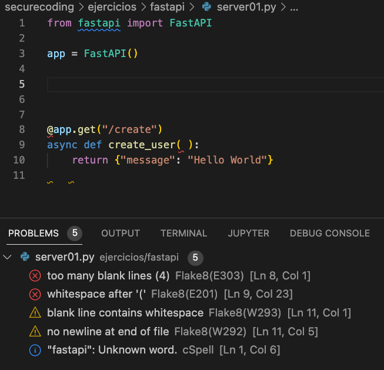
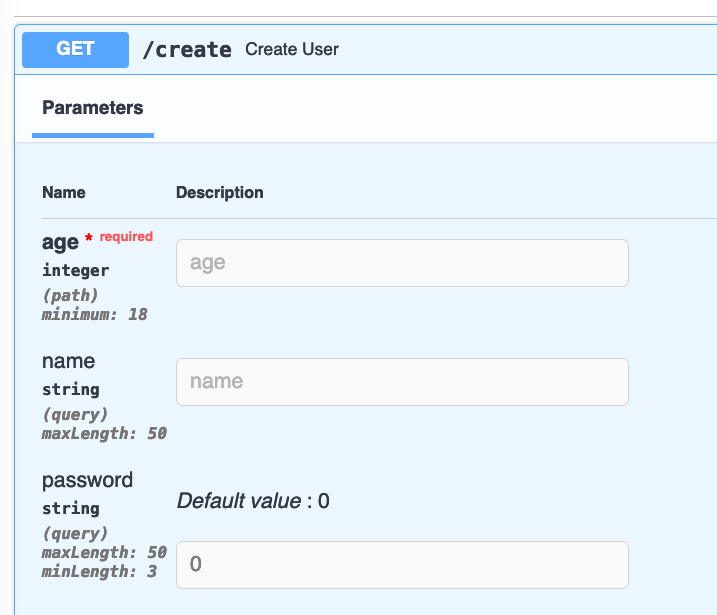

<!--
WARNING: está clase es interactiva. Las transparencias son solo una sugerencia
-->

<style>
    /* You can add custom style here. VSCode supports this.
    Other editor might need these custom code in
    the YAML header: section: | */
</style>

# Buenas Prácticas de Escritura de Código
<!-- _class: first-slide -->

Juan Vera del Campo - <juan.vera@professor.universidadviu.com>

# Como decíamos ayer...

- El Threat Modeling permite identificar amenazas y tratarlas en el momento del diseño
- ¿Podemos mejorar la seguridad de una aplicación simplemente escribiendo buen código?

# Hoy hablamos de...
<!-- _class: cool-list toc -->

1. [Mayores vulnerabilidades de código](#4)
1. [Secure System Design Principles](#14)
1. [Recomendaciones para Python](#25)
1. [Librerías y dependencias](#35)
1. [Proyectos JavaScript / Python](#39)
1. [Ejemplos](#48)
1. [Referencias](#58)

# Mayores vulnerabilidades de código
<!-- _class: lead -->


---


The Open Web Application Security Project® (OWASP) is a nonprofit foundation that works to improve the security of software.

- Tools and Resources
- Community and Networking
- Education & Training


## OWASP: Top 10


<https://owasp.org/www-project-top-ten/>

---


https://www.horangi.com/blog/real-life-examples-of-web-vulnerabilities
https://www.techtarget.com/searchsecurity/news/252494362/10-of-the-biggest-cyber-attacks

## Otros proyectos


OWASP tiene otros proyectos

- API Top 10: https://owasp.org/www-project-api-security/
- Checklist Mobile testing: https://owasp.org/www-project-mobile-security-testing-guide/
- Top 10 en programación de dispositivos móviles <https://owasp.org/www-project-mobile-top-10/>

## Ejemplo: Mobile Application Security


> https://mas.owasp.org/

## Otras recomendaciones: SANS Top25


https://www.sans.org/top25-software-errors/

## Otras recomendaciones: MITRE

<!-- _class: smallest-font -->

https://cwe.mitre.org/index.html

Rank|ID|Name|Score|2020 Rank Change
--|--|--|--|--
[1]|CWE-787|	Out-of-bounds Write|	65.93|+1
[2]|CWE-79|	Improper Neutralization of Input During Web Page Generation ('Cross-site Scripting')|	46.84|	-1
[3]|CWE-125|	Out-of-bounds Read|	24.9|	+1
[4]|CWE-20|	Improper Input Validation|	20.47|	-1
[5]|CWE-78|	Improper Neutralization of Special Elements used in an OS Command ('OS Command Injection')|	19.55|	+5
[6]|CWE-89|	Improper Neutralization of Special Elements used in an SQL Command ('SQL Injection')|	19.54	|0
[7]|CWE-416|	Use After Free|	16.83|	+1
[8]|CWE-22|	Improper Limitation of a Pathname to a Restricted Directory ('Path Traversal')|	14.69	|+4
[9]|CWE-352|	Cross-Site Request Forgery (CSRF)|	14.46	|0
[10]|CWE-434|	Unrestricted Upload of File with Dangerous Type|	8.45|	+5

## Recomendaciones
<!-- _class: two-columns smaller-font -->

1. **Input Validation**: nunca te fíes de tus entradas
    - Tamaño de la entrada
    - Caracteres válidos
    - Formato, tipo (entero, cadena...) -> **Sanitizar**
    - Dentro de valores permitidos (máximos, mínimos...)
    - ¡Existente!
2. **Manejo de secretos**
    - Comprueba que los errores de autenticación no incluyen información
    - Guarda las contraseñas de forma segura en todos los dispositivos
    - Transmite las contraseñas de forma segura
    - https://github.com/OWASP/wrongsecrets

<!-- -->

3. **Least privilege**
    - Valida los permisos en cada petición
    - Crea *tests* que validan permisos
    - Mantén las autorizaciones en el nivel mínimo posible
5. **Gestión de librerías** seguras y probadas
6. **Usable**
7. **Acceso denegado por defecto**
10. **Control de calidad** (ver siguiente temas)


> https://codesigningstore.com/secure-coding-practices-to-implement

## Guías de estilo (linters)

* Tienes que entender el código de otro para poder decidir si es seguro o no
* En dos semanas, no entenderás tu propio código
* Los lenguajes que dan mucha libertad pueden provocar que cada programador escriba de una manera
* Todos los programadores del equipo deben seguir las mismas reglas

Ejemplos:

- https://pep8.org/
- https://google.github.io/styleguide/pyguide.html
- https://sphinxcontrib-napoleon.readthedocs.io/en/latest/example_google.html

<!--
Para forzar las mismas reglas en toda la empresa, puedes utilizar linters: no permitirán que un código compile o se suba a git si no sigue las reglas de la empresa

PEP8 es un ejemplo de reglas. Hay muchos más. Los linters los puedes encontrar para cada lenguaje. Ejemplos en Python: pylama, frake8. Ejemplos en Javascript: eslint
-->

# Secure System Design Principles
<!-- _class: lead -->

"The Protection of Information in Computer Systems", JEROME H. SALTZER and MICHAEL D. SCHROEDER, 1974

## Bad example in C#

https://www.codeproject.com/Articles/1083348/Csharp-Bad-Practices-Learn-How-to-Make-Good-Code-b

https://twitter.com/LiveOverflow/status/1729798452094128278

<!--
Los ejemplos de esta página son una buena introducción a las "reglas de oro" que se discuten en el resto de la sesión. Es muy recomendable visitar esa página durante la sesión, y los alumnos después de ella.
-->

## Sistemas simples

*As systems get more complex, security will get worse* (Bruce Schneier)

*Keeping it simple, stupid!* (simpler said than done)

- Diseños lo más simples y pequeños posible (Principio KISS)
- Reducir el número de componentes utilizados, conservando sólo aquellos que sean esenciales
- Servicios y aplicaciones deshabilitados de forma predeterminada

- CWE:
    - https://cwe.mitre.org/data/definitions/561.html
    - https://cwe.mitre.org/data/definitions/637.html

> https://es.wikipedia.org/wiki/Principio_KISS

## Best practices y linters

- Verifica que todos los datos recibidos cumplan con las propiedades o tipos de datos esperados
- Mucho cuidado con permitir entender las entras como código
- Top 10 de OWASP y SANS

- CWE:
    - https://cwe.mitre.org/data/definitions/710.html
    - https://cwe.mitre.org/data/definitions/1006.html

## Secure by default

La situación por defecto tiene que ser "acceso prohibido"

Ejemplo:

- No permitas acceso sin autenticación
- No des información de tus usarios a personas no autenticadas
- Gestión de contraseñas por defecto
- Usa cifrado por defecto
- Configuraciones seguras por defecto

- CWE:
    - https://cwe.mitre.org/data/definitions/276.html
    - https://cwe.mitre.org/data/definitions/636.html

## Complete Mediation

- Para cada acceso a cada objeto verifica que el usuario tiene los permisos adecuado
- Verificar los permisos implica que el usuario está autenticado en el sistema

- CWE:
    - https://cwe.mitre.org/data/definitions/862.html
    - https://cwe.mitre.org/data/definitions/638.html

## Open Design

- La seguridad del sistema no debe depender de su secreto
- Evita la "seguridad por oscuridad"
- En software comercial: reviews internas del código

- CWE:
    - https://cwe.mitre.org/data/definitions/259.html
    - https://cwe.mitre.org/data/definitions/656.html

## Isolated compartments

- Contenedores ue gestionen o impidan la comunicación entre componentes y la fuga de información y el control.
- Restringe la comunicación autorizada entre componentes a rutas observables con interfaces definidas
- Aislamiento de procesos y memoria, particiones de disco, virtualización, protecciones de software, zonas, puertas de enlace, firewalls, docker, kubernetes

- CWE:
    - https://cwe.mitre.org/data/definitions/901.html
    - https://cwe.mitre.org/data/definitions/653.html

## Least Privilege

- Usa los privilegios mínimos necesarios para una tarea y durante el menor tiempo necesario
- Usa revocación de privilegios cuando ya no sean necesarios
- Los roles deben ser revisados, acordados y auditados periódicamente

- CWE:
    - https://cwe.mitre.org/data/definitions/269.html
    - https://cwe.mitre.org/data/definitions/250.html

## Evidence Production

- Registra las actividades del sistema
- Deben existir controles suficientes para que se pueda hacer cumplir la responsabilidad de los usuarios y sistemas

- CWE:
    - https://cwe.mitre.org/data/definitions/778.html
    - https://cwe.mitre.org/data/definitions/693.html

## Referencias y resúmenes

- In Defense of Clean Code: 100+ pieces of timeless advice from Uncle Bob : https://dev.to/thawkin3/in-defense-of-clean-code-100-pieces-of-timeless-advice-from-uncle-bob-5flk

- It's probably time to stop recommending Clean Code: https://qntm.org/clean

- https://cwe.mitre.org/data/definitions/1006.html#:~:text=CWE%20CATEGORY%3A%20Bad%20Coding%20Practices&text=If%20a%20program%20is%20complex,are%20buried%20in%20the%20code

- <https://www.redhat.com/en/blog/security-design-security-principles-and-threat-modeling>

- https://github.com/OWASP/DevGuide/blob/master/02-Design/01-Principles%20of%20Security%20Engineering.md

# Recomendaciones para Python
<!-- _class: lead -->

## Recomendaciones para Python

- Always sanitize external data
- Scan your code
- Be careful when downloading packages
- Review your dependency licenses
- Do not use the system standard version of Python
- Use Python’s capability for virtual environments
- Set DEBUG = False in production
- Be careful with string formatting
- (De)serialize very cautiously
- Use Python type annotations

> https://snyk.io/blog/python-security-best-practices-cheat-sheet/

## No te fíes de nadie

Siempre tienes que "sanitizar" cualquier *input* del usuario

```python
import os

filename = input('Select a file for deletion: ')
os.system('rm %s')
```

¿Qué pasa si el usario introduce `-rf / ; dd if=/dev/random of=/dev/sda`  ?

---

Mejor:

```python
import os

filename = input('Select a file for deletion: ')
os.remove(filename)
```

Pero...

¿Qué pasa si el usario introduce `*`  ?


<!--
En el caso particular de esta función, no pasa nada: la función no permite atajos de shell. Pero tienes que tenerlo en cuenta para tus funciones∫
-->

## Ataques de templates

```python
import yaml

input = '''
title: Título de Prueba
alumnos:
    - María
    - Eva
    - Alberto
    - Jorge
'''

clase = yaml.load(input, yaml.BaseLoader)
print(clase['alumnos'])

# Salida: ['María', 'Eva', 'Alberto', 'Jorge']
```

---

```python
import yaml

input = '!!python/object/new:sys.exit [42]'
yaml.load(input, Loader=yaml.UnsafeLoader)
```

¿Cuál es la salida de este comando?

> https://theconversation.com/what-is-log4j-a-cybersecurity-expert-explains-the-latest-internet-vulnerability-how-bad-it-is-and-whats-at-stake-173896

<!--
Un ejemplo de esta vulnerabildad que nos tuvo varias semanas pegados a la pantalla en 2021 fue log4j
-->

## Loguea todo

No uses `print()`, sino el módulo *logging* (Java: *log4j*)

```python
import logging

logger = logging.getLogger()
logger.warning('Esto es un mensaje de warning %d', 5)
logger.info('Esto es un mensaje de info')
logger.info('Esto es un mensaje de error')
```

Estas librerías especializadas permiten configurar la salida de log. Por ejemplo: errores consola y archivo, info solo a archivo, colores, incluir fechas...

> https://www.geeksforgeeks.org/logging-in-python/


<!--
Y los logs de aplicación puedes fácilmente centralizarlos en un SIEM
-->

## Pide permisos

Prefiero perdir perdón que permiso:

```python
try:
    file = open(path_to_file)
except PermissionError:
    return None
    with file:
        return file.read()
```

---

Mira antes de cruzar:

```python
if os.path(path_to_file, os.R_OK):
    with open(Path_to_file) as file:
        return file.read()
return None
```

<!--
Ambas son buenas soluciones, depende de tus preferencias. Pero tienes que implementar alguna de ellas
-->

## Archivos temporales

No los gestiones tú: usa las librerías del propio lenguaje

```python
from tempfile import TemporaryFile

with TemporaryFile() as tmp:
    tmp.write(...)
```

No hagas:

```python
with open('borrame.temp') as tmp:
    tmp.write(...)
os.unlink('borrame.temp')
```

> https://rules.sonarsource.com/python/type/Vulnerability/RSPEC-5445

<!--
Fíjate: en caso de error en el segundo ejemplo, el archivo no se borrará nunca. Además, el programa no puede ejecutarse en paralelo: dos ejecuciones concurrentes trabajarán sobre el mismo archivo.
-->


# Librerías y dependencias
<!-- _class: lead -->

## ¡No reinventes la rueda!

- No reinvientes la rueda: utiliza librerías reconocidas siempre que puedas
- Pero recuerda auditar tus librerías
- Considera utilizar contextos para la aplicación:
  - JavaScript: npm / yarn
  - Python: pip / conda / pipenv


## Audita tus librerías / dependencias

- https://www.bleepingcomputer.com/news/security/pytorch-discloses-malicious-dependency-chain-compromise-over-holidays/
- https://blog.reversinglabs.com/blog/the-npm-package-that-walked-away-with-all-your-passwords
- https://arstechnica.com/information-technology/2022/08/10-malicious-python-packages-exposed-in-latest-repository-attack/
- https://portswigger.net/daily-swig/popular-node-js-package-vulnerable-to-command-injection-attacks
- https://blog.sonatype.com/open-source-attacks-on-the-rise-top-8-malicious-packages-found-in-npm

## Cuidado con la inteligengia artificial
<!-- _class: with-warning -->

Asistentes de código:

- ChatGPT, escribe código a partir de lenguaje natural
- CoPilot, propone código a partir de un esqueleto que escribimos nosotros


ChatGPT propone código con SQL Injection y CoPilot mete vulnerabilidades

> https://www.elladodelmal.com/2022/12/chatgpt-hace-codigo-con-sql-injection.html?m=1
> https://www.elladodelmal.com/2022/09/copilot-y-su-codigo-inseguro-o-como-la.html

# Proyectos JavaScript / Python
<!-- _class: lead -->

---

En esta sección crearemos un proyecto Vue directamente dentro de un docker. Esta no es la manera recomendada de crear proyectos Vue, pero lo haremos así para no tener que instalar más cosas en nuestros PCs.

## Creación del proyecto

```
docker run -ti --rm node bash
mkdir project ; cd project∫
npm install vue
npm install vuetify
npm install vuetify@^3.0.1
npm install eslint
ls node_modules
npm audit
```

<!--
Esta transparencia la veremos con comandos reales, está aquí solo para referencia
-->

## Archivo package.json (JavaScript)

- Incluye metadados del proyecto
- Lista dependencias, con las versiones exactas
- Ventajas: es reproducible en cualquier PC
- Desventajas: ocupa mucho más espacio en disco

---


---

Ejemplos:

- https://medium.com/@alex.birsan/dependency-confusion-4a5d60fec610
- https://www.theverge.com/2022/1/9/22874949/developer-corrupts-open-source-libraries-projects-affected
- https://www.bleepingcomputer.com/news/security/dev-corrupts-npm-libs-colors-and-faker-breaking-thousands-of-apps/

## Archivo Package y Package.lock (Python)

```
"biplist": {
    "hashes": [
    "sha256:4c0549764c5fe50b28042ec21aa2e14fe1a2224e239a1dae77d9e7f3932aa4c6"
    ],
    "index": "pypi",
    "version": "==1.0.3"
  },
```

---


## Auditoría de librerías

```
npm audit
```


# Ejemplos
<!-- _class: lead -->

---



---

```python
from fastapi import FastAPI
import sqlite3

app = FastAPI()


@app.get("/create")
async def create(name, password):
    conn = sqlite3.connect('users.db')
    sql = f'INSERT INTO users(name,password) VALUES("{name}","{password}")'
    cur = conn.cursor()
    cur.execute(sql)
    conn.commit()
    return {"message": f"I created user {name}"}
```

Problemas:

* SQL injection
* Los errores no se manejan
* Contraseñas en claro

---

```python
from fastapi import FastAPI
import sqlite3
import bcrypt

app = FastAPI()


@app.get("/create")
async def create(name, password):
    conn = sqlite3.connect('users.db')
    sql = 'INSERT INTO users(name,password) VALUES(?,?)'
    hashed = bcrypt.hashpw(password.encode(), bcrypt.gensalt())
    cur = conn.cursor()
    cur.execute(sql, (name, hashed))
    conn.commit()
    return {"message": f"I created user {name}"}
```

Problemas:

* Los errores no se manejan
* Código poco legible

---

```python
from fastapi import FastAPI
import sqlite3
import bcrypt

app = FastAPI()


class User:
    def __init__(self, name, password):
        self.name = name
        self.hashed = bcrypt.hashpw(password.encode(), bcrypt.gensalt())
    
    def check(self, password):
        return bcrypt.checkpw(password.encode, self.hashed)
    
    def create(self):
        # TODO: check uniqueness
        conn = sqlite3.connect('users.db')
        sql = 'INSERT INTO users(name,password) VALUES(?,?)'
        cur = conn.cursor()
        cur.execute(sql, (self.name, self.hashed))
        conn.commit()        


@app.get("/create")
async def create(name, password):
    user = User(name, password)
    user.create()
    return {"message": f"I created user {name}"}
```

Problemas:

- No hay validación de entrada

---

```python
@app.get("/create")
async def create_user(
        name: str = Query(max_length=50, default=None),
        password: str = Query(min_length=3, max_length=50, default=0),
        age: int = Path(title="The age of the new user", ge=18, default=0)):
    user = User(name, password)
    user.create()
    return {"message": f"I created user {name}"}
```

- Ejecución: `uvicorn server05:app --reload`
- Visita: `localhost:8000/help`
- Problemas: cualquiera puede crear un nuevo usuario

---



---

```python
def get_current_username(
    credentials: Annotated[HTTPBasicCredentials, Depends(security)]
):
    current_username_bytes = credentials.username.encode("utf8")
    correct_username_bytes = b"stanleyjobson"
    is_correct_username = secrets.compare_digest(
        current_username_bytes, correct_username_bytes
    )
    current_password_bytes = credentials.password.encode("utf8")
    correct_password_bytes = b"swordfish"
    is_correct_password = secrets.compare_digest(
        current_password_bytes, correct_password_bytes
    )
    if not (is_correct_username and is_correct_password):
        raise HTTPException(
            status_code=status.HTTP_401_UNAUTHORIZED,
            detail="Incorrect email or password",
            headers={"WWW-Authenticate": "Basic"},
        )
    return credentials.username
```

> https://fastapi.tiangolo.com/advanced/security/http-basic-auth/#__tabbed_3_1

---


---


## Referencias
<!-- _class: lead -->

---

- https://brightsec.com/blog/xss-attack/
- https://www.securecoding.com/blog/best-python-open-source-security-tools/
- https://snyk.io/blog/python-security-best-practices-cheat-sheet/
- [Do Users Write More Insecure Code with AI Assistants?](https://arxiv.org/pdf/2211.03622.pdf), Universidad de Stanford. 16 de diciembre 2022
- [Asleep at the Keyboard? Assessing the
Security of GitHub Copilot’s Code Contribution](https://arxiv.org/pdf/2108.09293.pdf), diciembre 2021
- https://rules.sonarsource.com/

# ¡Gracias!
<!-- _class: last-slide --> 
