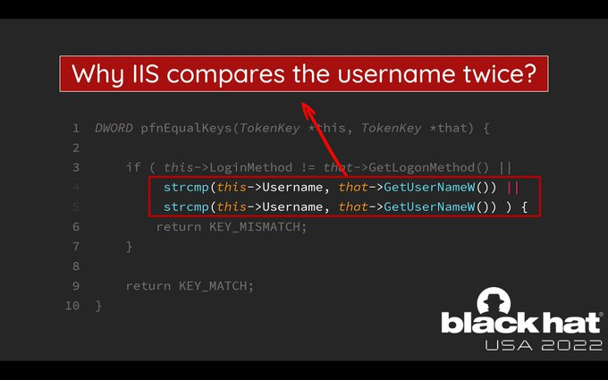

<!--
WARNING: está clase es interactiva. Las transparencias son solo una sugerencia
-->

<style>
    /* You can add custom style here. VSCode supports this.
    Other editor might need these custom code in
    the YAML header: section: | */
</style>

# Buenas Prácticas de Escritura de Código
<!-- _class: first-slide -->

Juan Vera del Campo

<juan.vera@campusviu.es>

# Como decíamos ayer...

- El Thread Modeling permite planificar amenazas y tratarlas en el momento del diseño
- ¿Podemos mejorar la seguridad de una aplicación simplemente escribiendo buen código?

# Hoy hablamos de...
<!-- _class: cool-list toc -->

1. [Clean Code](#4)
1. [Programación segura](#13)
1. [Librerías y dependencias](#23)
1. [Ejemplos: proyectos JavaScript / Python](#27)
1. [Ejemplos](#35)
1. [Referencias](#44)

# Clean Code
<!-- _class: lead -->

## Bad example in C#

https://www.codeproject.com/Articles/1083348/Csharp-Bad-Practices-Learn-How-to-Make-Good-Code-b

<!--
Los ejemplos de esta página son una buena introducción a las "reglas de oro" que se discuten en el resto de la sesión. Es muy recomendable visitar esa página durante la sesión, y los alumnos después de ella.
-->

## Reglas de oro

* Tienes que entender el código de otro para poder decidir si es seguro o no
* En dos semanas, no entenderás tu propio código
* Los lenguajes que dan mucha libertad pueden provocar que cada programador escriba de una manera
* Todos los programadores del equipo deben seguir las mismas reglas

Siguen recetas del libro "Clean Code" de Robert C. Martin.

## Guías de estilo

Ejemplos:

- https://pep8.org/
- https://google.github.io/styleguide/pyguide.html
- https://sphinxcontrib-napoleon.readthedocs.io/en/latest/example_google.html

<!--
Para forzar las mismas reglas en toda la empresa, puedes utilizar linters: no permitirán que un código compile o se suba a git si no sigue las reglas de la empresa

PEP8 es un ejemplo de reglas. Hay muchos más. Los linters los puedes encontrar para cada lenguaje. Ejemplos en Python: pylama, frake8. Ejemplos en Javascript: eslint
-->

## Nombres de variables

- Usa nombres que tengan sentido: `gameBoard` mejor que `theList`.
- Evita información incorrecta: no uses `accountList` si no es una lista `List`.
- Distingue perfectamente el nombre de las variables. No uses: `getActiveAccount`, `getActiveAccounts` y `getActiveAccountInfo`.
- Usa nombres que sean pronuncialbes
- Usa nombres que puedan buscarse: `i`, `7` no pueden buscarse. `counter`, `MAX_NUMBER` sí.
- Los nombres de clases son sustantivos
- Las funciones son verbos: `get`, `set` and `is`.
- Nomenclatura contante: fetch, retrieve or get? controller or manager?

# Funciones

- No más de 20 líneas
- No más de uno o dos niveles de indentación
- La función debe hacer solo una cosa
- Usa nombres descriptivos
- Evita parámetros "bandera"
- Prefiere excepciones a devolver códigos de error

# Comentarios

- Los comentarios no compensan un mal código. Mejora el código antes que los comentarios
- "Código autoexplicativo" (pero con cuidado)

--- 

Buenos comentarios:

- comentarios legales autor/licencia
- informativos sobre las intenciones
- clarificaciones sobre excepciones o por qué las cosas se hacen de una forma determinada que no es obvia
- TODO
- amplificación de la importancia de una línea (probablemente, por malas experiencias)
- **APIs**

---

Malos comentarios:

- Redundantes
- Falsos
- Sobre la historia del código
- Avisando de dónde acaba una sección: eso es que es demasiado larga
- Atribuciones: git blame!
- Código comentado

# Programación segura
<!-- _class: lead -->

## Recomendaciones para Python

- Always sanitize external data
- Scan your code
- Be careful when downloading packages
- Review your dependency licenses
- Do not use the system standard version of Python
- Use Python’s capability for virtual environments
- Set DEBUG = False in production
- Be careful with string formatting
- (De)serialize very cautiously
- Use Python type annotations

> https://snyk.io/blog/python-security-best-practices-cheat-sheet/

## No te fíes de nadie

Siempre tienes que "sanitizar" cualquier *input* del usuario

```python
import os

filename = input('Select a file for deletion: ')
os.system('rm %s')
```

¿Qué pasa si el usario introduce `-rf / ; dd if=/dev/random of=/dev/sda`  ?

---

Mejor:

```python
import os

filename = input('Select a file for deletion: ')
os.remove(filename)
```

Pero...

¿Qué pasa si el usario introduce `*`  ?


<!--
En el caso particular de esta función, no pasa nada: la función no permite atajos de shell. Pero tienes que tenerlo en cuenta para tus funciones∫
-->

## Ataques de templates

```python
import yaml

input = '''
title: Título de Prueba
alumnos:
    - María
    - Eva
    - Alberto
    - Jorge
'''

clase = yaml.load(input, yaml.BaseLoader)
print(clase['alumnos'])

# Salida: ['María', 'Eva', 'Alberto', 'Jorge']
```

---

```python
import yaml

input = '!!python/object/new:sys.exit [42]'
yaml.load(input, Loader=yaml.UnsafeLoader)
```

¿Cuál es la salida de este comando?

> https://theconversation.com/what-is-log4j-a-cybersecurity-expert-explains-the-latest-internet-vulnerability-how-bad-it-is-and-whats-at-stake-173896

<!--
Un ejemplo de esta vulnerabildad que nos tuvo varias semanas pegados a la pantalla en 2021 fue log4j
-->

## Loguea todo

No uses `print()`, sino el módulo *logging* (Java: *log4j*)

```python
import logging

logger = logging.getLogger()
logger.warning('Esto es un mensaje de warning %d', 5)
logger.info('Esto es un mensaje de info')
logger.info('Esto es un mensaje de error')
```

Estas librerías especializadas permiten configurar la salida de log. Por ejemplo: errores consola y archivo, info solo a archivo, colores, incluir fechas...

> https://www.geeksforgeeks.org/logging-in-python/


<!--
Y los logs de aplicación puedes fácilmente centralizarlos en un SIEM
-->

## Pide permisos

Prefiero perdir perdón que permiso:

```python
try:
    file = open(path_to_file)
except PermissionError:
    return None
    with file:
        return file.read()
```

---

Mira antes de cruzar:

```python
if os.path(path_to_file, os.R_OK):
    with open(Path_to_file) as file:
        return file.read()
return None
```

<!--
Ambas son buenas soluciones, depende de tus preferencias. Pero tienes que implementar alguna de ellas
-->

## Archivos temporales

No los gestiones tú: usa las librerías del propio lenguaje

```python
from tempfile import TemporaryFile

with TemporaryFile() as tmp:
    tmp.write(...)
```

No hagas:

```python
with open('borrame.temp') as tmp:
    tmp.write(...)
os.unlink('borrame.temp')
```

> https://rules.sonarsource.com/python/type/Vulnerability/RSPEC-5445

<!--
Fíjate: en caso de error en el segundo ejemplo, el archivo no se borrará nunca. Además, el programa no puede ejecutarse en paralelo: dos ejecuciones concurrentes trabajarán sobre el mismo archivo.
-->


# Librerías y dependencias
<!-- _class: lead -->

## ¡No reinventes la rueda!

- No reinvientes la rueda: utiliza librerías reconocidas siempre que puedas
- Pero recuerda auditar tus librerías
- Considera utilizar contextos para la aplicación:
  - JavaScript: npm / yarn
  - Python: pip / conda / pipenv


## Audita tus librerías / dependencias

- https://www.bleepingcomputer.com/news/security/pytorch-discloses-malicious-dependency-chain-compromise-over-holidays/
- https://blog.reversinglabs.com/blog/the-npm-package-that-walked-away-with-all-your-passwords
- https://arstechnica.com/information-technology/2022/08/10-malicious-python-packages-exposed-in-latest-repository-attack/
- https://portswigger.net/daily-swig/popular-node-js-package-vulnerable-to-command-injection-attacks
- https://blog.sonatype.com/open-source-attacks-on-the-rise-top-8-malicious-packages-found-in-npm

## Cuidado con la inteligengia artificial
<!-- _class: with-warning -->

Asistentes de código:

- ChatGPT, escribe código a partir de lenguaje natural
- CoPilot, propone código a partir de un esqueleto que escribimos nosotros


ChatGPT propone código con SQL Injection y CoPilot mete vulnerabilidades

> https://www.elladodelmal.com/2022/12/chatgpt-hace-codigo-con-sql-injection.html?m=1
> https://www.elladodelmal.com/2022/09/copilot-y-su-codigo-inseguro-o-como-la.html

# Ejemplos: proyectos JavaScript / Python
<!-- _class: lead -->

---

En esta sección crearemos un proyecto Vue directamente dentro de un docker. Esta no es la manera recomendada de crear proyectos Vue, pero lo haremos así para no tener que instalar más cosas en nuestros PCs.

## Creación del proyecto

```
docker run -ti --rm node bash
mkdir project ; cd project∫
npm install vue
npm install vuetify
npm install vuetify@^3.0.1
npm install eslint
ls node_modules
npm audit
```

<!--
Esta transparencia la veremos con comandos reales, está aquí solo para referencia
-->

## Archivo package.json (JavaScript)

- Incluye metadados del proyecto
- Lista dependencias, con las versiones exactas
- Ventajas: es reproducible en cualquier PC
- Desventajas: ocupa mucho más espacio en disco

---


## Archivo Package y Package.lock (Python)

```
"biplist": {
    "hashes": [
    "sha256:4c0549764c5fe50b28042ec21aa2e14fe1a2224e239a1dae77d9e7f3932aa4c6"
    ],
    "index": "pypi",
    "version": "==1.0.3"
  },
```

---


## Auditoría de librerías

```
npm audit
```


# Ejemplos
<!-- _class: lead -->

---


---

```python
from fastapi import FastAPI
import sqlite3

app = FastAPI()


@app.get("/create")
async def create(name, password):
    conn = sqlite3.connect('users.db')
    sql = f'INSERT INTO users(name,password) VALUES("{name}","{password}")'
    cur = conn.cursor()
    cur.execute(sql)
    conn.commit()
    return {"message": f"I created user {name}"}
```

Problemas:

* SQL injection
* Los errores no se manejan
* Contraseñas en claro

---

```python
from fastapi import FastAPI
import sqlite3
import bcrypt

app = FastAPI()


@app.get("/create")
async def create(name, password):
    conn = sqlite3.connect('users.db')
    sql = 'INSERT INTO users(name,password) VALUES(?,?)'
    hashed = bcrypt.hashpw(password.encode(), bcrypt.gensalt())
    cur = conn.cursor()
    cur.execute(sql, (name, hashed))
    conn.commit()
    return {"message": f"I created user {name}"}
```

Problemas:

* Los errores no se manejan
* Código poco legible

---

```python
from fastapi import FastAPI
import sqlite3
import bcrypt

app = FastAPI()


class User:
    def __init__(self, name, password):
        self.name = name
        self.hashed = bcrypt.hashpw(password.encode(), bcrypt.gensalt())
    
    def check(self, password):
        return bcrypt.checkpw(password.encode, self.hashed)
    
    def create(self):
        # TODO: check uniqueness
        conn = sqlite3.connect('users.db')
        sql = 'INSERT INTO users(name,password) VALUES(?,?)'
        cur = conn.cursor()
        cur.execute(sql, (self.name, self.hashed))
        conn.commit()        


@app.get("/create")
async def create(name, password):
    user = User(name, password)
    user.create()
    return {"message": f"I created user {name}"}
```

Problemas:

- No hay validación de entrada

---

```python
@app.get("/create")
async def create_user(
        name: str = Query(max_length=50, default=None),
        password: str = Query(min_length=3, max_length=50, default=0),
        age: int = Path(title="The age of the new user", ge=18, default=0)):
    user = User(name, password)
    user.create()
    return {"message": f"I created user {name}"}
```

- Ejecución: `uvicorn server05:app --reload`
- Visita: `localhost:8000/help`

---


---



---


## Referencias
<!-- _class: lead -->

---

- https://brightsec.com/blog/xss-attack/
- https://www.securecoding.com/blog/best-python-open-source-security-tools/
- https://snyk.io/blog/python-security-best-practices-cheat-sheet/
- [Do Users Write More Insecure Code with AI Assistants?](https://arxiv.org/pdf/2211.03622.pdf), Universidad de Stanford. 16 de diciembre 2022
- [Asleep at the Keyboard? Assessing the
Security of GitHub Copilot’s Code Contribution](https://arxiv.org/pdf/2108.09293.pdf), diciembre 2021
- https://rules.sonarsource.com/

---
<!-- _class: center -->

Continúa en: [Quality Assurance](03-quality.html)

# ¡Gracias!
<!-- _class: last-slide --> 
