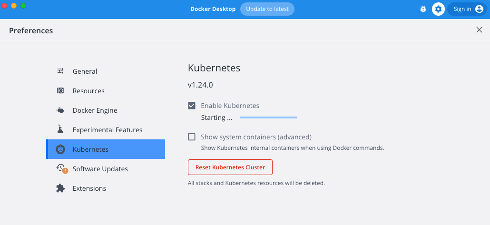
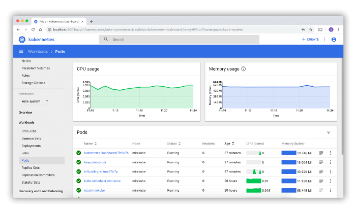

<style>
    /* You can add custom style here. VSCode supports this.
    Other editor might need these custom code in
    the YAML header: section: | */
</style>

# Distribución de aplicaciones: contenedores y microservicios
<!-- _class: first-slide -->

Juan Vera del Campo - <juan.vera@professor.universidadviu.com>

# Hoy hablamos de...
<!-- _class: cool-list toc -->

1. [De aplicaciones a contenedores](#3)
1. [Contenedores Docker](#13)
1. [Orquestadores](#17)
1. [Kubernetes](#23)
1. [Referencias](#40)

# De aplicaciones a contenedores
<!-- _class: lead -->

---


## Containers: máquinas de usar y tirar

- Los **containers** se crean y se destruyen fácilmente
- Puedes volver a ejecutar la **image** en la que están basados
- Los datos persistentes se guardan en **volúmenes**
- Puedes crear **networks** aisladas (o no) para comunicar los containers entre sí


## ¿Qué es un contenedor?

Es como una máquina virtual... pero no


> https://www.ubuntupit.com/everything-you-need-to-know-about-linux-containers-lxc/

## Ventajas de los contenedores

- Comparado con VMs: más rápidos de empezar y acabar
- Seguridad:
    - Sistema aislado: solo ven la parte del sistema que les dejas ver
    - Pueden conectarse entre ellos
- Portabilidad: arregla "en mi PC funciona":
    - Gestión de "snapshots"
    - Dependencias "autocontenidas"
    - Fácil instalación y compartición
---
<!-- _class: with-success -->

- Auditable:
    - Inicio rápido y consistente
    - Descritos en un archivo de texto que puede auditarse fácilmente
    - Gestión del ciclo de vida
- Escalabilidad:
    - Pueden crearse y destruirse rápidamente
    - PUeden conectarse entre ellos
- Tolerancia a fallos:
    - El gestor de contenedores detecta cuándo uno ha fallado y lo reinicia automáticamente

Los contenedores son ideales para microservicios

## Microservicios

Uso de múltiples componentes de software independientes para crear una aplicación

Ejemplo: contenedores para:

- Base de datos
- Proxy SSL
- Balanceador
- Frontend web
- API

---


> https://online.visual-paradigm.com/diagrams/templates/ibm-cloud-architecture-diagram/microservices-diagram/

## Desventajas de los contenedores

- Un contenedor no es una máquina virtual: si un atacante "escapa", tiene acceso a todo el sistema
- Un contenedor puede estar desactualizado
- Puede tener sus propios problemas de seguridad

## Terminología

- **Imágenes**: "snapshot" de un sistema. Es el "estado inicial" de un contenedor
- **Contenedor**: un sistema ejecutándose
- **Volumen**: "pendrive" o "carpeta compartida" entre sistemas. Se usa para persistencia y configuraciones


# Contenedores Docker
<!-- _class: lead -->

---

Seguimos en:

<https://github.com/Juanvvc/securecoding/blob/main/ejercicios/docker/04-docker.ipynb>

## Ciclo de vida de un contenedor


> https://faun.pub/introduction-to-docker-life-cycle-3bf3aeba883

## ¿Cómo organizamos todo esto?


- Aplicaciones simples: docker-compose
- Aplicaciones complejas: Orquestadores

# Orquestadores
<!-- _class: lead -->

## Orquestadores

- Provisión y despliegue
- Redundancia y escalado
- Elasticidad
- Redes
- Balanceador de carga
- Monitorización de salud
- Gestión centralizado de configuración: compliance, auditability

## Más populares

- Kubernetes:
    - "Núcleo Linux" para sistemas distribuidos
- Docker Swarm:
    - Respuesta de Docker a la orquestación de contenedores
- Mesos
    - Manejador de clúster
    - Frameworks (Marathon) para equiparar con Swarm y Kubernetes


> https://betterstack.com/community/guides/scaling-docker/docker-swarm-kubernetes/


---


---


## Seguridad

- Los contenedores se crean muy rápido, y es posible cometer errores de configuración, bugs o librerías desactualizadas
- Pérdida de visibilidad de dónde está cada recurso de la empresa
- Monitorización de cientos de contenedores parar errors de seguridad
- Tecnología cambiante y nueva que necesita de nuevas habilidades

> https://www.veritas.com/blogs/the-10-biggest-challenges-of-deploying-containers
> https://www.sentinelone.com/cybersecurity-101/cloud-security/container-security-best-practices/
> https://iterasec.com/blog/container-security-vulnerabilities/

# Kubernetes
<!-- _class: lead -->

## Kubernetes / K8s

- Sistema de código libre para la automatización del despliegue, ajuste de escala y manejo de aplicaciones en contenedores
- Originalmente diseñado por Google 
- Actualmente gestionado por la Cloud Native Computing Foundation (parte de la Linux Foundation)
- Soporta diferentes entornos para la ejecución de contenedores
    - docker. Deprecated en la versión 1.24, puede usarse a través de cri-dockerd
    - containerd
    - CRI-O

---


---


> https://www.youtube.com/watch?v=Rl5M1CzgEH4

## Docker y Kubernetes



## Interfaces
<!-- _class: two-columns -->

```
19:32 securecoding $ kubectl cluster-info
Kubernetes control plane is running at
https://kubernetes.docker.internal:6443

CoreDNS is running at
https://kubernetes.docker.internal:6443/api/v1/
namespaces/kube-system/services/kube-dns:dns/proxy

To further debug and diagnose cluster problems, use 'kubectl cluster-info dump'.
19:32 securecoding $ kubectl get pod     
NAME                                  READY   STATUS    RESTARTS       AGE
kubernetes-bootcamp-d9b4bdd78-trhhh   1/1     Running   1 (114s ago)   26h
```

```yaml
apiVersion: apps/v1
kind: Deployment
metadata:
  name: nginx-deployment
spec:
  selector:
    matchLabels:
      app: nginx
  minReadySeconds: 5
  template:
    metadata:
      labels:
        app: nginx
    spec:
      containers:
      - name: nginx
        image: nginx:1.14.2
        ports:
        - containerPort: 80
```

---



## Control plane


- kube-apiserver:
    - Punto de interactuación
- etcd:
    - Almacenamiento distribuido interno
    - Sólo accesible por kube-apiserver
- kube-control-manager
    - Director de orquesta
- kube-scheduler
    - Decide dónde se despliegan los "pods"

## Node

- Máquina que ejecuta pods
- kubelet
    - Agente en cada nodo, incluído el maestro
- kube-proxy
    - Comuniaciones entre contenedores y sistema
- Motor de contenedores
    - Containerd (Docker)
    - Rkt (CoreOS)
    - y otros


## Pod

- Unidad mínima de trabajo
- Puede contener uno o más contenedores
- Similar a un solo docker-compose


> https://kubernetes.io/docs/tutorials/kubernetes-basics/explore/explore-intro/

---


## Health checks

- Liveness
    - Indica si un pod está vivo y en buenas condiciones
    - Kubernetes reinicia el pod si no este falla
- Readiness
    - Indica si el pod está listo para recibir tráfico
    - Kubernetes no manda tráfico hasta que éste esté listo
- Startup
    - Usado para pods lentos (arranque)
    - Kubernetes no comprueba los otros checks

## Labels y filters

Puedes asignar labels a los pods, para seleccionarlos desde otros pods

- Basados en igualdad
- Basados en expresiones


## Redes

- Redes de "pods"
    - Red dentro del clúster para la comunicación entre Pods
    - CNI (Container Network Interface) plugin
- Redes de servicios
    - Red dentro del clúster de IPs virtuales usadas por kube-
proxy para la localización de servicios (Service Discovery)

---

- Todos los contenedores en un Pod se pueden comunicar entre ellos sin ningún tipo de restricción
- Todos los Pods se pueden comunicar entre ellos sin usar NAT
- Todos los nodos se pueden comunicar con todos los Pods y viceversa sin NAT

## Servicios

Forma de acceder a los Pods desde el exterior

- Son “duraderos”
- IP estática y única del clúster
- Nombre de dominio (DNS) estático y único
- Apuntan a los Pods usando selectores de igualdad
- Actúan como simples balanceadores de carga a través de kube-proxy
- kube-proxy se encarga de modificar las iptables de los nodos para crear una entrada local por cada servicio
- Puedes configurar que siempre hayan 3 pods atendiendo a un servicio
- Los servicios regeneran los pods que caen

---


# Referencias
<!-- _class: lead -->

---


- [Tutorial de Docker](https://docs.docker.com/get-started/)
- [The evolution of containers: Docker, Kubernetes and the future](https://www.techtarget.com/searchitoperations/feature/Dive-into-the-decades-long-history-of-container-technology)
- [Kubernetes Tutorial](https://kubernetes.io/es/docs/tutorials/), intereactivo y muy recomendable
- [The Kubernetes Learning Slides](https://docs.google.com/presentation/d/13EQKZSQDounPC1I6EC4PmqaRmdCrpT3qswQJz9KRCyE/edit#slide=id.g7cd09fc403_101_0), con muchos recursos, explicaciones y sobre todo enlaces a documentación más extensa
- [CI/CD Pipelines with Kubernetes | Best Practices and Tools](https://www.containiq.com/post/cicd-pipelines-with-kubernetes)

# ¡Gracias!
<!-- _class: last-slide -->