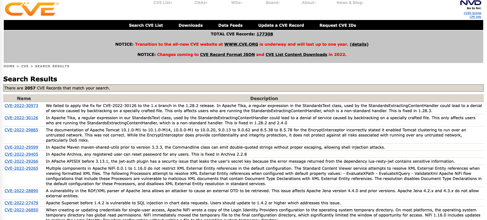
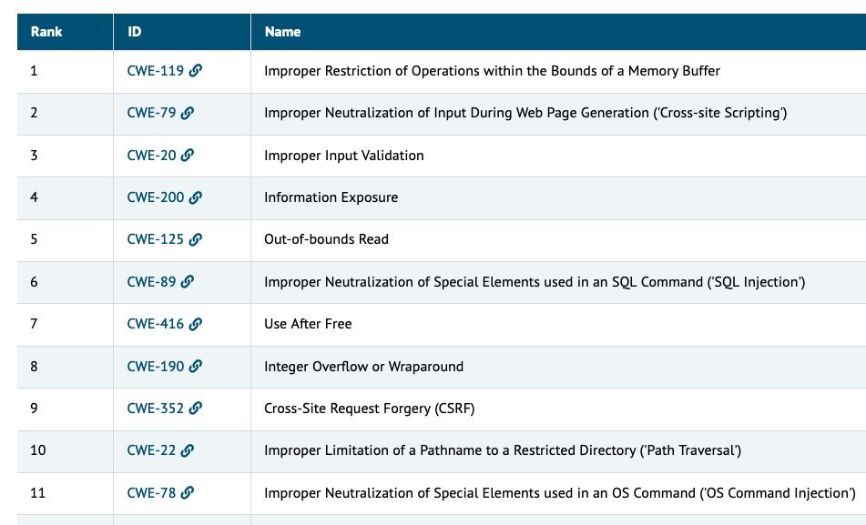
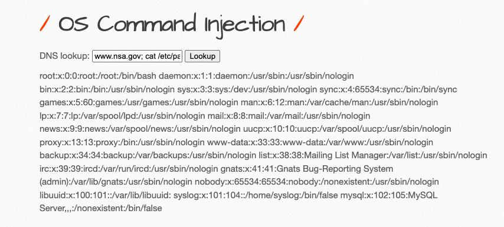

<style>
    /* You can add custom style here. VSCode supports this.
    Other editor might need these custom code in
    the YAML header: section: | */
</style>

# Quality Assurance
<!-- _class: first-slide -->

Juan Vera del Campo

<juan.vera@campusviu.es>

# Como decíamos ayer...

- El Thread Modeling permite planificar amenazas y tratarlas en el momento del diseño
- ¿Podemos seguir comprobando la seguridad en el momento de la ejecución?

# Hoy hablamos de...
<!-- _class: cool-list -->

1. [Quality Assurance](#4)
1. [OWASP](#9)
1. [Otras recomendaciones](#15)
1. [Demos](#33)
1. [Referencias y ejercicio](#22)

# Quality Assurance
<!-- _class: lead -->

## Escaneos de vulnerabilides

- Software especializado en búsqueda de vulnerabilidades
- Software que CONOCE vulnerabilidades y escanea tus sistemas
- Escaneos automáticos

Ejemplos: https://owasp.org/www-community/Vulnerability_Scanning_Tools

---

Problemas:

- Solo se escanea lo que el sofware conoce
- Se conoce el estado de un sistema en un momento concreto del tiempo

## Pentesting

- Externalizar el escaneo: empresas especializadas


## CVE: Identify, define, and catalog publicly disclosed cybersecurity vulnerabilities.



https://cve.mitre.org/cgi-bin/cvekey.cgi?keyword=apache

# OWASP
<!-- _class: lead -->


---


The Open Web Application Security Project® (OWASP) is a nonprofit foundation that works to improve the security of software.

- Tools and Resources
- Community and Networking
- Education & Training


## OWASP: Top 10


<https://owasp.org/www-project-top-ten/>

---


## Otros proyectos


OWASP tiene otros proyectos

- API Top 10: https://owasp.org/www-project-api-security/
- Checklist Mobile testing: https://owasp.org/www-project-mobile-security-testing-guide/
- Top 10 en programación de dispositivos móviles <https://owasp.org/www-project-mobile-top-10/>

---


# Otras recomendaciones
<!-- _class: lead -->

---



https://www.sans.org/top25-software-errors/

---
<!-- _class: smallest-font -->

Rank|ID|Name|Score|2020 Rank Change
--|--|--|--|--
[1]|CWE-787|	Out-of-bounds Write|	65.93|+1
[2]|CWE-79|	Improper Neutralization of Input During Web Page Generation ('Cross-site Scripting')|	46.84|	-1
[3]|CWE-125|	Out-of-bounds Read|	24.9|	+1
[4]|CWE-20|	Improper Input Validation|	20.47|	-1
[5]|CWE-78|	Improper Neutralization of Special Elements used in an OS Command ('OS Command Injection')|	19.55|	+5
[6]|CWE-89|	Improper Neutralization of Special Elements used in an SQL Command ('SQL Injection')|	19.54	|0
[7]|CWE-416|	Use After Free|	16.83|	+1
[8]|CWE-22|	Improper Limitation of a Pathname to a Restricted Directory ('Path Traversal')|	14.69	|+4
[9]|CWE-352|	Cross-Site Request Forgery (CSRF)|	14.46	|0
[10]|CWE-434|	Unrestricted Upload of File with Dangerous Type|	8.45|	+5

http://cwe.mitre.org/top25/archive/2021/2021_cwe_top25.html

# Demos
<!-- _class: lead -->

## Bwapp


- Aplicación web con múltiples problemas de seguridad
- ¡No incluye explicaciones!
- Tres niveles de dificultad

http://www.itsecgames.com/

---

1. `docker run --rm -p 80:80 raesene/bwapp`
1. Go to: <http://localhost/install.php> and click on "install"

## WebGoat


- Web de aprendizaje de OWASP
- Incluye lecciones y ejercicios de la lista de OWASP

https://owasp.org/www-project-webgoat/

---

1. `docker run --rm -p 8080:8080 -p 9090:9090 -t -e TZ=Europe/Amsterdam webgoat/goatandwolf`
1. Ve a <http://localhost/WebGoat> y registra un nuevo usuario

<!--
Nota: no he sido capaz de ejecutar WebWolf desde el docker, quizá prefieras hacerlo en tu propio PC
-->


## Exampe: command injection
<!-- _class: two-columns -->

```php
<?php

$command = "ls ".$_GET['modifiers'];

$output = exec($command);
```



# Referencias
<!-- _class: lead -->

---

- https://owasp.org/
- https://www.sans.org/top25-software-errors/
- https://www.hackerone.com/vulnerability-management/what-vulnerability-scanning-and-how-do-it-right
- https://www.codecademy.com/article/vulnerability-scans

## Ejercicio

- Ejecuta WebGoat y encuentra al menos dos vulnerabilidades

---

<!-- _class: center -->

Continúa en: [DevSecOps](04-devsecops.pdf)

# ¡Gracias!
<!-- _class: last-slide --> 