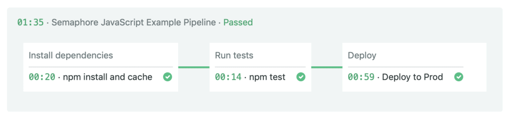
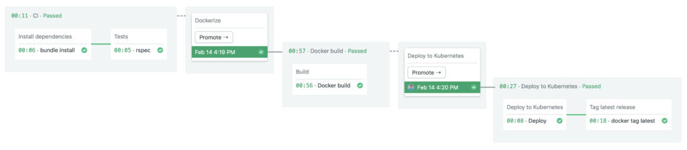

# DevSecOps
<!-- _class: first-slide -->

Juan Vera del Campo

<juan.vera@campusviu.es>

# Hoy hablamos de...
<!-- _class: cool-list toc -->

1. [Análisis de riesgos y modelado de Amenazas](#3)
1. [¿En qué estamos trabajando?](#10)
1. [¿Qué puede salir mal?](#24)
1. [¿Qué podemos hacer para arreglarlo?](#39)
1. [¿Hemos hecho un buen trabajo?](#48)
1. [Ejemplo: drones](#53)
1. [Referencias y ejercicios](#56)

# DevOps
<!-- _class: lead -->

## El problema

El código debe ser dinámico dinámico: los desarrolladores están constamentemente añadiendo funcionalidad y arreglando errores

- ¿Cómo podemos automatizar el proceso de analizar la calidad del código?
- ¿Cómo podemos reducir el tiempo de entrega de la nueva versión del código?
- ¿Podemos hacer el código más seguro en esta etapa?

DevOps: metodología para que desarrollo, operaciones y seguridad colaboren desde las primeras etapas para automatizar el proceso que lleva desde la programación hasta la entrega derl código

> https://www.edureka.co/blog/devops-tutorial

## Problemas de los modelos tradicionales

- Demasiado tiempo entre desarrollo y despliegue
- Tareas manuales no automatizadas
- Varios equipos tienen que aceptas los cambios

## Nuevo paradigma

## CI/CD Continuous Integration / Continous Development
<!-- _class: with-success -->

- Compila código
- Ejecuta tests
- Despliega nuevas versiones de la aplicación frecuentemente
- Flexible y adaptable a cambios
- Feedback constante de los usuarios finales
- Todo de forma automática

Cada cambio en el código se testea y despliega en producción en minutos

> https://semaphoreci.com/blog/cicd-pipeline

---

## Fases

- **Build**: en esta etapa se realiza la compilación de las unidades de código. Herramientas: Maven, Gradle...
- **Tests**: la prueba de todas las unidades se realiza en esta etapa. Entonces, sabremos dónde exactamente el código tiene errores y, si se encuentran errores, no se continúa a las siguientes etapas. Herramientas: linters, Selenium, PYtest...
- **Integrar**: en esta etapa, se integran todas las unidades de los códigos. Herramientas: Jenkins.
- **Despliegue**: en esta etapa, el código se despliega en el entorno del cliente. AlEjemplos: AWS, Docker...
- **Operar**: las operaciones se realizan en el código si es necesario.Herramienta: Kubernetes, OpenShift...
- **Monitor**: en esta etapa, el monitoreo de la aplicación se realiza aquí en el entorno del cliente. Herramientas: Nagios, ELK, Splunk, Grafana...

## Exigencias

- Diseña el sistema de manera que admita versiones iterativas.
- Métricas que ayuden a detectar problemas en tiempo real.
- Desarrollo basado en tests para mantener siempre el código en un estado desplegable.
- Monitoreo, registro y tolerancia a fallas por diseño.
- Trabaja en pequeñas iteraciones. Por ejemplo, si desarrolla en ramas de características, no deberían vivir más de un día.
- Uso de entornos de prueba similares a los de producción
- Si lo desarrollas, lo ejecutas. Los equipos de ingeniería autónomos deben ser responsables de la calidad y la estabilidad del software que construyen
- Los clientes tienen que poder aceptar cambios contantes
- El desarrollo Ci/CD puede ser más caro que el tradicional

## Buenas prácticas

- Trata la rama "main" como si pudiese desplegarse en cualquier momento
- Cada fallo de tests es un big
- Mejora los tests
- No uses ramas de desarrollo enormes
- Automatiza todo el deployment
    - Incluila la creación de infraestructura: terraform, ansible, kubernetes...

# Etapas
<!-- _class: lead -->

## Build

- Compilación, y errores de compilación
- Linters
- Gestión de librerías, y auditoría de librerías

## Build - librerías

`npm audit`

 

## DevOps

Repositorios de código (Github, Gitlab, Bitbucket, etc)
Infraestructura (Terraform, CloudFormation, etc)
CI/CD (Jenkins, Bamboo, CircleCI, TravisCI, etc)
Builds (Maven, Gradle, make, rake, etc)
Test (*unit, cucumber, protractor, etc)
Repositorio de artefactos (Nexus, Artifactory, Docker Hub,
S3, etc)
Despliegue (Ansible, Puppet, Chef, etc)
Monitorización (NewRelic, AppDynamics, Sysdig, etc)
Logging (Splunk, ELK, etc)
Comunicación (Slack, HipChat, etc)

# Resumen y referencias

## Referencias

- https://semaphoreci.com/blog/cicd-pipeline
- https://www.edureka.co/blog/devops-tutorial

---
<!-- _class: center -->

Continúa en: [Ejemplo del curso](07-ejemplo.html)

# ¡Gracias!
<!-- _class: last-slide --> 
