<style>
    /* You can add custom style here. VSCode supports this.
    Other editor might need these custom code in
    the YAML header: section: | */
</style>

# DevSecOps 
<!-- _class: first-slide -->

Juan Vera del Campo - <juan.vera@professor.universidadviu.com>

# Hoy hablamos de...
<!-- _class: cool-list toc -->

1. [DevOps](#3)
1. [Etapas](#12)
1. [Resumen y referencias](#33)

# Desarrollo y Operaciones
<!-- _class: lead -->

## El problema

El código debe ser dinámico dinámico: los desarrolladores están constamentemente añadiendo funcionalidad y arreglando errores

- ¿Cómo podemos automatizar el proceso de analizar la calidad del código?
- ¿Cómo podemos reducir el tiempo de entrega de la nueva versión del código?
- ¿Podemos hacer el código más seguro en esta etapa?

DevOps: metodología para que desarrollo, operaciones y seguridad colaboren desde las primeras etapas para automatizar el proceso que lleva desde la programación hasta la entrega derl código

> https://www.edureka.co/blog/devops-tutorial


## Problemas de los modelos tradicionales

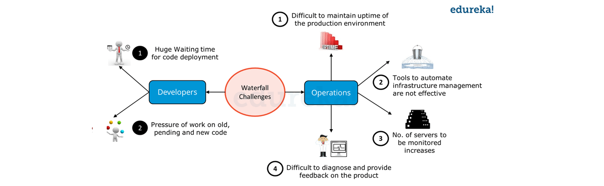

- Demasiado tiempo entre desarrollo y despliegue
- Tareas manuales no automatizadas
- Varios equipos tienen que aceptas los cambios

## Nuevo paradigma


## CI/CD Continuous Integration / Continous Development
<!-- _class: with-success -->

- Compila código
- Ejecuta tests
- Despliega nuevas version de la aplicación
- Comprueba que el sistema final no tiene problemas de seguridad
- Flexible y adaptable a cambios
- Feedback constante de los usuarios finales
- **Todo de forma automática**

Cada cambio en el código se testea y despliega en producción en minutos

> https://semaphoreci.com/blog/cicd-pipeline

## Exigencias

- Diseña el sistema de manera que admita versiones iterativas.
- Métricas que ayuden a detectar problemas en tiempo real.
- Desarrollo basado en tests para mantener siempre el código en un estado desplegable.
- Monitoreo, registro y tolerancia a fallas por diseño.
- Trabaja en pequeñas iteraciones. Por ejemplo, si desarrolla en ramas de características, no deberían vivir más de un día.
- Uso de entornos de prueba similares a los de producción
- Si lo desarrollas, lo ejecutas. Los equipos de ingeniería autónomos deben ser responsables de la calidad y la estabilidad del software que construyen
- Los clientes tienen que poder aceptar cambios contantes
- El desarrollo Ci/CD puede ser más caro que el tradicional

## Buenas prácticas

- Trata la rama "*main*" como si pudiese desplegarse en cualquier momento
- Cada fallo de tests es un bug
- Mejora los tests
- No uses ramas de desarrollo enormes
- Automatiza todo el despliegue:
    - Incluida la creación de infraestructura: terraform, ansible, kubernetes...

---

Y por supuesto, ¡introduce controles de seguridad en todo el proceso!

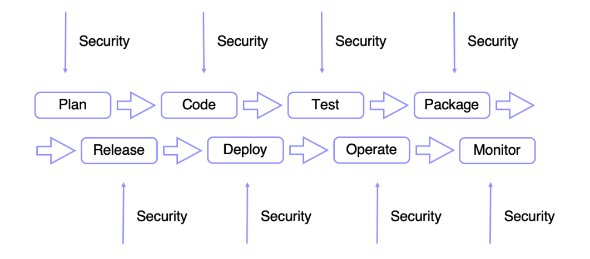

## DevOps: herramientas

- Repositorios de código (Github, Gitlab, Bitbucket, etc)
- Infraestructura (Terraform, CloudFormation, etc)
- CI/CD (Jenkins, Bamboo, CircleCI, TravisCI, etc)
- Builds (Maven, Gradle, make, rake, etc)
- Test (*unit, cucumber, protractor, etc)
- Repositorio de artefactos (Nexus, Artifactory, Docker Hub,
S3, etc)
- Despliegue (Ansible, Puppet, Chef, etc)
- Monitorización (NewRelic, AppDynamics, Sysdig, etc)
- Logging (Splunk, ELK, etc)
- Comunicación (Slack, HipChat, etc)

# Etapas DevOps
<!-- _class: lead -->

## Etapas

- **Build**: en esta etapa se realiza la compilación de las unidades de código. Herramientas: Maven, Gradle...
- **Tests**: la prueba de todas las unidades se realiza en esta etapa. Entonces, sabremos dónde exactamente el código tiene errores y, si se encuentran errores, no se continúa a las siguientes etapas. Herramientas: linters, Selenium, PYtest...
- **Integrar**: en esta etapa, se integran todas las unidades de los códigos. Herramientas: Jenkins.
- **Despliegue**: en esta etapa, el código se despliega en el entorno del cliente. AlEjemplos: AWS, Docker...
- **Operar**: las operaciones se realizan en el código si es necesario.Herramienta: Kubernetes, OpenShift...
- **Monitor**: en esta etapa, el monitoreo de la aplicación se realiza aquí en el entorno del cliente. Herramientas: Nagios, ELK, Splunk, Grafana...

---


## Etapa 1: Build

Análisis estático de código: Static application security testing (SAST)

- Linters
- Compilación y gestión de errores de compilación
- Detección de errores comunes de seguridad
- Auditoría de librerías
- Gestión de secretos
- Herramientas: Brakeman (Ruby), SpotBugs+FindSecBugs (Java), Go AST (Go), Bandit (Python), Linters... 

> https://seguridad.prestigia.es/que-son-las-herramientas-sast-y-dast/
> https://owasp.org/www-community/Source_Code_Analysis_Tools

## Etapa 1: Build - linters

No corrigen errores, sino que usan formatos estandarizados para el código

- Todo el equipo sigue las mismas reglas
- Aumenta la legibilidad del código
- Corrige algunos errores básicos
- Pueden integrase en tu entorno de desarrollo

Ejemplos: [black](https://black.readthedocs.io/en/stable/), [Pylama](https://klen.github.io/pylama/), Flake8.

---

Ejemplo: black

```bash
$ git clone https://github.com/NetSPI/django.nV ; cd django.nV
$ bpython3 -m pip install black
$ python3 -m black taskManager/views.py
$ git diff
```

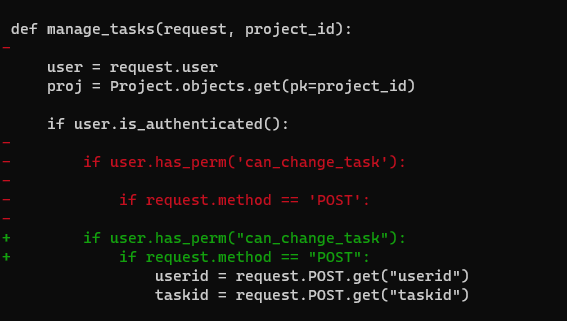

---

Ejempo: pylama

```bash
$ git clone https://github.com/NetSPI/django.nV ; cd django.nV
$ python3 -m pip install pylama
$ python3 -m pylama taskManager/views.py
$ python3 -m pylama taskManager/views.py

taskManager/views.py:18:1 W0611 'codecs' imported but unused [pyflakes]
taskManager/views.py:161:9 W0612 local variable 'proj' is assigned to but never used [pyflakes]
taskManager/views.py:821:101 E501 line too long (151 > 100 characters) [pycodestyle]
```

Pueden ignorarse errores determinados:

```bash 
$ python3 -m pylama -i E501 taskManager/views.py

taskManager/views.py:18:1 W0611 'codecs' imported but unused [pyflakes]
taskManager/views.py:161:9 W0612 local variable 'proj' is assigned to but never used [pyflakes]
```

---

También pueden integrarse en tu entorno de desarrollo para que haga las comprobaciones siempre:

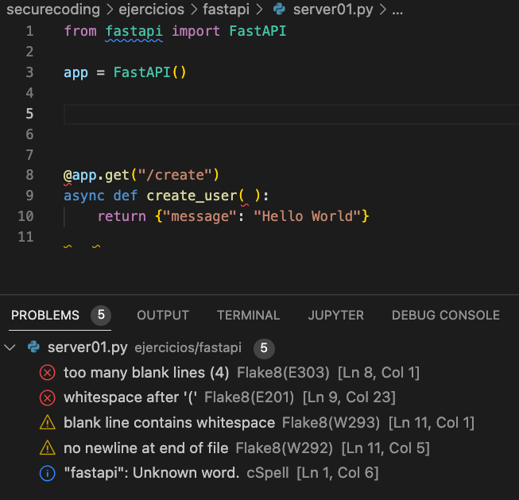


## Etapa 1: Build - Análisis estático de código SAST

Análisis estático: *Static Application Security Testing*

- Análisis automático del código antes de compilarlo
- Encuentra errores comunes: algoritmos que no deben usarse, estructuras que pueden crear un buffer overflow, variables usadas antes de asignarse...
- Puede tener falsos positivos
- No encontrará errores en la lógica del código

---


Lenguaje|Herramienta SAST
--|--
Python|[bandit](https://bandit.readthedocs.io/en/latest/)
Ruby|Brakeman
Comerciales|[SonarQube](https://www.sonarsource.com/products/sonarqube/downloads/)
Secretos|Github secrets, Trufflehog, git-secrets, detect-secrets...

---

Ejemplo: [bandit](https://bandit.readthedocs.io/en/latest/) analiza errores comunes en Python

```bash
git clone https://github.com/NetSPI/django.nV ; cd django.nV
python3 -m pip install bandit
bandit -r .
```

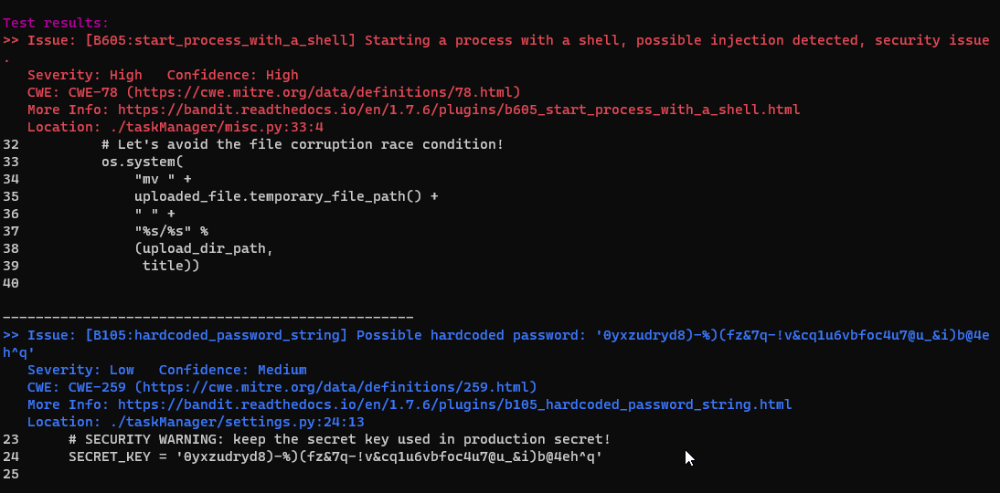

---

Ejemplo: [SonarQube](https://www.sonarsource.com/products/sonarqube/downloads/)

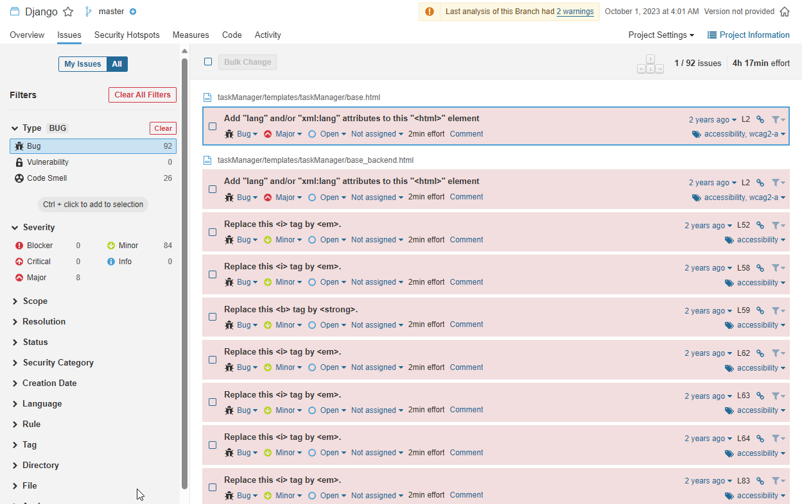

## Etapa 1: Build - Auditoría de librerías
<!-- _class: smaller-font -->

- Estas herramientas comprueban en una base de datos si la librería usada tiene alguna vulnerabilidad conocida -> ¡No analizan la librería!
- ¿Es posible actualizar la librería o asumimos el riesgo?
- No detectan vulnerabilidades automáticamente: se tiene que analizar periódicamente con bases de datos actualizadas


Lenguaje|Herramienta de análisis de librerías
--|--
JS|[Retirejs](https://retirejs.github.io/retire.js/)/npm audit/AuditJS
Python|[Safety](https://github.com/pyupio/safety)
Ruby|Bundler audit/Chelsea
PHP|Composer
Java|OWASP dependency checker

---

Ejemplo: [Safety](https://github.com/pyupio/safety) analiza librerías Python

```bash
git clone https://github.com/NetSPI/django.nV ; cd django.nV
python3 -m pip install safety
python3 -m safety check -r requirements.txt --save-json safety-resuls.json
```

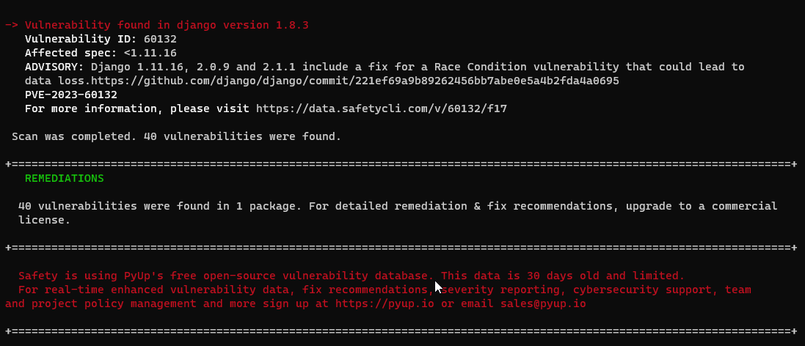

<!--
Fíjate: el comando simplemente examina el archivo de requisitos, no el código

Safety tiene una versión gratuita con vulnerabilidades >30 days, y otra de comercial con vulnerabilidades recientes
-->

---

Ejemplo: Pip audit

```bash
git clone https://github.com/NetSPI/django.nV
python3 -m pip pip-audit
pip-audit -r ./requirements.txt
```

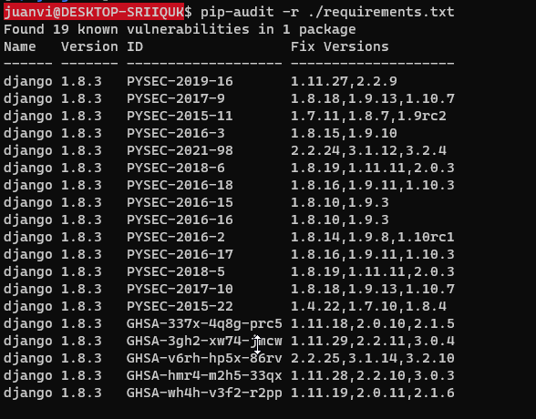

---

Ejemplo: npm audit (ya incluido con node)

```
https://github.com/SasanLabs/VulnerableApp-facade
cd VulnerableApp-facade/facade-app
npm audit
```


---

Ejemplo: Github Dependabot

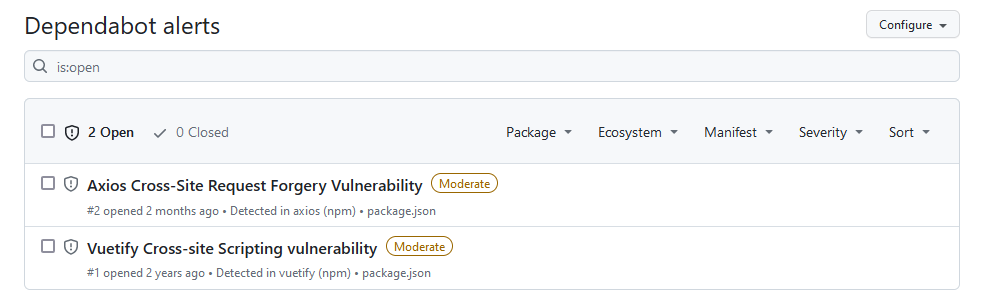

Dependabot es un servicio que puedes activar en la configuración de tu proyecto en GitHub

---

Ejemplos de librerías maliciosas:

- https://socket.dev/npm/package/segment-bundle/files/6.6.9/package.json
- https://socket.dev/npm/package/filebdecoder/files/1.0.0/package.json
- https://socket.dev/npm/package/123rf-ui-core/files/9.849.9/index.js

> https://twitter.com/feross/status/1672401333893365761

## ¿Me he dejado alguna contraseña?

Escaneo de contraseñas:

- Basados en patrones/regex
    - Muchos falsos positivos
    - Reconocen errores comunes como poner la contraseña en la llamada a la función
- Basados en entropía: reconocen "el aspecto" de una contraseña

---
<!-- _class: smaller-font -->

Tool|History|Regex/entropy|FP handling|Custom regex|Language|CI/CD|Comments
--|--|--|--|--|--|--|--
git-secrets|No|regex|yes|yes|shell scripts|No|-|Git hook
Trufflehog|yes|both|-|yes|python|yes|no|-
gitrob|yes|regex|no|yes|ruby|no|no|standalone
repo-security-scanner|yes|regex@yes|yes|golang|yes|-|-
git-hound|-|regex|no|yes|golang|-|-|-
surch|yes|regex|no|yes|python|no|-|-

---

Ejemplo: trufflehog

```bash
$ wget https://github.com/trufflesecurity/trufflehog/releases/download/v3.28.0/trufflehog_3.28.0_linux_amd64.tar.gz
$ tar -xvf trufflehog_3.28.0_linux_amd64.tar.gz trufflehog
$ chmod +x trufflehog
$ ./trufflehog filesystem --directory=trufflehog
```

Nota: esto busca contraseñas en el propio archivo de trufflehog, a ti te interesará buscarlas en tu código

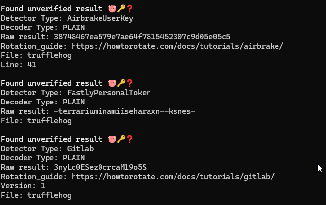

<!-- Observa que trufflehog tiene diferentes detectores gitlab, token... -->

---

Ejemplo: deepfence

```
docker run --rm -v `pwd`:/source deepfenceio/deepfence_secret_scanner --local /source --output json
```

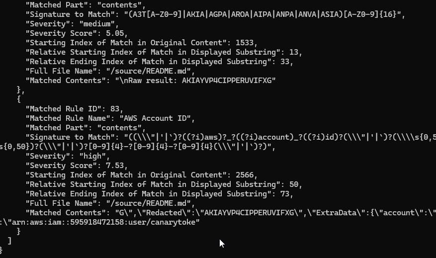

Con este ejemplo vemos también que podemos ejecutar algunas de las herramientas con docker. Veremos en la siguiente sesión que esto es muy deseable

## GitHub
<!-- _class: two-columns-->

- Dependabot: análisis de librerías
- Code scanning: SAST
- Secret scanning: secretos
- Ejemplo: https://github.com/Juanvvc/sMSD/security

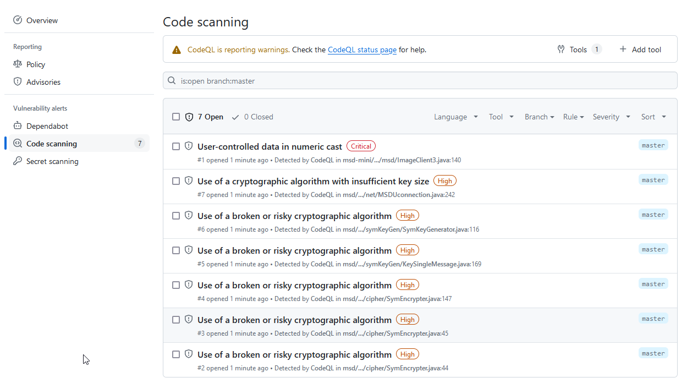

## Etapa 2: Tests
<!-- _class: smallest-font -->

- ¿Cuál es tu input?
  - ¿Qué pasa si algunos de los parámetros no esá presente, o tiene un tipo no esperado, o está fuera de rango?
- ¿Cuál es la lógica?
  - Modificación de la entrada por otros elementos
  - Código esperando entrada del usaurio
  - Salidas sin control, o nulas
  - Timeouts para las salida
  - ¿Están todos los posibles casos cubiertos?
  - ¿Son relevantes todos los casos?
- Interacciones con los datos: CRUD
  - ¿Autorización para las acciones?
  - ¿Puedes distinguir entre no autorizado, errores o datos que no existen?
- Bucles
  - ¿Siempre acaban?
  - ¿Salen bien en caso de error?

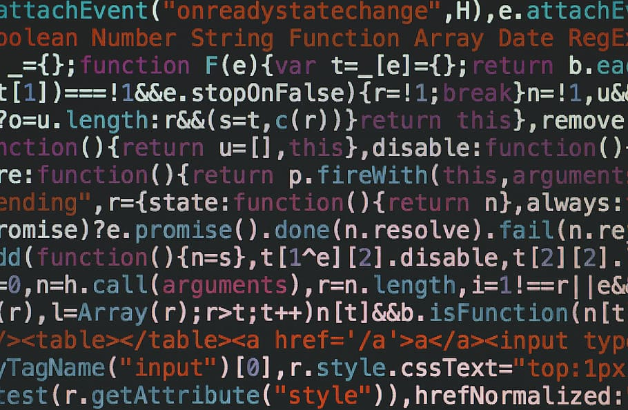

> [Hris Koleva en twitter](https://twitter.com/hrisKoleva)

## Tests unitarios

```python
import unittest
from code.my_calculations import Calculations

class TestCalculations(unittest.TestCase):

    def test_sum(self):
        calculation = Calculations(8, 2)
        self.assertEqual(calculation.get_sum(), 10, 'The sum is wrong.')

    def test_diff(self):
        calculation = Calculations(8, 2)
        self.assertEqual(calculation.get_difference(), 6, 'The difference is wrong.')

    def test_product(self):
        calculation = Calculations(8, 2)
        self.assertEqual(calculation.get_product(), 16, 'The product is wrong.')

    def test_quotient(self):
        calculation = Calculations(8, 2)
        self.assertEqual(calculation.get_quotient(), 4, 'The quotient is wrong.')

if __name__ == '__main__':
    unittest.main() 
```

> https://www.dataquest.io/blog/unit-tests-python/

## Test Coverage

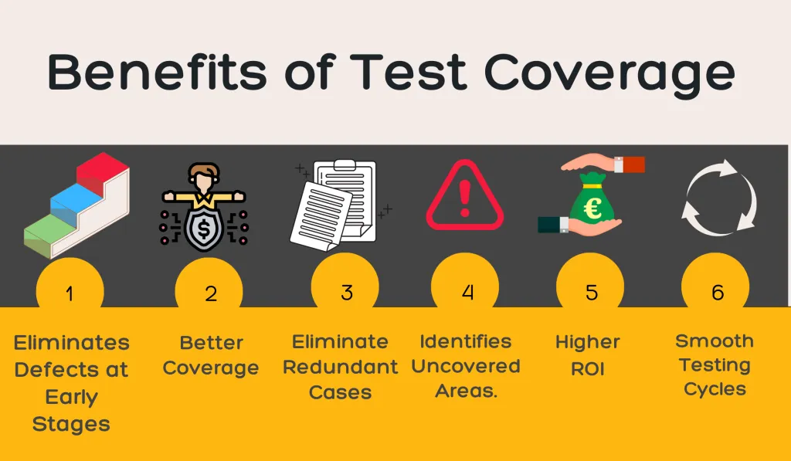

> https://artoftesting.com/test-coverage

---

- ¿Qué porcentaje del código cubren nuestros tests? Ejemplo: <https://coverage.readthedocs.io/en/7.5.3/>
- ¿Qué portentaje de las amenazas detectadas durante el diseño cubren los tests?
- ¿Se testean todos los casos de uso de la aplicación?


---

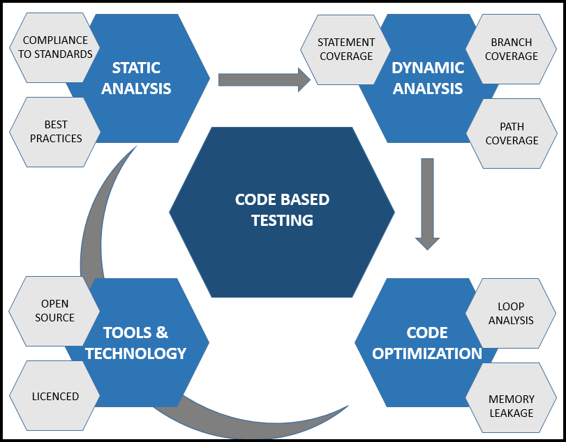

## Etapa 4: Dynamic Application Security Testing DAST

- Explora vulnerabilidades conocidas de las aplicación en ejecución
- Ejemplos:
  - uso de protocolos http en vez de https
  - configuración inadecuada del servidor
  - puertos abiertos
  - Compliance

> https://about.gitlab.com/blog/2019/08/12/developer-intro-sast-dast/
> https://realm3ter.medium.com/analyzing-javascript-files-to-find-bugs-820167476ffe
> https://www.gb-advisors.com/es/pruebas-de-seguridad-de-aplicaciones-ast-sast-dast-e-iast/

---

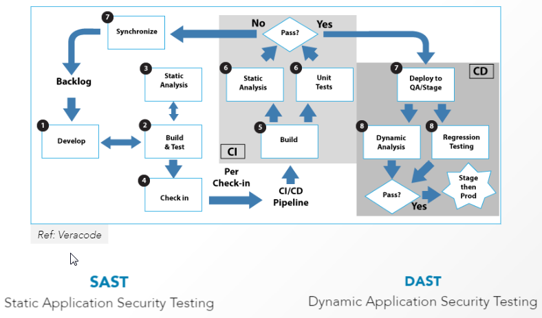

> https://blog.51sec.org/2018/12/from-devops-to-devsecops-topics.html

## Etapa 4: despliegue

Manejo de secretos:

- AWS Secret Management
- Azure Key Vault
- Secret Manager (GCP)
- GitHub secret scanning

https://gist.github.com/win3zz/0a1c70589fcbea64dba4588b93095855

## Etapa 4: despliegue: análisis dinámico de código

- Analiza vulnerabilidades de las aplicaciones en funcionamiento
- Ejemplos: puertos cerrados, protocolos HTTPS para todo, configuraciones correctas...

---

Algunas herramientas:

- NMAP
- SSLyze
- [Nikto](https://cirt.net/Nikto2)
- [Zed Attack Proxy (ZAP)](https://www.zaproxy.org/): web vulnerability scanner, OWASP Top 10.
- [Dastarly](https://portswigger.net/burp/dastardly) similar a ZAP, pero de la empresa Burp
- [Nuclei](https://github.com/projectdiscovery/nuclei)
- Infrastructura y compliance: [Inspec](https://github.com/inspec/inspec), [Ansible](https://www.ansible.com/), [checkov](https://github.com/bridgecrewio/checkov)
  - Ejemplo: [Linux baseline en inspec](https://github.com/dev-sec/linux-baseline/blob/master/controls/os_spec.rb)
- Bases de datos de vulnerabilidades a través de agentes: Qualys

## Infrastructure-as-a-code

1. Ejecuta *terraform* para desplegar dockers/máquinas virtuales
1. Ejecuta *ansible* para configurar las máquinas desplegadas
2. Ejecuta testeos con *inspec*

## Terraform
<!-- _class: two-columns -->

- Terraform: https://www.terraform.io/
- Crea la infrastructura de máquinas virtuales / docker que necesites
- SAST con [Checkov](https://www.checkov.io/)

```
terraform {
  required_providers {
    aws = {
      source  = "hashicorp/aws"
      version = "~> 4.16"
    }
  }

  required_version = ">= 1.2.0"
}

provider "aws" {
  region  = "us-west-2"
}

resource "aws_instance" "app_server" {
  ami           = "ami-830c94e3"
  instance_type = "t2.micro"

  tags = {
    Name = "ExampleAppServerInstance"
  }
}
```

## Ansible
<!-- _class: two-columns -->

- [Ansible](https://docs.ansible.com/ansible/latest/index.html): Application deployment + configuration management
- https://github.com/dev-sec/ansible-collection-hardening
- Prepara y configura los sistemas a tu gusto: *hardening*
- Utiliza ssh para conectarse a los sistemas

```
- name: Playbook to install nginx
  hosts: sandbox
  remote_user: root
  become: yes

  # We are checking avaibility of nginx binary at a specific location
  tasks:
    - name: check if nginx installed
      stat:
        path: /usr/sbin/nginx
      register: stat_nginx

    - name: get nginx version
      command: nginx -v
      register: nginx_version
      when: stat_nginx.stat.exists

    - name: Print version
      debug:
        msg: "{{ nginx_version.stderr }}"
      when:
        - nginx_version is defined
        - stat_nginx.stat.exists

    - name: install nginx if not exist
      apt:
        name: nginx
        state: present
        update_cache: true
      when: not stat_nginx.stat.exists
```

> https://www.redhat.com/sysadmin/harden-new-system-ansible

## Inspec
<!-- _class: two-columns -->

- Inspec: <https://github.com/inspec/inspec>
- Test de infrastructura para compliance y seguridad
- Guía: https://www.chef.io/docs/cheflibraries/whitepapers/guidetopcidsscompliance.pdf

```
describe file('/etc/ssh/sshd_config') do
    it { should exist }
    it { should be_file }
    it { should be_owned_by 'root' }
    its('content') { should match 'PasswordAuthentication no' }
end

describe file('/etc/pam.d/password-auth') do
  its('content') { 
      should match(/^\s*password\s+requisite\s+
        pam_pwquality\.so\s+(\S+\s+)*try_first_pass/)
  }
  its('content') {
      should match(/^\s*password\s+requisite\s+
        pam_pwquality\.so\s+(\S+\s+)*retry=[3210]/)
  }
end
```


# Resumen y referencias
<!-- _class: lead -->

## Referencias

- https://semaphoreci.com/blog/cicd-pipeline
- https://www.edureka.co/blog/devops-tutorial
- Tools for testing: https://www.creativebloq.com/features/12-must-have-user-testing-tools
- Courses: https://javarevisited.blogspot.com/2020/07/5-free-courses-to-learn-devops-in-2020.html

--- 


- https://docs.github.com/en/code-security/code-scanning
- https://github.com/kaiiyer/awesome-vulnerable
- https://github.com/appsecco/dvna
- https://github.com/analysis-tools-dev/static-analysis#javascript
- https://deepscan.io/pricing/
- https://www.sonarsource.com/products/sonarlint/
- https://github.com/designsecurity/progpilot
- https://github.com/duo-labs/dlinto
- https://snyk.io/learn/code-security-audit/
- https://www.sonarsource.com/solutions/security/
- https://www.codementor.io/learn-programming/performing-security-audit-for-your-code-the-basics
- https://owasp.org/www-pdf-archive/OWASP_Code_Review_Guide_v2.pdf

# ¡Gracias!
<!-- _class: last-slide --> 
