<style>
    /* You can add custom style here. VSCode supports this.
    Other editor might need these custom code in
    the YAML header: section: | */
</style>

# Continuous Integration / Continuous Delivery
<!-- _class: first-slide -->

Juan Vera del Campo - <juan.vera@professor.universidadviu.com>

# Hoy hablamos de...
<!-- _class: cool-list toc -->

1. [Continuous Integration / Continuous Delivery](#4)
1. [Ejemplos de Pipelines](#15)
1. [Resumen y referencias](#37)

---

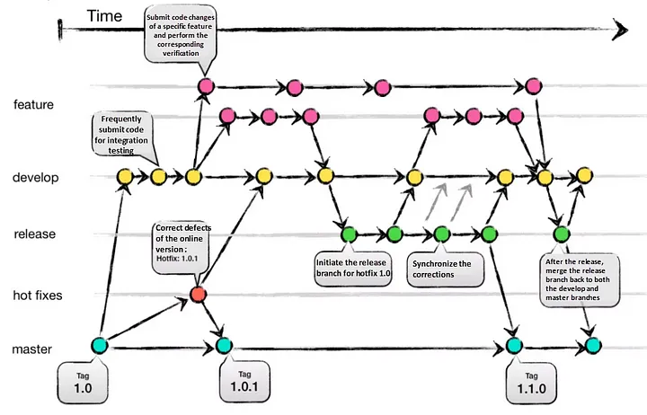

> https://alibaba-cloud.medium.com/how-to-select-a-git-branch-mode-1f8774a8bd94

<!--
Así es como funciona un desarrollo típico cuando usamos ramas: tenemos ramas de profucto final (v1, v2...), ramas de features nuevas, ramas de pruebas...

Integrar todo esto es un problema ¿va a funcionar todo bien? ¿hemos introducido errores en el sistema?

Históricamente, este proceso ha llevado mucho tiempo. Ahora queremos automatizarlo
-->


# Continuous Integration / Continuous Delivery
<!-- _class: lead -->

---

"La integración continua es una práctica de desarrollo de software en la que cada miembro de un equipo fusiona sus cambios en un código base junto con los cambios de sus colegas al menos diariamente. Cada una de estas integraciones se verifica mediante una compilación automatizada para detectar errores lo más rápido posible"


> https://martinfowler.com/articles/continuousIntegration.html

<!--
Os recomiendo mucho la lectura completa de este enlace que incluye descripciones muy detalladas del proceso de desarrollo completo´
-->

## Continuous Integration / Continuous Delivery: CI/CD
<!-- _class: with-success -->

- Usa control de versiones para todo
- Incluye herramientas de testeo estático y dinámico automático
- "*git push*" constante a la rama de desarrollo "*main*"
- Todos los "*git push*" deben generar un "*build*"
- Arregla los "*builds*" sin éxito inmediatamente
- Mantén el proceso rápido
- No tengas "*work in progress*" en la rama principal
- Testeos dinámicos en un "clon" del entorno de producción
- Todos pueden ver lo que se está haciendo
- Deployment **automático** a producción

Cada cambio en el código se testea y despliega en producción en minutos

## Ventajas del CI/CD
<!-- _class: with-success -->

- Reducir el tiempo de llevar una aplicación a producción
- No perder el tiempo en integración
- Menos errores de código e integración
- Mejor calidad general del sistema al permitir refactorización rápida
- Llevar algo a producción es una decisión de negocio/marketing y no una decisión técnica

Estamos siempre preparados para ir a producción

## Pipeline de CI/CD

Una *pipeline* de CI/CD es una serie de pasos que se deben realizar para poner en producción una nueva versión de software

En la actualidad, se tiende a ejecutar una *pipeline* completa cada día

Podéis configurar el control de versiones (GitHub, GitLab...) para que ejecute una pipeline **después de un evento de Git**, especialmente *commit* y *merge*


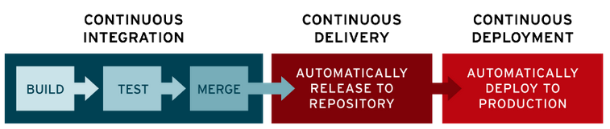

> https://www.redhat.com/en/topics/devops/what-cicd-pipeline

---

El CI/CD se estructura en "pipelines": "jobs" automáticos que se ejecutan uno después de otro

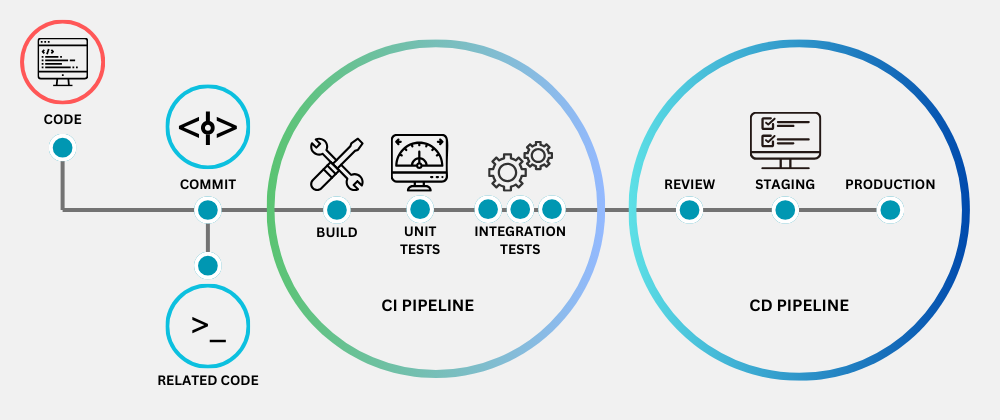

> https://testrigor.com/blog/what-is-cicd/

<!--

La idea principal es que a partir de que el desarrollador hace un commit, el resto de los pasos hasta llegar a producción sean automáticos

Pasos de CI:

- quality assurance: linters, chequeo de librerías, análisis estático
- compilación
- tests de integración

Pasos de CD:

- fase beta "staging"
- tests dinámicos
- deployment final en producción

-->

## Responsabilidad de una pipeline

1. Cada *commit* debería ejecutar todas las herramientas automáticas de detección de errores
1. Repara inmediatamente los errores de compilación
1. Repara los errores de seguridad
1. La ejecución de todas estas pruebas debe ser rápida...
1. ...y automática
1. Automatiza también el despliegue de la aplicación

--- 

Ejemplos:

Evento|Pipeline
--|--
Merge Request|BUILD -> TEST -> INTEGRATION
Merge to master|BUILD -> TEST -> INTEGRATION -> DEPLOY TO STAGING
Tag for release|DOWNLOAD ARTIFACTS -> DEPLOY TO PRODUCTION

## Terminología

- **Pipeline**: conjunto de etapas que se ejecutan cuando sucede algo en un proyecto. Por ejemplo, cuando se hace un "git push"
- **Jobs**: comandos que hay que ejecutar. Por ejemplo: linters, analizadores estáticos...
- **Stages**: etapa en las que se ejecuta un conjunto de *jobs*. En gitlab, todos los jobs de una etapa se ejecutan en paralelo. La ejecución puede pararse si falla algún *job* dentro de un *stage*.
- **Runners**: máquinas que ejecutan los *jobs*. Generalmente son un servidor *docker* que ejecuta una imagen determinada
- **Artifacts**: archivos que se generan al final de un *job*. En nuestro caso, son los reportes de las herramientas de seguridad, o los archivos .exe que se pasan a la etapa siguiente.

<!--

Los runners son máquinas virtuales que ejecutan los jobs. Gitlab/github ofrece algunos minutos al mes de runner gratuitos y también se pueden contratar más. También puedes tener el runner ejecutándose en cualquier sitio, incluso en tu casa

-->

## Etapas/Stages comunes

- **Build**: en esta etapa se realiza la compilación del código. Herramientas: Maven, Gradle...
- **Tests**: la prueba de todas las unidades se realiza en esta etapa. Entonces, sabremos dónde exactamente el código tiene errores y, si se encuentran errores, no se continúa a las siguientes etapas. Herramientas: linters, Selenium, PYtest...
- **Integrar**: en esta etapa, se juntan las piezas del código y librerías
- **Staging**: en esta etapa, el código se despliega en un entorno de pruebas, para análisis dinámico.
- **Despliegue**: en esta etapa, el código se despliega en el entorno del cliente. Ejemplos: AWS, Docker...
- **Operar**: las operaciones se realizan en el código si es necesario.Herramienta: Kubernetes, OpenShift...
- **Monitor**: en esta etapa, el monitoreo de la aplicación se realiza aquí en el entorno del cliente. Herramientas: Nagios, ELK, Splunk, Grafana...


---

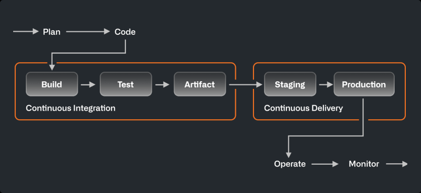

> https://resources.github.com/ci-cd/

# Ejemplos de Pipelines
<!-- _class: lead -->

## Pasos para crear una pipeline CI/CD
<!-- _class: cool-list -->

1. *Prueba los comandos localmente antes de subirlos a la *pipeline* usando una imagen docker*
1. *Asegúrate de que la ejecución de una *pipeline* lleva menos de 10 minutos*
1. *Guarda la salida para referencia futura y análisis*
1. *Considera si las *pipelines* deben interrumpirse si falla algún paso*

> https://opensource.com/article/20/5/cicd-best-practices

## Ejemplo: bandit desde una imagen docker
<!-- _class: cool-list -->

1. *Prueba los comandos localmente antes de subirlos a la *pipeline* usando una imagen docker*

[Recuerda](04-devsecops.html): [bandit](https://bandit.readthedocs.io/en/latest/) analiza errores comunes en Python

```bash
git clone https://github.com/NetSPI/django.nV ; cd django.nV
docker run --rm -v $(pwd):/src --user $(id -u):$(id -g) cytopia/bandit -r /src -f json -o /src/bandit-output.json
```

La salida se guarda en el archivo `bandit-output.json`

## Ejemplo: trufflehog desde una imagen docker
<!-- _class: cool-list -->

1. *Prueba los comandos localmente antes de subirlos a la *pipeline* usando una imagen docker*

[Recuerda](04-devsecops.html): trufflehog comprueba si te has dejado contraseñas o tokens de seguridad en el código

```bash
git clone https://github.com/NetSPI/django.nV ; cd django.nV
docker run --user $(id -u):$(id -g) -v $(pwd):/src --rm \
    hysnsec/trufflehog filesystem --directory=/src --json \
    | tee trufflehog-output.json
```

---
<!-- _class: cool-list -->

<style scoped>ol { counter-reset: li 1; }</style>


Una vez que hemos probado que podemos ejecutar las herramientas de seguridad en un docker...

1. *Asegúrate de que la ejecución de una *pipeline* lleva menos de 10 minutos*
1. *Guarda la salida para referencia futura y análisis*
1. *Considera si las *pipelines* deben interrumpirse si falla algún paso*

## Orquestadores: Gitlab, GitHub, Jenkins...
<!-- _class: two-columns -->

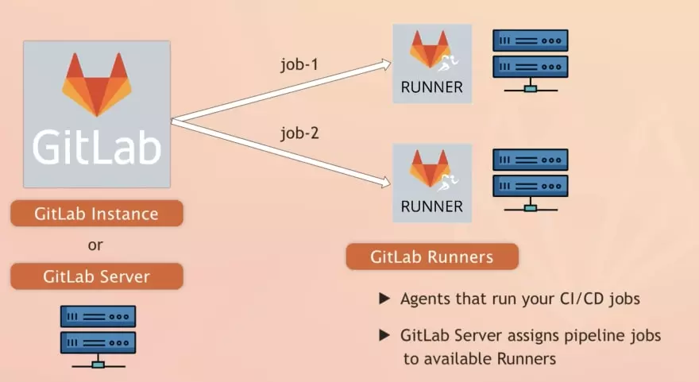

- Los *Runners* ejecutan los *jobs* que definas
- Los *jobs* se ejecutan en contenedores como docker
- Los *jobs* se pueden ejecutar en los servidores de gitlab (pagando), o en tus propios servidores
- El *deployment* de una aplicación lo puedes hacer en AWS, Google...

> https://devopstales.github.io/home/introduction-to-gitlab-ci-cd/

<!--
Descrición:

- Gitlab maneja el código fuente de tu aplicación o estructura
- Cuando pasa algo (un commit, por ejemplo), entonces ejecuta una "pipeline", un conjunto de jobs
- Estos jobs se ejecutan por los Runners en contenedores docker o máquinas virtuales
- Puedes contratar runners en gitlab, o crear tu propio runner en tu empresa que ejecute los dockers en tu empresa
-->

---

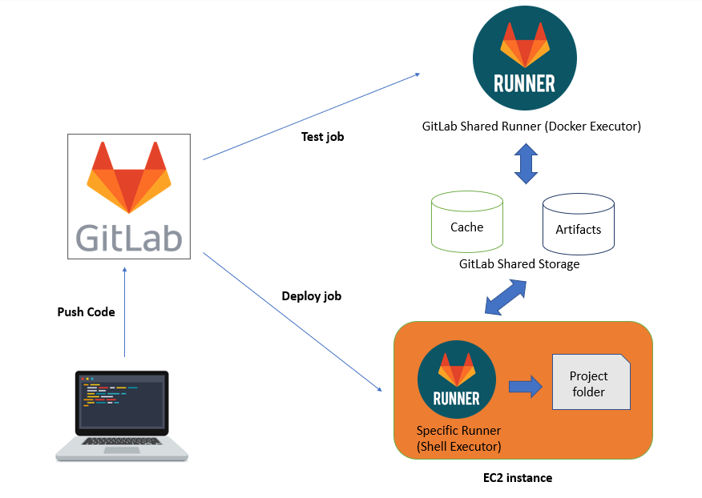

> https://bwgjoseph.com/how-to-setup-and-configure-your-own-gitlab-runner


## Ejemplo: esta misma presentación

Cada vez que modifico algo en esta presentación, hay una pipeline que automáticamente (2025):

- CI: compila el código Markdown a HTML
- CD: publica el código HTML en la web

https://github.com/Juanvvc/securecoding/tree/main/.github/workflows

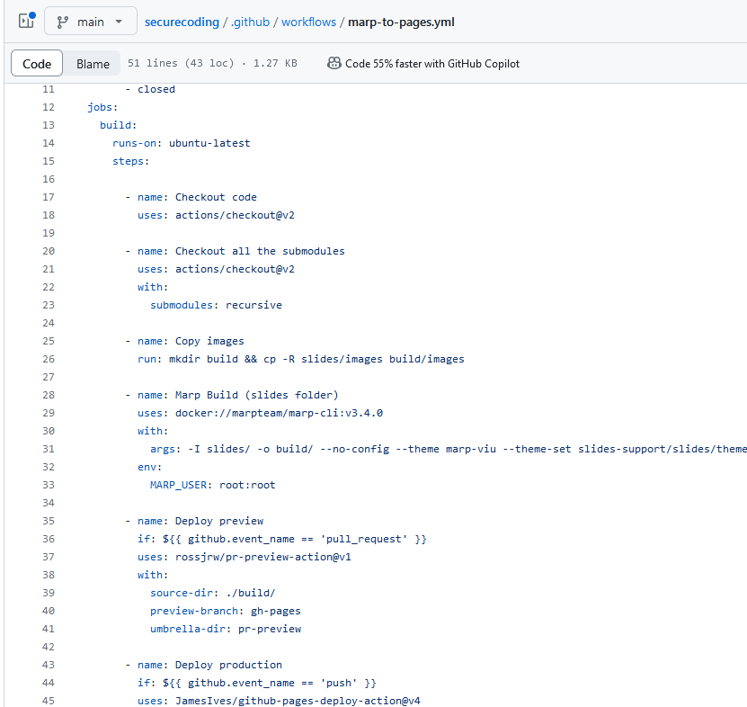

---

Jobs ejecutados

[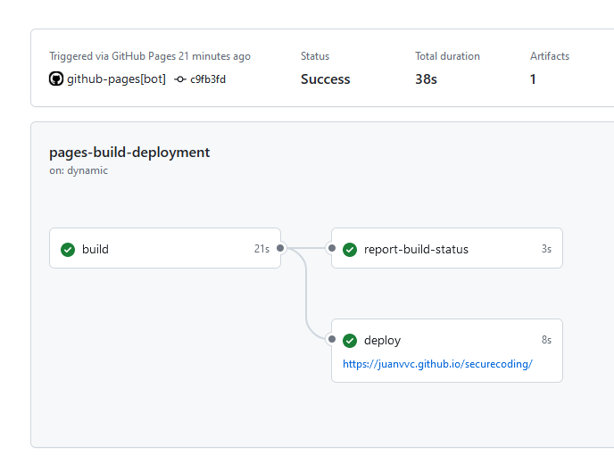](https://github.com/Juanvvc/securecoding/actions/runs/9600917428)

---

Observa: la compilación se hace a través de una contenedor docker

[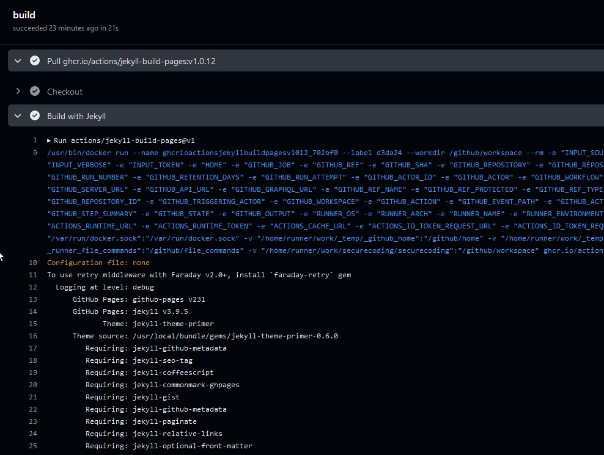](https://github.com/Juanvvc/securecoding/actions/runs/9600917428/job/26478269851)

## Ejemplo en GitLab

```yaml
stages:   # Dictionary
 - build   # this is build stage
 - test    # this is test stage
 - integration # this is an integration stage
 - prod       # this is prod/production stage

build:       # this is job named build, it can be anything, job1, job2, etc.,
  stage: build    # this job belongs to the build stage. Here both job name and stage name is the same i.e., build
  script:
    - echo "This is a build step"  # We are running an echo command, but it can be any command.
    - echo "{\"vulnerability\":\"SQL Injection\"}" > output.json
  artifacts:      # notice a new tag artifacts
    paths: [output.json]   # this is the path to the output.json file
    when: always  # when the artifact is included: always|on_failure|on_success
    expire_in: never # 2 hrs|3 weeks|6 mos

test:
  stage: test
  script:
    - echo "This is a test step."
    - exit 1         # Non zero exit code, fails a job.
  allow_failure: true   #<--- allow the build to fail but don't mark it as such

integration:        # integration job under stage integration.
  stage: integration
  script:
    - echo "This is an integration step."

prod:
  stage: prod
  script:
    - echo "This is a deploy step."
  when: man
```

---

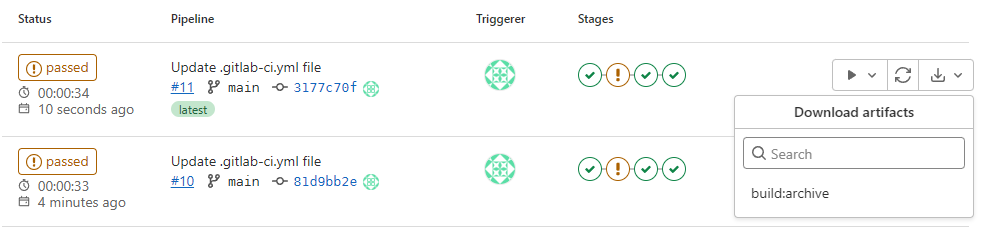

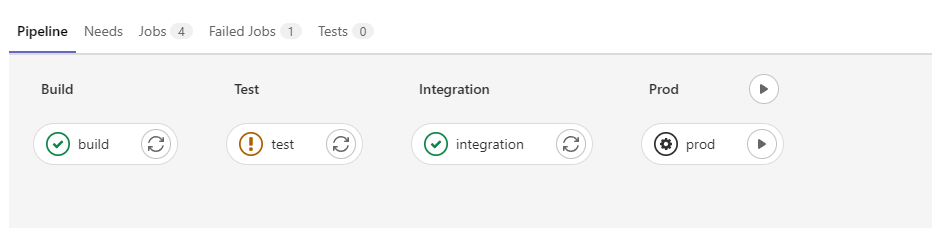

## Ejemplo: integrando bandit en CI/CD

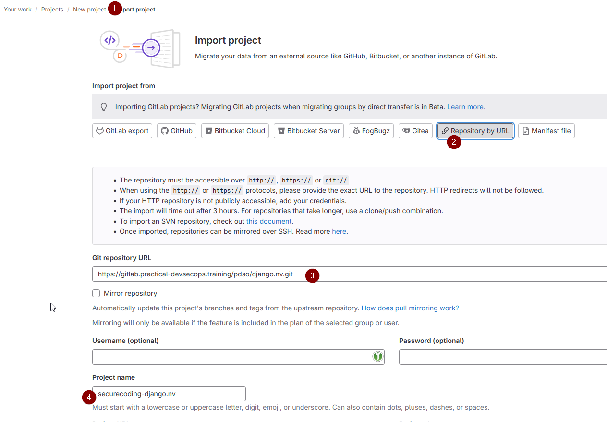

1. Crea un nuevo proyecto en gitlab.com: New Project -> Import
1. Importa desde URL: <https://github.com/NetSPI/django.nV>
1. Menú de la izquierda: Build -> Pipeline editor, o edita directamente el archivo `.gitlab-ci.yml`

---
<!-- _class: two-columns -->

- Usa la pipeline que ya viene de ejemplo
- "commit changes"
- Build -> pipelines. Observa:
  - Stages
  - Ejecución
  - Salida de cada job
- Nota: el ejemplo de Gitlab incluye comentarios, leélos

```yaml
stages:
  - build
  - test
  - deploy

build-job:
  stage: build
  script:
    - echo "Compiling the co  de..."
    - echo "Compile complete."

unit-test-job:
  stage: test 
  script:
    - echo "Running unit tests... This will take about 60 seconds."
    - sleep 60
    - echo "Code coverage is 90%"

lint-test-job:
  stage: test
  script:
    - echo "Linting code... This will take about 10 seconds."
    - sleep 10
    - echo "No lint issues found."

deploy-job:
  stage: deploy
  environment: production
  script:
    - echo "Deploying application..."
    - echo "Application successfully deployed."
```

---

Sustituye `.gitlab-ci.yml` en Build -> Pipeline editor. Quita los caracteres `\\`, no cabía la línea entera en esta transparencia.

```yaml
image: docker:20.10

services:
  - docker:dind

stages:
  - build
  - test
  - deploy

sast:
  stage: build
  script:
    - docker pull hysnsec/bandit
    - docker run --user $(id -u):$(id -g) -v $(pwd):/src --rm \\
    hysnsec/bandit -r /src -f json -o /src/bandit-output.json
  artifacts:
    paths: [bandit-output.json]
    when: always
  allow_failure: true
```

Busca la ejecución en el menú izquierdo, Build -> Pipelines

---

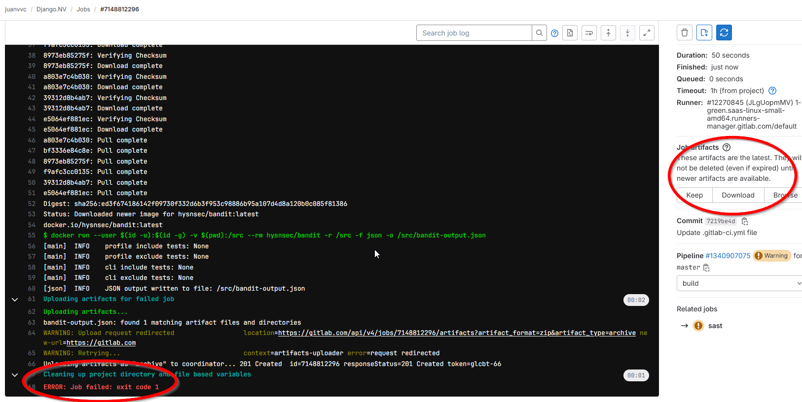

Observa los artefactos y que la pipeline ha fallado. `allow_failure: true` permite ejecutar otros jobs después, si los hubiese

---

Más ejemplos: comprueba si hay secretos con trufflehog. Quita los caracteres `\\`, no cabía la línea entera en esta transparencia.

```yaml
git-secrets:
  stage: build
  script:
    - docker run --user $(id -u):$(id -g) -v $(pwd):/src --rm \\
    hysnsec/trufflehog filesystem --directory=/src --json \\
    | tee trufflehog-output.json
    - docker run --user $(id -u):$(id -g) -v $(pwd):/src --rm \\
    hysnsec/trufflehog filesystem --directory=/src --json \\
    | tee trufflehog-output.json
  artifacts:
    paths: [trufflehog-output.json]
    when: always
    expire_in: one week
  allow_failure: true
```

---

Más ejemplos: NMAP

```yaml
# DAST using nmap, during integration stage
dast-nmap:
  stage: integration
  script:
    - docker pull hysnsec/nmap
    - docker run --rm --user $(id -u):$(id -g) -v $(pwd):/tmp hysnsec/nmap $PROD_SERVER -oX /tmp/nmap-output.xml
  artifacts:
    paths: [nmap-output.xml]
    when: always
    expire_in: one week
  allow_failure: true
```

## Gestión de secretos

En el ejemplo anterior, fíjate en la variable: `PROD_SERVER`

Puedes gestionar variables en Settings -> Variables

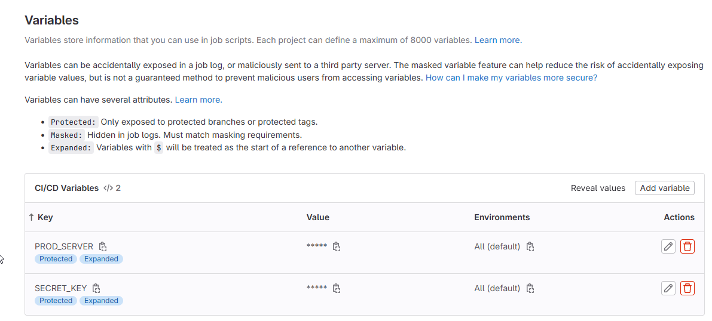

---

Ejemplos: inspec

```yaml
inspec:
  stage: prod
  only:
    - main
  environment: production
  before_script:
    - mkdir -p ~/.ssh
    - echo "$DEPLOYMENT_SERVER_SSH_PRIVKEY" | tr -d '\r' > ~/.ssh/id_rsa
    - chmod 600 ~/.ssh/id_rsa
    - eval "$(ssh-agent -s)"
    - ssh-add ~/.ssh/id_rsa
    - ssh-keyscan -t rsa $DEPLOYMENT_SERVER >> ~/.ssh/known_hosts
  script:
    - docker run --rm -v ~/.ssh:/root/.ssh -v $(pwd):/share \\
    hysnsec/inspec exec https://github.com/dev-sec/linux-baseline \\
    -t ssh://root@$DEPLOYMENT_SERVER -i ~/.ssh/id_rsa \\
    --chef-license accept --reporter json:/share/inspec-output.json
  artifacts:
    paths: [inspec-output.json]
    when: always
```

##  Defect Dojo

<https://www.defectdojo.org/>

Gestión de vulnerabilidades e informes de CI/CD

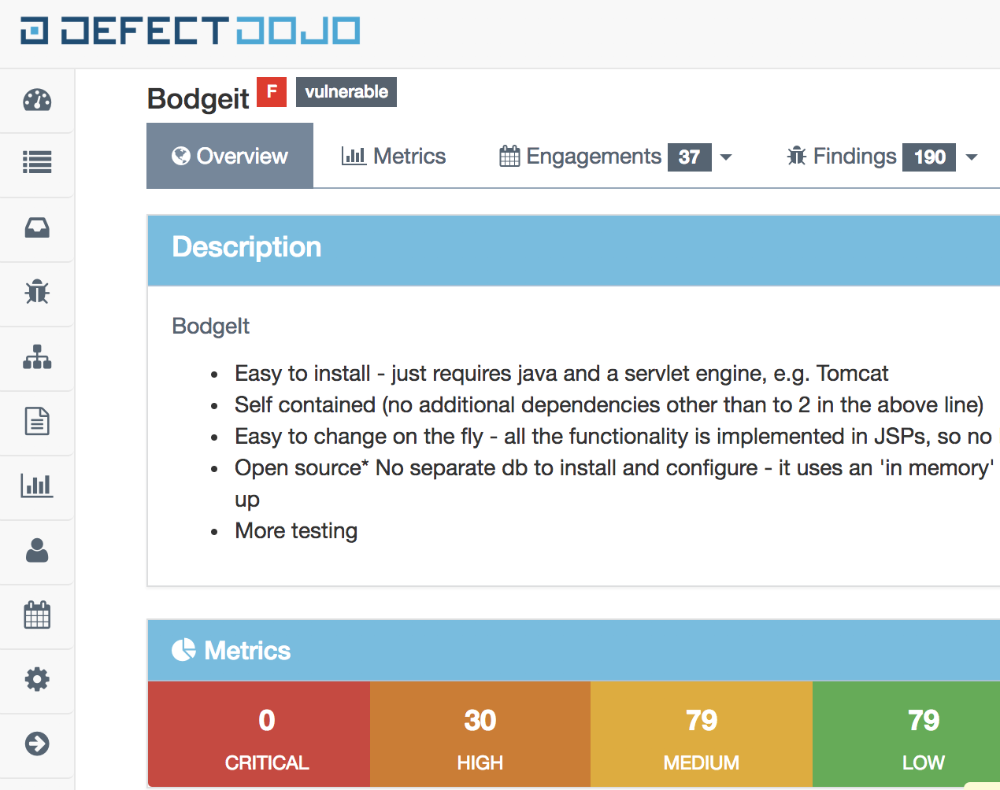

---

Ejemplos: enviar los artefactos de los jobs anteriores a DefectDojo

```yaml
sast:
  stage: build
  before_script:
    - apk add py-pip py-requests
  script:
    - docker pull hysnsec/bandit
    - docker run --user $(id -u):$(id -g) -v $(pwd):/src --rm \\
    hysnsec/bandit -r /src -f json -o /src/bandit-output.json
  after_script:
    - python3 upload-results.py --host $DOJO_HOST \\
    --api_key $DOJO_API_TOKEN --engagement_id 1 \\
    --product_id 1 --lead_id 1 --environment "Production" \\
    --result_file bandit-output.json --scanner "Bandit Scan"
  artifacts:
    paths: [bandit-output.json]
    when: always
```

# Resumen y referencias
<!-- _class: lead -->

## Referencias

- [Continuous Integration](https://martinfowler.com/articles/continuousIntegration.html), Martin Fowler
- [CI/CD: The what, why, and how](https://resources.github.com/ci-cd/)
- [What is CI/CD?](https://www.redhat.com/en/topics/devops/what-is-ci-cd)
- [ Introducción a CI/CD con GitLab (video)](https://www.youtube.com/watch?v=I2qztG7vxPQ)
- [CI/CD Pipeline: A Gentle Introduction](https://semaphoreci.com/blog/cicd-pipeline)
- [CI/CD en Gitlab](https://docs.gitlab.com/ee/ci/)
- [CI/CD en Github](https://github.blog/2022-02-02-build-ci-cd-pipeline-github-actions-four-steps/)

# ¡Gracias!
<!-- _class: last-slide --> 
