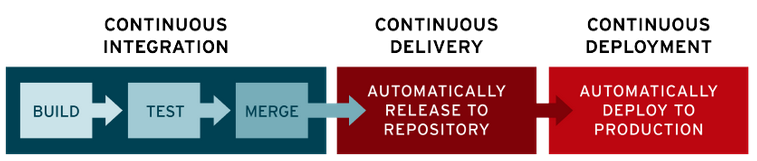
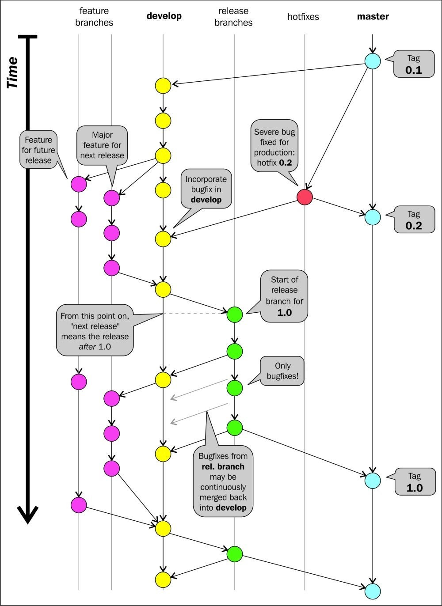
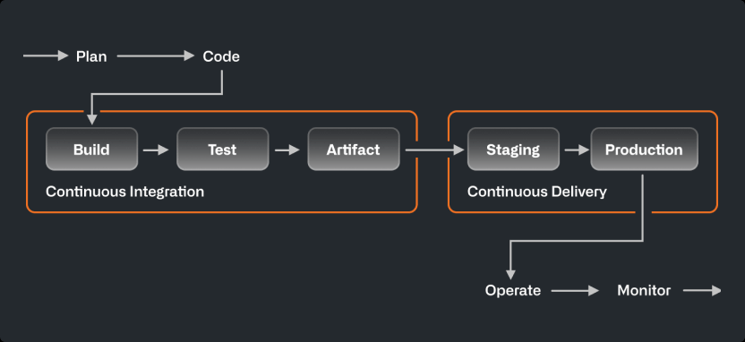
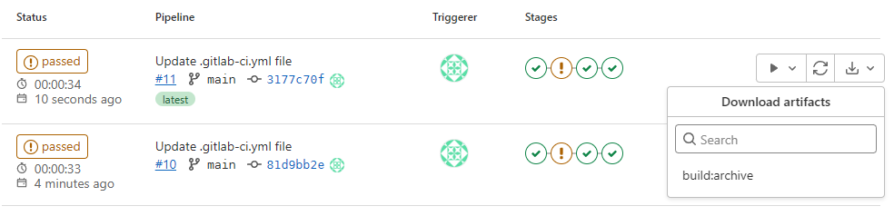
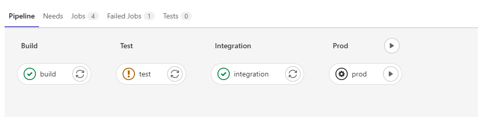
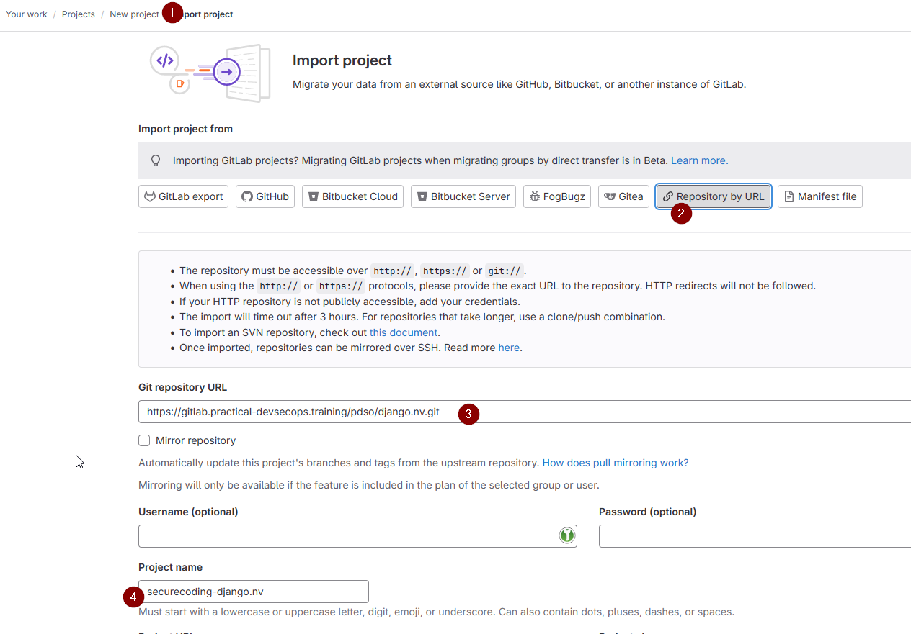
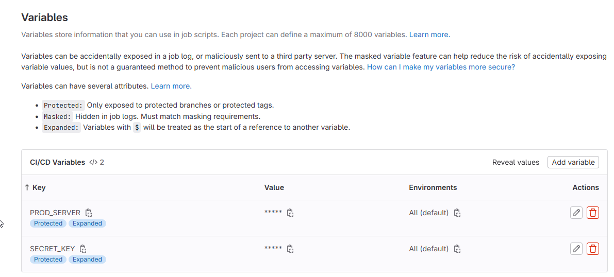
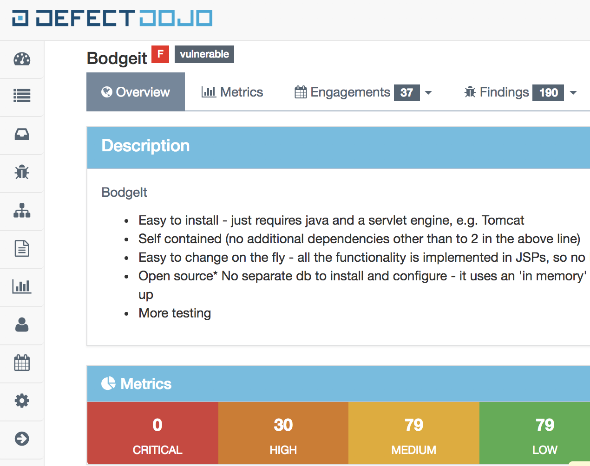

<style>
    /* You can add custom style here. VSCode supports this.
    Other editor might need these custom code in
    the YAML header: section: | */
</style>

# CI/CD
<!-- _class: first-slide -->

Juan Vera del Campo - <juan.vera@professor.universidadviu.com>

# Hoy hablamos de...
<!-- _class: cool-list toc -->

1. [CI/CD](#3)
1. [Ejemplos](#17)
1. [Resumen y referencias](#27)

# CI/CD
<!-- _class: lead -->

## CI/CD Continuous Integration / Continous Delivery
<!-- _class: with-success -->

- Compila código
- Ejecuta tests
- Despliega nuevas versiones de la aplicación frecuentemente
- Flexible y adaptable a cambios
- Feedback constante de los usuarios finales
- Todo de forma automática

Cada cambio en el código se testea y despliega en producción en minutos

> https://semaphoreci.com/blog/cicd-pipeline

---

"La integración continua es una práctica de desarrollo de software en la que cada miembro de un equipo fusiona sus cambios en un código base junto con los cambios de sus colegas al menos diariamente. Cada una de estas integraciones se verifica mediante una compilación automatizada (incluida la prueba) para detectar errores de integración lo más rápido posible. Los equipos descubren que este enfoque reduce el riesgo de retrasos en la entrega, reduce el esfuerzo de integración y permite prácticas que fomentan una base de código saludable para una mejora rápida con nuevas funciones."

> https://martinfowler.com/articles/continuousIntegration.html

---


## Pipeline de CI/CD

Una *pipeline* de CI/CD es una serie de pasos que se deben realizar para poner en producción una nueva versión de software

En la actualidad, se tiende a ejecutar una *pipeline* completa cada día



> https://www.redhat.com/en/topics/devops/what-cicd-pipeline

---

Podéis configurar el control de versiones (GitHub, GitLab...) para que ejecute una pipeline después de un evento de Git, especialmente *commit* y *merge*

Ejemplo en estas mismas transparencias: https://github.com/Juanvvc/securecoding/tree/main/.github/workflows



---

1. Cada *commit* debería ejecutar todas las herramientas automáticas de detección de errores
1. Repara inmediatamente los errores de compilación
1. Repara los errores de seguridad
1. La ejecución de todas estas pruebas debe ser rápida...
1. ...y automática
1. Automatiza también el despliegue de la aplicación

--- 

Ejemplos:

- Merge Request: BUILD -> TEST -> INTEGRATION
- Merge to master: BUILD -> TEST -> INTEGRATION -> DEPLOY TO STAGING
- Tag for release: DOWNLOAD ARTIFACTS -> DEPLOY TO PRODUCTION

## Terminología:

- **Jobs**: comandos para ejecutar
- **Stages**: pasos en los que se ejecutan los comandos. La pipeline puede intentar ejecutar todos los pasos, o parar si falla alguno
- **Runners**: máquinas que ejecutan los *jobs*. Generalmente son un servidor *docker* que ejecuta una imagen determinada
- **Artifacts**: archivos opcionales que se generan en un *stage*. En nuestro caso, son los reportes de las herramientas de seguridad

<!--

Los runners son máquinas virtuales que ejecutan los jobs. Gitlab/github ofrece algunos minutos al mes de runner gratuitos y también se pueden contratar más. También puedes tener el runner ejecutándose en cualquier sitio, incluso en tu casa

-->

## Stages comunes

- **Build**: en esta etapa se realiza la compilación de las unidades de código. Herramientas: Maven, Gradle...
- **Tests**: la prueba de todas las unidades se realiza en esta etapa. Entonces, sabremos dónde exactamente el código tiene errores y, si se encuentran errores, no se continúa a las siguientes etapas. Herramientas: linters, Selenium, PYtest...
- **Integrar**: en esta etapa, se integran todas las unidades de los códigos. Herramientas: Jenkins.
- **Despliegue**: en esta etapa, el código se despliega en el entorno del cliente. AlEjemplos: AWS, Docker...
- **Operar**: las operaciones se realizan en el código si es necesario.Herramienta: Kubernetes, OpenShift...
- **Monitor**: en esta etapa, el monitoreo de la aplicación se realiza aquí en el entorno del cliente. Herramientas: Nagios, ELK, Splunk, Grafana...


---



> https://resources.github.com/ci-cd/

---

Ejemplo en GitLab:

```yaml
stages:   # Dictionary
 - build   # this is build stage
 - test    # this is test stage
 - integration # this is an integration stage
 - prod       # this is prod/production stage

build:       # this is job named build, it can be anything, job1, job2, etc.,
  stage: build    # this job belongs to the build stage. Here both job name and stage name is the same i.e., build
  script:
    - echo "This is a build step"  # We are running an echo command, but it can be any command.
    - echo "{\"vulnerability\":\"SQL Injection\"}" > output.json
  artifacts:      # notice a new tag artifacts
    paths: [output.json]   # this is the path to the output.json file
    when: always  # when the artifact is included: always|on_failure|on_success
    expire_in: never # 2 hrs|3 weeks|6 mos

test:
  stage: test
  script:
    - echo "This is a test step."
    - exit 1         # Non zero exit code, fails a job.
  allow_failure: true   #<--- allow the build to fail but don't mark it as such

integration:        # integration job under stage integration.
  stage: integration
  script:
    - echo "This is an integration step."

prod:
  stage: prod
  script:
    - echo "This is a deploy step."
  when: man
```

---






## La biblia del CI/CD

1. Prueba los comandos localmente antes de subirlos a la *pipeline* usando una imagen docker
1. Asegúrate de que la ejecución de una *pipeline* lleva menos de 10 minutos
1. Guarda la salida para referencia futura y análisis
1. Considera si las *pipelines* deben interrumpirse si fallan


# Ejemplos
<!-- _class: lead -->

Vamos a convertir [DevSecOps](04-devsecops.html) en comandos Docker

## Ejemplo: bandit desde una imagen docker

Ejemplo: [bandit](https://bandit.readthedocs.io/en/latest/) analiza errores comunes en Python

```bash
git clone https://github.com/NetSPI/django.nV ; cd django.nV
docker run --rm -v $(pwd):/src --user $(id -u):$(id -g) cytopia/bandit -r /src -f json -o /src/b
andit-output.json
```

La salida se guarda en el archivo `bandit-output.json`

## Ejemplo: integrando bandit en CI/CD



1. Crea un nuevo proyecto en gitlab.com: New Project -> Import
1. Importa desde URL: <https://gitlab.practical-devsecops.training/pdso/django.nv.git>
1. Nombre: *securecoding-djangonv*
1. Menú de la izquierda: Build -> Pipeline editor, o edita directamente el archivo `.gitlab-ci.yml`

---

Añade un nuevo *job* y commit:

```yaml
sast:
  stage: build
  script:
    - docker pull hysnsec/bandit
    - docker run --user $(id -u):$(id -g) -v $(pwd):/src --rm
    hysnsec/bandit -r /src -f json -o /src/bandit-output.json
  artifacts:
    paths: [bandit-output.json]
    when: always
  allow_failure: true
```

Busca la ejecución en el menú izquierdo, Build -> Pipelones

---

Más ejemplos: comprueba si hay secretos

```yaml
git-secrets:
  stage: build
  script:
    - docker run --user $(id -u):$(id -g) -v $(pwd):/src --rm 
    hysnsec/trufflehog --repo_path /src file:///src --json | tee trufflehog-output.json
  artifacts:
    paths: [trufflehog-output.json]
    when: always
    expire_in: one week
  allow_failure: true
```

---

Más ejemplos: NMAP

```yaml
# DAST using nmap, during integration stage
dast-nmap:
  stage: integration
  script:
    - docker pull hysnsec/nmap
    - docker run --rm --user $(id -u):$(id -g) -v $(pwd):/tmp hysnsec/nmap $PROD_SERVER -oX /tmp/nmap-output.xml
  artifacts:
    paths: [nmap-output.xml]
    when: always
    expire_in: one week
  allow_failure: true
```

## Gestión de secretos

En el ejemplo anterior, fíjate en la variable: PROD_SERVER

Puedes gestionar variables en Settings -> CI/CD Variables



---

```yaml
inspec:
  stage: prod
  only:
    - main
  environment: production
  before_script:
    - mkdir -p ~/.ssh
    - echo "$DEPLOYMENT_SERVER_SSH_PRIVKEY" | tr -d '\r' > ~/.ssh/id_rsa
    - chmod 600 ~/.ssh/id_rsa
    - eval "$(ssh-agent -s)"
    - ssh-add ~/.ssh/id_rsa
    - ssh-keyscan -t rsa $DEPLOYMENT_SERVER >> ~/.ssh/known_hosts
  script:
    - docker run --rm -v ~/.ssh:/root/.ssh -v $(pwd):/share \\
    hysnsec/inspec exec https://github.com/dev-sec/linux-baseline \\
    -t ssh://root@$DEPLOYMENT_SERVER -i ~/.ssh/id_rsa \\
    --chef-license accept --reporter json:/share/inspec-output.json
  artifacts:
    paths: [inspec-output.json]
    when: always
```

##  Defect Dojo

<https://www.defectdojo.org/>

Gestión de vulnerabilidades e informes de CI/CD



---


```yaml
sast:
  stage: build
  before_script:
    - apk add py-pip py-requests
  script:
    - docker pull hysnsec/bandit
    - docker run --user $(id -u):$(id -g) -v $(pwd):/src --rm \\
    hysnsec/bandit -r /src -f json -o /src/bandit-output.json
  after_script:
    - python3 upload-results.py --host $DOJO_HOST \\
    --api_key $DOJO_API_TOKEN --engagement_id 1 \\
    --product_id 1 --lead_id 1 --environment "Production" \\
    --result_file bandit-output.json --scanner "Bandit Scan"
  artifacts:
    paths: [bandit-output.json]
    when: always
```

# Resumen y referencias
<!-- _class: lead -->

## Referencias

- [Continuous Integration](https://martinfowler.com/articles/continuousIntegration.html), Martin Fowler
- [CI/CD: The what, why, and how](https://resources.github.com/ci-cd/)
- [What is CI/CD?](https://www.redhat.com/en/topics/devops/what-is-ci-cd)
- [ Introducción a CI/CD con GitLab (video)](https://www.youtube.com/watch?v=I2qztG7vxPQ)
- [CI/CD Pipeline: A Gentle Introduction](https://semaphoreci.com/blog/cicd-pipeline)
- [CI/CD en Gitlab](https://docs.gitlab.com/ee/ci/)
- [CI/CD en Github](https://github.blog/2022-02-02-build-ci-cd-pipeline-github-actions-four-steps/)

# ¡Gracias!
<!-- _class: last-slide --> 
