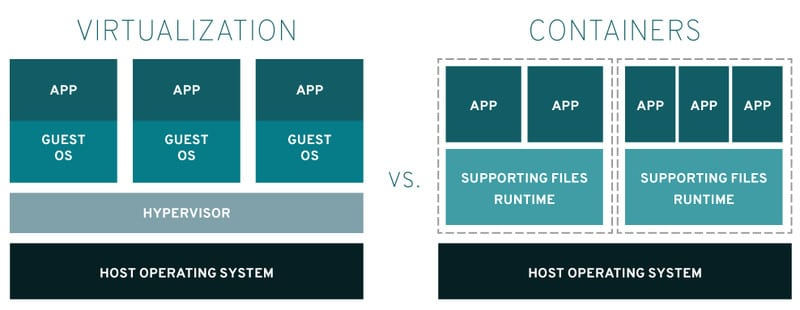

# Quality Assurance
<!-- _class: first-slide -->

Juan Vera del Campo

<juan.vera@campusviu.es>

# Hoy hablamos de...
<!-- _class: cool-list toc -->

1. [Quality Assurance](#4)
1. [OWASP](#9)
1. [Otras recomendaciones](#15)
1. [Demos](#18)
1. [Referencias](#25)

# Contenedores
<!-- _class: lead -->

## ¿Qué es un contenedor?

Es como una máquina virtual... pero no

> https://www.ubuntupit.com/everything-you-need-to-know-about-linux-containers-lxc/

## Ventajas de los contenedores

- Solo ven la parte del sistema que les dejas ver
- Pueden conectarse entre ellos
- Inicio rápido
- Gestión de "snapshots"
- Dependencias "autocontenidas"
- Fácil instalación y compartición
- Descritos en un archivo de texto que puede auditarse fácilmente
- Gestión del ciclo de vida

## Docker. Terminología

- Imágenes: "snapshot" de un sistema. Es el "estado inicial" de un contenedor
- Contenedor: un sistema ejecutándose
- Volumen: "pendrive" o "carpeta compartida" entre sistemas. Se usa para persistencia y configuraciones

---

Seguimos en: https://colab.research.google.com/github/Juanvvc/securecoding/blob/main/ejercicios/04-docker.ipynb

# Referencias

- Tutorial: https://docs.docker.com/get-started/