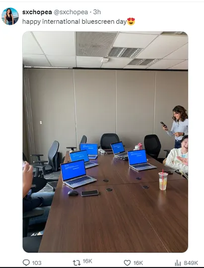
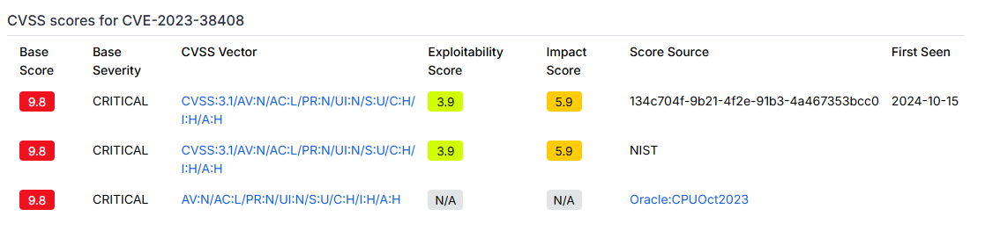

# Código seguro y *quality assurance*
<!-- _class: first-slide -->

**Presentación**
Juan Vera del Campo - <juan.vera@professor.universidadviu.com>

## Temario
<!-- _class: cool-list -->

1. [Introducción al curso](index.html)
1. [Modelado de amenazas](01-threatmodeling.html)
2. [Buenas prácticas en la escritura de código](02-coding.html)
3. [Contenedores y microservicios](03-contenedores.html)
4. [DevSecOps](04-devsecops.html)
5. [CI/CD](05-cicd.html)

# Presentación
<!-- _class: lead -->

## Objetivos

1. Identificar problemas de seguridad durante el diseño de una app
1. Identificación de problemas de seguridad durante el desarrollo de una app
1. Quality Assurance Testing
1. Despliegue seguro de aplicaciones: Docker, Kubernetes
1. Análisis estático y dinámico de seguridad
1. CI/CD

En resumen: **gestión de la seguridad durante todo el ciclo de vida de la aplicación**

> https://www.packetlabs.net/posts/devsecops-replace-agile/
> https://www.packetlabs.net/posts/security-qa-testing/

## Sobre mí

Dr. Juan Vera (Juanvi)

<juan.vera@professor.universidadviu.com>

Intereses:

- DFIR: Análisis forense e *Incident Response*
- Miembro del Cyber Incident Response Team de [Valeo](https://es.wikipedia.org/wiki/Valeo)
- Cualquier cosa que vuele

## Intrucciones de uso de las transparencias

- Acceso directo HTML: <http://juanvvc.github.io/securecoding>
    - Pulsa `p` para notas de presentación
    - Puedes "Imprimir a PDF" las presentaciones si usas Chrome o Edge, pero no en Firefox o Safari
- Código Markdown: <https://github.com/juanvvc/securecoding>

Es muy recomendable seguir los enlaces que aparecen en la presentación

<!-- 
Esto es un ejemplo de notas de profesor. Aquí habrá información adicional, aclaraciones, referencias o explicaciones más largas de los conceptos de la transparencia
-->

## Evaluación
<!-- _class: with-warning smaller-font -->

- Puntuación. Dos partes:
    - 50% examen
    - 50% actividades
- Es necesario superar con nota media de 5 **cada parte por separado**
- Actividades:
    - No es  necesario superar las actividades individuales, solo que **la media de todos las actividades sea superior a 5**
    - Las actividades no presentados se puntúan como 0
    - Se pueden presentar las actividades hasta el día del examen correspondiente
- En segunda convocatoria, se mantiene la nota de aquella parte que fue superada en primera convocatoria

Presenta las actividades en formato PDF

## Conocimientos necesarios

- Algo de programación
- Algo de sistemas
- Algo de gestión de sistemas operativos

A pesar de ser una asignatura de "código seguro", estudiaremos el proceso de creación y gestión de una aplicación, no la programación de la aplicación en sí

# ¿Qué puede salir mal?
<!-- _class: lead -->

Ejemplos del mundo real de cosas saliendo mal

---

CrowdStrike es una empresa líder de EDRs: antivirus + análisis de comportamiento + respuesta a incidentes + SIEM

Está instalado en todos los PCs de muchas compañías

El 19 de julio de 2024, una actualización de su EDR obligaba a los PCs a reiniciarse... pero impedía su encendido

> [El caso CrowdStrike-Microsoft afectó a 8.5 millones de equipos y dejó grandes pérdidas bursátiles](https://es.wired.com/articulos/caso-crowdstrike-microsoft-afecto-a-85-millones-de-equipos)
> [¿Qué pasó con Microsoft en la caída global informática y qué causó el fallo?](https://cnnespanol.cnn.com/2024/07/19/que-paso-caida-mundial-microsoft-crowdstrike-trax/)
> [CrowdStrike update chaos explained: What you need to know](https://www.computerweekly.com/feature/CrowdStrike-update-chaos-explained-What-you-need-to-know)

---

- Si algo en el kernel de un OS falla, el sistema entero falla
- Windows solo permite drivers firmados en su espacio de kernel
- Microsoft probaba y firmaba las actualizaciones de CrowdStrike... pero no tan rápido como a CrowdStrike le interesaba
- "Solución": CrowdStrike Falcon tiene:
    - Un driver que se carga en espacio de kernel al inicio de Windows
    - Carga dinámica de configuración sin firmar: archivos SYS
    - Actualización rápida y constante de archivos SYS
- El 9 de julio de 2024, CrowdStrike envió una actualización de los archivos SYS que no estaba suficientemente probada: error de acceso de memoria que impedía a Widows iniciarse
- La única solución fue que los técnicos accediesen físicamente a millones de PCs para borrar el archivo SYS manualmente

---

Fíjate:

- Había sistemas de seguridad en marcha:
    - Firmado de drivers
    - Actualizaciones constantes y automáticas
    - Separación entre espacio de kernel y usuario
- Pero las "malas prácticas" causaron el desastre:
    - Un archivo que no suficientemente probado
    - Un código que leía más allá de donde tenía 
    - Un sistema que no podía iniciarse para "autorecuperarse"

---

¿Qué han hecho para impedir fallos similares en el futuro?

- Pruebas automatizadas para todos los Template Types existentes
- Añadir más capas de implementación y comprobaciones para aceptación para el Sistema de Configuración del Contenido
- Más control sobre la implementación de las actualizaciones del Contenido para Respuesta Rápida
- Validación del número de campos de entrada para evitar que ocurra este problema
- Mejorar la comprobación de límites en el Intérprete de Contenido para el Contenido para Respuesta Rápida en el Channel File 291

Fíjate: ninguno de esos puntos es "escribiremos mejor software" porque eso no se puede prometer. Todos implican "controles", "validaciones" y "automatismos"

>  [Resumen ejecutivo del Análisis de la Causa Raíz del Channel File 291](https://www.crowdstrike.com/falcon-content-update-remediation-and-guidance-hub/translated-resources/#spanish)

## Log4j / Log4Shell

En noviembre de 2021, Apache publicó la vulnerabilidad crítica [CVE-2021-44228](https://nvd.nist.gov/vuln/detail/CVE-2021-44228) que afectaba a su librería log4j. La vulnerabilidad permitía a un atacante ejecutar cualquier comando en un servidor

Log4j se utiliza para escribir logs de aplicación en pantalla, archivo, syslog, SIEM... Está incluida en multitud de proyectos y productos Java como una librería más

La vulnerabilidad estuvo activa entre 2013 hasta que se detectó en 2021

> [¿Qué es la vulnerabilidad Log4j?](https://www.ibm.com/es-es/topics/log4j)
> [The Apache Log4j vulnerabilities: A timeline](https://www.csoonline.com/article/571797/the-apache-log4j-vulnerabilities-a-timeline.html)
> [Log4Shell Overview and Resources for Log4j Vulnerabilities ](https://www.splunk.com/en_us/surge/log4shell-log4j-response-overview.html)

<!--
En el segundo enlace, fíjate en la secuencia de acontecimientos: a veces tardamos días en entender qué está pasando, y la primera solución no es buena
-->

---

Fíjate:

- La vulnerabilidad podía afectar a tu código a través de una librería (log4j) que no has escrito tú, ni habrás auditado, ni eres responsable: **no solo tienes que preocuparte de tus errores, también de errores de los demás**
- Puedes tener aplicaciones que usen la librerías log4j y no saberlo
- Solución:
    - auditoría de las librerías de terceros que usa nuestro código
    - programas de gestión de vulnerabilidades
    - sistemas de detección de ataques

> https://www.microsoft.com/en-us/security/blog/2021/12/11/guidance-for-preventing-detecting-and-hunting-for-cve-2021-44228-log4j-2-exploitation/

## XZ Utils backdoor

En marzo de 2024, [se descubríó un código malicioso introducido por un atacante en la librería XZ](https://www.openwall.com/lists/oss-security/2024/03/29/4), básica en los sistemas Linux

El "virus" no estaba el el código principal, sino que solo se introducía durante el testeo de la librería: estaba entre **los archivos de test**

Afectaba a las personas que crean distribuciones de Linux: cuando probaban que la nueva librería funcionaba correctamente... infectaba el sistema

Se descubrió porque una conexión SSH duraba unos milisegunos más de los esperado

> https://techcommunity.microsoft.com/blog/vulnerability-management/microsoft-faq-and-guidance-for-xz-utils-backdoor/4101961
> https://nvd.nist.gov/vuln/detail/CVE-2024-3094
> https://pentest-tools.com/blog/xz-utils-backdoor-cve-2024-3094
> https://ariadne.space/2024/04/02/the-xz-utils-backdoor-is-a-symptom-of-a-larger-problem/

## CVE-2023-38408

Vulnerabilidad de ssh-agent que permite a un atacante ejecutar código en PC de un administrador

¿Es preocupante?

> https://nvd.nist.gov/vuln/detail/CVE-2023-38408
> https://blog.qualys.com/vulnerabilities-threat-research/2023/07/19/cve-2023-38408-remote-code-execution-in-opensshs-forwarded-ssh-agent

---

Fíjate:

- Si se consigue aprovechar de la vulnerabilidad, es MUY preocupante
- Pero para aprovecharla, el atacante:
    - Tiene que comprometer un servidor en el que confíe la víctima
    - La víctima tiene que tener la opción ssh-agent activada
    - La víctima tiene que conectarse utilizando la opción `-A`
- En resumen: severidad alta, pero explotabilidad difícil: impacto bajo

> https://www.cvedetails.com/cve/CVE-2023-38408

## Lecciones aprendidas

- Diseña teniendo en cuenta la seguridad
- Prueba tu código
- Te vas a equivocar
- Los demás se van a equivocar
- Incluye controles automáticos en el proceso de desarrollo:
    - De tu código
    - De las librerías que utilizas
    - En el despliegue y distribución
- Prioriza lo que tienes que arreglar

# Conceptos generales
<!-- _class: lead -->

---
<!-- _class: cool-list -->

Estructura del curso:

1. [Diseño: Modelado de amenazas](01-threatmodeling.html)
2. [Desarrollo:  escritura de código](02-coding.html)
3. [Despliegue: Docker](03-docker.html)
4. [Automatismos: DevSecOps](04-devsecops.html)
5. [Operación: CI/CD](05-cicd.html)

## Módelo clásico de desarrollo

- Pasa demasiado tiempo entre desarrollo y despliegue
- Muchas tareas manuales no automatizadas
- Varios equipos validando los cambios

## Nuevo paradigma: Agile

---

- Ciclos de desarrollo más cortos y *feedback* constante del cliente: cada nueva característica necesita menos cambios
- Llegada a producción muy rápida
- Problema: **la velocidad de los cambios es mayor que la necesaria para un equipo de seguridad**: *blocking point*

Solución: que desarrollo y operaciones trabajen juntos: DevOps

## Objetivos

- Identificar problemas de seguridad desde el inicio
- Estandarización del código
- Ser capaces de publicas una nueva versión de una aplicación en horas, pero manteniendo seguridad y calidad
- Debemos **automatizar** el análisis de la seguridad de una aplicación
- Equipos Dev y Ops trabajando en paralelo

---

## Quality Assurance

 "*Quality assurance*" (QA) : conjunto de procesos diseñados para garantizar que el software cumple con ciertos estándares de calidad antes de ser entregado al usuario

 1. **Prevención de errores**, no solo detección, desde etapas tempranas del desarrollo
 1. **Establecimiento de procesos y estándares**: desarrollar, documentar, probar y mantener los productos de software para asegurar calidad de forma consistente.
    - Estándares de codificación y pruebas comunes a todo el equipo
    - Revisión de código y diseño
    - Testeo estático y dinámico
    - Métricas de calidad

## Diseño: Modelado de amenazas

> https://csrc.nist.gov/publications/detail/sp/800-30/rev-1/final

## Desarrollo: escritura de código

<!-- _class: smallest-font -->

https://cwe.mitre.org/index.html

Rank|ID|Name|Score|2020 Rank Change
--|--|--|--|--
[1]|CWE-787|	Out-of-bounds Write|	65.93|+1
[2]|CWE-79|	Improper Neutralization of Input During Web Page Generation ('Cross-site Scripting')|	46.84|	-1
[3]|CWE-125|	Out-of-bounds Read|	24.9|	+1
[4]|CWE-20|	Improper Input Validation|	20.47|	-1
[5]|CWE-78|	Improper Neutralization of Special Elements used in an OS Command ('OS Command Injection')|	19.55|	+5
[6]|CWE-89|	Improper Neutralization of Special Elements used in an SQL Command ('SQL Injection')|	19.54	|0
[7]|CWE-416|	Use After Free|	16.83|	+1
[8]|CWE-22|	Improper Limitation of a Pathname to a Restricted Directory ('Path Traversal')|	14.69	|+4
[9]|CWE-352|	Cross-Site Request Forgery (CSRF)|	14.46	|0
[10]|CWE-434|	Unrestricted Upload of File with Dangerous Type|	8.45|	+5

## Continous Integration

> https://blog.51sec.org/2018/12/from-devops-to-devsecops-topics.html

## Continous Delivery

## ¡Gracias!
<!-- _class: last-slide -->

