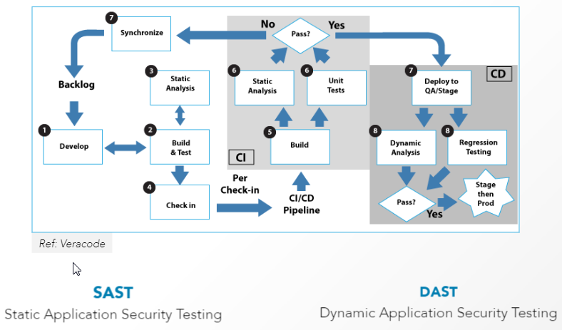

# Código seguro y *quality assurance*
<!-- _class: first-slide -->

**Presentación**
Juan Vera del Campo - <juan.vera@professor.universidadviu.com>

## Temario
<!-- _class: cool-list -->

1. [Modelado de amenazas](01-threatmodeling.html)
2. [Buenas prácticas en la escritura de código](02-coding.html)
3. [Docker](03-docker.html)
4. [DevSecOps](04-devsecops.html)
5. [CI/CD](05-cicd.html)

# Presentación
<!-- _class: lead -->

## Objetivos

1. Seguridad en la creación de aplicaciones de software
1. Identificar problemas de seguridad durante el diseño
1. Despliegue seguro de aplicaciones
1. Quality Assurance Testing

En resumen: gestión de la seguridad durante todo el ciclo de vida de la aplicación

> https://www.packetlabs.net/posts/devsecops-replace-agile/
> https://www.packetlabs.net/posts/security-qa-testing/

## Sobre mí

Dr. Juan Vera (Juanvi)

<juan.vera@professor.universidadviu.com>

Intereses:

- DFIR: Análisis forense e *Incident Response*
- Miembro del Cyber Incident Response Team de [Valeo](https://es.wikipedia.org/wiki/Valeo)
- Cualquier cosa que vuele

## Intrucciones de uso de las transparencias
<!-- _class: smaller-font -->

Versión más actualizada:

- Acceso directo HTML: <http://juanvvc.github.io/securecoding/slides>
    - Puedes pulsar `p` para ver las notas de presentación
    - Con "Inicio" (en pie de cada transparencia) puedes venir a esta presentación, con el índice global de contenidos
    - Encontrarás la versión en PDF entre los recursos de la asignatura
- Código Markdown: <https://github.com/juanvvc/securecoding>

Durante el estudio personal es muy recomendable seguir los enlaces que aparecen en las transparencias para completar el tema.

 Esta obra esta sujeta a una licencia de [Atribución 4.0 Internacional de Creative Commons](http://creativecommons.org/licenses/by/4.0/)

## Evaluación
<!-- _class: smaller-font -->

- Puntuación. Dos partes:
    - 50% examen
    - 50% actividades
- Son tres actividades en total, se recomienda realizarlas después de los temas 2, 3 y 5
    - No es  necesario superar las actividades individuales, solo que **la media de todos las actividades sea superior a 5**
    - Las actividades no presentados se puntúan como 0
    - Se pueden presentar las actividades hasta el día del examen correspondiente
    - **Presenta las actividades como PDFl**
- Es necesario superar con nota media de 5 **cada parte por separado**
- En segunda convocatoria, se mantiene la nota de aquella parte que fue superada en primera convocatoria

## Conocimientos necesarios

- Algo de programación
- Algo de sistemas
- Algo de gestión de sistemas operativos

# Introducción
<!-- _class: lead -->

---
<!-- _class: cool-list -->

1. [Modelado de amenazas](01-threatmodeling.html)
2. [Buenas prácticas en la escritura de código](02-coding.html)
3. [Docker](03-docker.html)
4. [DevSecOps](04-devsecops.html)
5. [CI/CD](05-cicd.html)

## Módelo clásico de desarollo

- Demasiado tiempo entre desarrollo y despliegue
- Tareas manuales no automatizadas
- Varios equipos tienen que aceptas los cambios

## Nuevo paradigma

---

## Modelado de amenazas

> https://csrc.nist.gov/publications/detail/sp/800-30/rev-1/final

## Escritura de código

<!-- _class: smallest-font -->

https://cwe.mitre.org/index.html

Rank|ID|Name|Score|2020 Rank Change
--|--|--|--|--
[1]|CWE-787|	Out-of-bounds Write|	65.93|+1
[2]|CWE-79|	Improper Neutralization of Input During Web Page Generation ('Cross-site Scripting')|	46.84|	-1
[3]|CWE-125|	Out-of-bounds Read|	24.9|	+1
[4]|CWE-20|	Improper Input Validation|	20.47|	-1
[5]|CWE-78|	Improper Neutralization of Special Elements used in an OS Command ('OS Command Injection')|	19.55|	+5
[6]|CWE-89|	Improper Neutralization of Special Elements used in an SQL Command ('SQL Injection')|	19.54	|0
[7]|CWE-416|	Use After Free|	16.83|	+1
[8]|CWE-22|	Improper Limitation of a Pathname to a Restricted Directory ('Path Traversal')|	14.69	|+4
[9]|CWE-352|	Cross-Site Request Forgery (CSRF)|	14.46	|0
[10]|CWE-434|	Unrestricted Upload of File with Dangerous Type|	8.45|	+5

## Tests automáticos

> https://blog.51sec.org/2018/12/from-devops-to-devsecops-topics.html

## Continous Delivery

## Ejercicio de la sesión de hoy

Utilizaremos docker en varias de las sesiones de la asignatura. Como ejercicio de hoy, instaladlo en vuestros PCs y probad que se ha instalado correctamente (Windows, Linux, Mac)

- Instalación de docker en vuestros PCs
- Ejecución de imagen "Hola mundo": https://hub.docker.com/_/hello-world/
- Entrega: "pantallazo" de que se todo ha ejecutado correctamente

## ¡Gracias!
<!-- _class: last-slide -->

